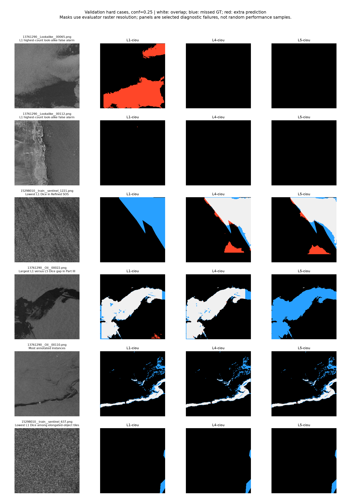

# Screening review and final-model selection — 2026-09-15

## Decision

**Select `none-ciou`, `L1-ciou`, and `L4-ciou` for three fresh 100-epoch final comparison runs.** L1 is the primary performance candidate; L4 is a complementary false-alarm/shape candidate; plain YOLO is the mandatory architecture control. This is a model-selection decision, not a claim that any checkpoint is deployment-ready. Do not start final training before the data/provenance and configuration gates below are recorded. No final training was launched during this review.

**L5-ciou is the reserve, not a required winner.** Its mask AP is close to L4, but its look-alike false alarms are worse at matched recall and its Part III mask coverage is weaker. All six runs labeled MPDIoU remain archived empirical treatments; an implementation scale mismatch prevents interpreting them as a valid test of the intended loss.

## Project reasoning and documents reviewed

The README and HANDOFF establish the history and machine migration. PLAN/INDEX, ARCHITECTURE, INTERFACES, CONSTRAINTS, EVALUATION and the phase documents define the intended pipeline: SAR segmentation -> geometry/head-tail/wind -> ensemble backward origin field -> AIS gating and explainable attribution -> read-only interface/offline demo. RESEARCH/SYNTHESIS and the look-alike notes explain why L5 transfer is an open question and why a negative result is legitimate. Phase 02 is not complete merely because screening ended: binary labels, mask geometry, look-alike C8, SAHI, two-class manifest and downstream acceptance still matter. Phase 08 is not completed by this validation review.

The mask supplies area, medial axis, head/tail and drift seeds. Undercoverage can shift or shrink the inferred footprint; false detections can create an unsupported AIS attribution. This is why this review combines instance recovery, pixel overlap, boundaries, shape, source, confidence sensitivity and negative-image errors rather than inventing a single weighted score.

The prospective protocol is [PLAN/SCREENING_REVIEW.md](../../PLAN/SCREENING_REVIEW.md). Original training outputs were preserved. Final test images and labels were not read or used for selection.

## Completion and provenance

The queue log records SCREENING COMPLETE at 2026-09-15 19:07:18 IST. Twelve independent 60-epoch runs = 720 screening epochs. Including the separate 60-epoch reference gives **780/1080 completed, 300 remaining**. The budget was not reduced. Final runs are fresh 100-epoch training, not forty-epoch extensions.

- Eleven grid best checkpoints were independently re-evaluated on all 585 validation images (2,937 labeled instances). Three close CIoU candidates also received exact recall-matched comparisons and common diagnostic panels.
- `runs/ablation/none-ciou/run.json` exists and records completion, but its checkpoint and results.csv are absent from the available run artifacts. No mask, FP, speed or learning-curve claims are fabricated for it. Recover its exact original weights if available elsewhere; a fresh final control is still required.
- `runs/segment/baseline-screen` is a different reference: COCO head initialization, unlike the grid’s non-head/backbone transfer. Its roughly .208 mask AP cannot substitute for missing grid-control measurements.
- L1/L2 CIoU used physical batch 8 on the 5070 Ti laptop; L3 changed from batch 8 to 4 after epoch 43; subsequent cells used batch 4 on the 4060 Ti 8 GB. All use seed 0. Gradient accumulation to nbs=32 does not erase BatchNorm, optimizer-step, precision or hardware differences.
- Checkpoint arguments show mosaic=1, translate=.1, scale=.5, HSV augmentation and horizontal/vertical flips=.5. Rotation/shear/perspective were zero. The old “mirroring only” claim is inaccurate for these runs.
- optimizer=auto overrode lr0=.01. The L5 MPDIoU log explicitly records AdamW(lr=.002, momentum=.9). Do not describe the grid as an exact P004 hyperparameter replication.

Exact versions, checkpoint hashes, parameter counts, configuration and all curve summaries are in [provenance.json](provenance.json). The original run summaries and the common re-evaluation are different measurements and are kept separate; differences have not been attributed to any one cause without a controlled experiment.

## Dataset audit and independence

| Split / source | Images | Empty labels | Instances | Named look-alikes | Named No_oil |
|---|---:|---:|---:|---:|---:|
| train/13761290 | 340 | 222 | 1652 | 116 | 106 |
| train/15298010 | 3291 | 147 | 11047 | 0 | 0 |
| train/8346860 | 975 | 0 | 10080 | 0 | 0 |
| val/13761290 | 57 | 38 | 380 | 23 | 15 |
| val/15298010 | 413 | 17 | 1369 | 0 | 0 |
| val/8346860 | 115 | 0 | 1188 | 0 | 0 |

Train has 4,606 images and 369 backgrounds (8.01%); validation has 585 images and 55 backgrounds (9.40%). Named look-alikes alone are 116/4606 (2.52%) and 23/585 (3.93%), so “10% look-alikes” is not true of the assembled data. No missing label files were found. Background is an annotation fact, not proof of physical absence of oil.

The sources are Part III (13761290), Refined SOS Sentinel subset (15298010), and Part I (8346860). Part II was skipped in the actual build. Part III was mixed into training and validation; it is not an untouched external test set. Refined SOS source names containing `train` describe its original layout, not this project’s split assignment.

**Two exact PNG duplicates cross train/validation:**

- train/8346860__Oil__00357.png ↔ val/8346860__Oil__00356.png
- train/8346860__Oil__01339.png ↔ val/8346860__Oil__00007.png

Hashes cover PNG bytes for train and validation, not decoded-pixel equivalence, near-duplicates or unknown scene families. The split is CRC32 tile identity, not scene/acquisition grouping. Thus these are internal validation estimates with confirmed small leakage and possible broader scene dependence. The 627-image test split remains reserved; audit its provenance and duplication without using model results to redesign it before final evaluation.

Excluding the two known duplicate validation tiles leaves 583 images. L1/L4/L5 positive-tile Dice becomes .78060/.77249/.77473, and instance recall .32777/.30426/.31175: the main comparison does not reverse. This sensitivity check applies to saved fixed-threshold metrics, **not** a recomputed clean AP. Removing validation duplicates after training cannot undo exposure; version a clean scene-aware final dataset rather than editing old evidence.

## Common evaluation and metric definitions

All available grid best.pt files: imgsz=1024, physical validation batch=4, workers=2, CUDA device=0, FP32, NMS IoU=.7, conf floor=.001, max_det=300; no test inference. Standard box/mask metrics use installed Ultralytics. The diagnostic TP/FP/FN uses confidence-ordered one-to-one mask matching at IoU >=.5. This differs from the library matching used for AP and is explicitly separate.

At .25, mask metrics use the evaluator’s prototype-resolution raster (typically 256x256), not a full-resolution geocoded mask. Dice/IoU/boundary F1 are macro averages on the 530 positive images only. Boundary tolerance is 2 raster pixels (about 8 input pixels), not metres. Pixel precision/recall and area bias are micro totals over validation including backgrounds, weighted by pixel counts rather than geographic area. Empty-positive predictions score zero. Negative images are evaluated by false alarms, not an artificially perfect empty-mask Dice.

Size is raster GT-mask fraction of evaluator image: small <.1%, medium .1–1%, large >=1%. Elongated means GT box aspect >=5; border means mask touches evaluator raster edge. These are screening strata, not COCO sizes or calibrated physical slick dimensions. A targeted GT check found **zero empty rasterized GT masks** out of 2,937, so missing small instances are not explained by masks entirely disappearing at this resolution.

## All available models: detection and segmentation

| Cell | Original mask AP | Common mask AP | Mask AP50 | Mask AP75 | Box AP | P at .25 | R at .25 | Positive Dice | Boundary F1 |
|---|---:|---:|---:|---:|---:|---:|---:|---:|---:|
| L1-ciou | 0.19854 | 0.19475 | 0.4208 | 0.1611 | 0.2608 | 0.654 | 0.328 | 0.781 | 0.512 |
| L1-mpdiou | 0.18991 | 0.18550 | 0.4004 | 0.1581 | 0.2511 | 0.667 | 0.302 | 0.768 | 0.502 |
| L2-ciou | 0.19048 | 0.18678 | 0.4095 | 0.1506 | 0.2499 | 0.649 | 0.321 | 0.776 | 0.508 |
| L2-mpdiou | 0.18386 | 0.18125 | 0.3975 | 0.1516 | 0.2394 | 0.665 | 0.303 | 0.772 | 0.502 |
| L3-ciou | 0.18804 | 0.18324 | 0.4006 | 0.1497 | 0.2437 | 0.653 | 0.304 | 0.773 | 0.504 |
| L3-mpdiou | 0.18759 | 0.18247 | 0.3981 | 0.1491 | 0.2449 | 0.659 | 0.299 | 0.765 | 0.504 |
| L4-ciou | 0.19068 | 0.18907 | 0.4121 | 0.1573 | 0.2640 | 0.672 | 0.305 | 0.773 | 0.504 |
| L4-mpdiou | 0.19153 | 0.18730 | 0.4033 | 0.1560 | 0.2624 | 0.691 | 0.302 | 0.780 | 0.505 |
| L5-ciou | 0.19270 | 0.18854 | 0.4124 | 0.1591 | 0.2590 | 0.682 | 0.312 | 0.775 | 0.499 |
| L5-mpdiou | 0.19185 | 0.18817 | 0.4087 | 0.1580 | 0.2615 | 0.685 | 0.306 | 0.774 | 0.498 |
| none-mpdiou | 0.18801 | 0.18156 | 0.3941 | 0.1505 | 0.2429 | 0.639 | 0.307 | 0.776 | 0.511 |
| none-ciou | 0.19818 | unavailable | unavailable | unavailable | unavailable | unavailable | unavailable | unavailable | unavailable |

L1 leads common mask AP (.19475), AP50 (.42083), positive Dice (.781) and small-instance recall. The original none/L1 AP gap is only .00036, but baseline missing artifacts prevent the expanded comparison. Do not infer a statistically proven LSK benefit.

**Union overlap hides misses:** L1 Dice is about .781 while only 964/2937 instances are recovered at .25. Large connected regions dominate pixels while many small separate slick components are missed. This is a material downstream segmentation limitation, not evidence of 78% operational accuracy.

### Prediction-cap sensitivity (completed)

The .001 confidence-floor evaluation hit max_det=300 on 146 L1, 115 L4 and 117 L5 validation tiles. The highest minimum retained confidence on capped tiles was .03101/.02712/.02812 respectively, below the .10 operating point. Re-evaluating all three with max_det=1000 confirms unchanged .10/.25/.50 diagnostic TP/FP counts and unchanged model selection; low-confidence AP moves slightly.

| Model | Mask AP, cap300 | Mask AP, cap1000 | Change |
|---|---:|---:|---:|
| L1-ciou | 0.194748 | 0.196201 | +0.001453 |
| L4-ciou | 0.189070 | 0.190287 | +0.001217 |
| L5-ciou | 0.188543 | 0.189497 | +0.000954 |

Artifacts are in eval/screening_sensitivity/<cell>/. This checks the three close CIoU candidates, not all eleven treatments. It does not establish an unlimited-prediction metric.

## False positives and threshold sensitivity (C8)

| Cell | Background FP images /55 at .25 | Background FP instances | Look-alike FP images /23 | Look-alike FP instances | No_oil FP images /15 | R at .10 | Look-alike FP images at .10 | R at .50 | Look-alike FP images at .50 |
|---|---:|---:|---:|---:|---:|---:|---:|---:|---:|
| L1-ciou | 5 | 17 | 4 | 6 | 1 | 0.494 | 9 | 0.174 | 1 |
| L1-mpdiou | 3 | 12 | 2 | 2 | 1 | 0.460 | 9 | 0.158 | 0 |
| L2-ciou | 11 | 24 | 9 | 12 | 1 | 0.481 | 12 | 0.162 | 2 |
| L2-mpdiou | 5 | 18 | 4 | 10 | 1 | 0.463 | 11 | 0.152 | 1 |
| L3-ciou | 5 | 16 | 4 | 6 | 1 | 0.470 | 8 | 0.165 | 0 |
| L3-mpdiou | 5 | 15 | 4 | 6 | 1 | 0.461 | 7 | 0.151 | 0 |
| L4-ciou | 4 | 11 | 3 | 3 | 1 | 0.464 | 8 | 0.169 | 0 |
| L4-mpdiou | 4 | 12 | 3 | 3 | 1 | 0.454 | 7 | 0.165 | 0 |
| L5-ciou | 7 | 20 | 6 | 11 | 1 | 0.466 | 12 | 0.163 | 0 |
| L5-mpdiou | 5 | 17 | 3 | 6 | 1 | 0.460 | 10 | 0.167 | 0 |
| none-mpdiou | 3 | 14 | 1 | 1 | 1 | 0.466 | 9 | 0.156 | 0 |

All models have zero FP images on the 17 Refined SOS backgrounds at .25, but that small pool is not the hard look-alike pool. Counts are relative to supplied annotations, not chemically verified oil. None-mpdiou has just one look-alike FP tile at .25, but lower AP/recall and the invalid intended-loss implementation; selecting it solely for that count would repeat the single-metric mistake.

At .50 L4/L5 have zero look-alike false alarms, but recall drops to roughly .16–.17. Zero of 23 does not demonstrate zero risk. Raising confidence is not a free reliability gain.

### Exact matched instance recall among the close CIoU candidates

Thresholds are derived from confidence-ordered matched predictions on validation, then evaluated at the same attained recall. They are diagnostic thresholds, not frozen deployment settings. No test calibration was performed.

| Target recall | Model | Threshold | Attained recall | Precision | All-background FP images /55 | Look-alike FP images /23 | Look-alike FP instances |
|---|---|---:|---:|---:|---:|---:|---:|
| 0.3 | L1-ciou | 0.2908 | 0.3003 | 0.704 | 4 | 3 | 4 |
| 0.3 | L4-ciou | 0.2582 | 0.3003 | 0.686 | 3 | 2 | 2 |
| 0.3 | L5-ciou | 0.2658 | 0.3003 | 0.700 | 7 | 6 | 8 |
| 0.35 | L1-ciou | 0.2254 | 0.3500 | 0.614 | 6 | 5 | 7 |
| 0.35 | L4-ciou | 0.2002 | 0.3500 | 0.606 | 7 | 4 | 4 |
| 0.35 | L5-ciou | 0.1971 | 0.3500 | 0.593 | 9 | 8 | 22 |
| 0.4 | L1-ciou | 0.1697 | 0.4001 | 0.502 | 8 | 7 | 15 |
| 0.4 | L4-ciou | 0.1501 | 0.4001 | 0.514 | 10 | 5 | 10 |
| 0.4 | L5-ciou | 0.1442 | 0.4001 | 0.491 | 15 | 11 | 54 |
| 0.45 | L1-ciou | 0.1289 | 0.4501 | 0.421 | 10 | 7 | 28 |
| 0.45 | L4-ciou | 0.1084 | 0.4501 | 0.413 | 14 | 8 | 27 |
| 0.45 | L5-ciou | 0.1102 | 0.4501 | 0.406 | 18 | 12 | 81 |

L4 improves the named-look-alike tradeoff over L5 at each tested matched-recall target. Compared with L1, L4 improves look-alike counts through .40 recall but has more total background false-alarm tiles at .35/.40; at .45 even the look-alike advantage disappears. Thus **L4 is a complementary candidate, not globally safer**. Exact matching was performed for these three candidates; the other models have the full fixed threshold sweep in aggregate.json.

## Size, shape, border and source robustness

| Cell | Small R (n=1273) | Medium R (n=659) | Large R (n=1005) | Elongated R (n=46) | Border R (n=1251) | Pixel P | Pixel R | Relative area bias |
|---|---:|---:|---:|---:|---:|---:|---:|---:|---:|
| L1-ciou | 0.118 | 0.270 | 0.633 | 0.370 | 0.500 | 0.914 | 0.786 | -0.139 |
| L1-mpdiou | 0.083 | 0.240 | 0.620 | 0.326 | 0.489 | 0.911 | 0.783 | -0.141 |
| L2-ciou | 0.102 | 0.258 | 0.639 | 0.348 | 0.506 | 0.907 | 0.794 | -0.124 |
| L2-mpdiou | 0.079 | 0.244 | 0.625 | 0.348 | 0.491 | 0.915 | 0.779 | -0.149 |
| L3-ciou | 0.081 | 0.253 | 0.619 | 0.326 | 0.489 | 0.910 | 0.796 | -0.125 |
| L3-mpdiou | 0.079 | 0.255 | 0.606 | 0.283 | 0.484 | 0.915 | 0.784 | -0.143 |
| L4-ciou | 0.080 | 0.249 | 0.626 | 0.413 | 0.496 | 0.917 | 0.784 | -0.145 |
| L4-mpdiou | 0.075 | 0.243 | 0.630 | 0.391 | 0.492 | 0.915 | 0.790 | -0.137 |
| L5-ciou | 0.086 | 0.256 | 0.636 | 0.391 | 0.501 | 0.905 | 0.789 | -0.128 |
| L5-mpdiou | 0.081 | 0.250 | 0.627 | 0.391 | 0.494 | 0.903 | 0.792 | -0.123 |
| none-mpdiou | 0.084 | 0.246 | 0.629 | 0.348 | 0.496 | 0.913 | 0.784 | -0.142 |

Small-instance recall is only 7.5–11.8% at .25. L4 recovers 19/46 elongated objects, L5 18/46 and L1 17/46: the shape advantage is two objects, not a robust generalization claim. All models underpredict aggregate mask area by roughly 12–15%. Geographic area accuracy within 5% (Phase 03) has not been demonstrated.

| Model | Part III positive Dice / instance R | Refined SOS positive Dice / instance R | Part I positive Dice / instance R |
|---|---:|---:|---:|
| L1-ciou | 0.878 / 0.103 | 0.776 / 0.435 | 0.782 / 0.278 |
| L4-ciou | 0.763 / 0.082 | 0.771 / 0.430 | 0.780 / 0.231 |
| L5-ciou | 0.679 / 0.087 | 0.772 / 0.437 | 0.801 / 0.241 |

Positive-image sample counts are 19 Part III, 396 Refined SOS and 115 Part I. These sources have very different instance-size and label distributions. L5 wins Part I Dice (.801), but its Part III Dice (.679) is substantially below L1 (.878) and L4 (.763). The 19-image Part III estimate is sparse, yet its failure cases matter for the choice. High pooled metrics conceal these differences.

## Training stability and uncertainty

| Cell | Peak mask AP epoch in CSV | Last mask AP | Last-10 mean | Last-10 slope per epoch | Detrended SD |
|---|---:|---:|---:|---:|---:|
| L1-ciou | 59 | 0.19840 | 0.19547 | +0.001007 | 0.001191 |
| L1-mpdiou | 60 | 0.18986 | 0.18741 | +0.000721 | 0.000926 |
| L2-ciou | 56 | 0.18943 | 0.18853 | +0.000638 | 0.001262 |
| L2-mpdiou | 60 | 0.18396 | 0.18075 | +0.000726 | 0.000703 |
| L3-ciou | 55 | 0.18808 | 0.18735 | +0.000264 | 0.001037 |
| L3-mpdiou | 60 | 0.18768 | 0.18482 | +0.000536 | 0.000593 |
| L4-ciou | 60 | 0.19069 | 0.18817 | +0.000658 | 0.001018 |
| L4-mpdiou | 57 | 0.19144 | 0.18922 | +0.000692 | 0.001045 |
| L5-ciou | 60 | 0.19273 | 0.18989 | +0.000813 | 0.001112 |
| L5-mpdiou | 60 | 0.19174 | 0.18772 | +0.000893 | 0.000581 |
| none-mpdiou | 60 | 0.18806 | 0.18362 | +0.000912 | 0.000486 |

All eleven final-ten-epoch mask-AP slopes are positive; peaks fall between epochs 55 and 60. This supports further training as planned, but does not guarantee that 100 epochs converges or improves holdout performance. The CSV peak is not necessarily the saved best.pt epoch: Ultralytics checkpoint fitness combines metrics. The original assertion “no overfitting anywhere” was broader than the evidence; this review reports observed curves only.

The previous .004 “noise floor” was a within-run heuristic. It is **not** a statistical indistinguishability threshold. Epochs are correlated; one seed per treatment plus mixed hardware cannot estimate training-seed uncertainty.

Paired bootstrap: 3,000 resamples, seed 20260915, same validation images per pair, conditional on the trained weights. Positive tiles for Dice/recall; backgrounds for false alarms. 95% percentile intervals, unadjusted exploratory comparisons. Unknown scene dependence, selection bias and training variance are not covered.

| Candidate minus L1 at .25 | Dice difference [95% interval] | Recall difference [95% interval] | Look-alike alarm-rate difference [95% interval] |
|---|---|---|---|
| L4-ciou | -0.0083 [-0.0218, +0.0044] | -0.0235 [-0.0356, -0.0115] | -0.0435 [-0.2609, +0.1304] |
| L5-ciou | -0.0059 [-0.0195, +0.0083] | -0.0160 [-0.0266, -0.0057] | +0.0870 [-0.1739, +0.3043] |

The broad false-alarm intervals include no improvement. They support caution, not a claim that L4 is statistically safer. The paired recall deficits relative to L1 are more consistent on this validation sample, which reinforces L1 as the primary challenger.

## Inference cost

| Cell | Parameters | Best.pt MiB | Model inference ms/image | Peak allocated CUDA MiB |
|---|---:|---:|---:|---:|
| L1-ciou | 3,092,857 | 6.29 | 6.01 | 430.7 |
| L1-mpdiou | 3,092,857 | 6.29 | 6.03 | 430.7 |
| L2-ciou | 2,862,457 | 5.85 | 6.43 | 445.6 |
| L2-mpdiou | 2,862,457 | 5.85 | 6.39 | 446.2 |
| L3-ciou | 2,910,585 | 5.94 | 6.15 | 437.8 |
| L3-mpdiou | 2,910,585 | 5.94 | 6.16 | 437.7 |
| L4-ciou | 3,092,857 | 6.29 | 6.02 | 434.5 |
| L4-mpdiou | 3,092,857 | 6.29 | 6.03 | 434.4 |
| L5-ciou | 3,180,293 | 6.47 | 6.83 | 458.1 |
| L5-mpdiou | 3,180,293 | 6.47 | 6.74 | 458.1 |
| none-mpdiou | 2,842,803 | 5.81 | 5.92 | 430.5 |

These are observed same-machine validation inference timings after the validator warmup, not repeated latency benchmarks or p95 guarantees. They exclude audit computations and are not full-scene SAHI timings. CUDA allocated memory excludes reserved memory, driver and other processes; it is not training VRAM. L4 and L1 have equal parameter counts; L5 has more parameters and was slower in these measurements. Latency differences alone did not determine selection.

## Qualitative inspection



The sample-selection rules are recorded in visual_samples.json and intentionally target failures, so this panel is not a random accuracy estimate. Original SAR-like image tiles are shown alongside masks; white is overlap, blue missed GT, red extra prediction.

- Lookalike 00065: L1 produces a large false foreground region while L4/L5 suppress it at .25. This illustrates the reason to keep a complementary candidate despite L1’s stronger pooled scores.
- Refined SOS sentinel_1221: L1 misses the annotated region; L4/L5 recover much of it but also add a separate foreground patch. Strong source-level averages do not eliminate individual failures.
- Part III Oil 00022: L1/L4 recover most of the large annotated region while L5 mostly misses it. This supports investigating the Part III coverage weakness rather than dismissing it as a small AP difference.
- Part III Oil 00110: all three capture the main elongated region but miss many small annotated fragments; this visually explains high union overlap alongside low instance recall.
- Refined SOS sentinel_637: all three miss the narrow edge annotations. Boundary/elongation validation and label review remain necessary.
- The small false positives in Lookalike 00112 are barely visible at overview resolution; instance counts and full-resolution panels should be used together. No imagery-based physical cause or chemical oil classification was inferred from these panels.

## MPDIoU implementation audit

`ultralytics/utils/loss.py` passes decoded prediction boxes in feature-grid units and `target_bboxes / stride_tensor` to BboxLoss. `ml/models/loss_patch.py` ignores the supplied stride and passes those grid-unit boxes to mpdiou with image_size=(1024,1024). Thus corner distances are in grid units while the denominator is in image pixels. The distance penalty is reduced by stride squared: **64x at stride 8, 256x at 16, 1024x at 32**. IoU itself remains scale invariant, so this does not mean the run trained with no loss; it is a different, much weaker distance-penalty treatment.

A direct numeric diagnostic is saved in loss_scale_audit.json. No training-loss source or old weights were changed. Before any future intended-MPDIoU run, convert both prediction/target boxes to pixels using the per-anchor stride (or use a correctly scaled per-anchor denominator), add a nonidentical-box stride-invariance regression test through the patch, and verify the callback applies before the first training batch. Existing patch installation occurs after the first batch. Corrected-loss results must use new names and provenance; they cannot silently replace the six old rows. Repeating that axis is outside the remaining fixed 300-epoch budget.

## Finalists and alternatives

| Role | Choice | Why | Main limitation |
|---|---|---|---|
| Required control | none-ciou | Isolates whether LSK earns its complexity; resolves plain YOLO versus L5 baseline ambiguity | Original expanded audit unavailable because weights are missing |
| Primary candidate | L1-ciou | Best common mask AP, overlap, small-instance recall and strong Part III coverage | Fails some look-alikes badly; batch/hardware differs from late grid |
| Complementary candidate | L4-ciou | Better look-alike tradeoff than L5 at matched recall, competitive AP, strongest observed elongated recall, lower observed cost | Lower recall than L1; sparse safety/shape evidence; not uniformly fewer background alarms |
| Reserve | L5-ciou | Competitive segmentation and best Part I Dice among the shortlist; directly addresses original all-head hypothesis | More look-alike alarms, poor Part III coverage, larger/slower |

L2-ciou has 9/23 look-alike alarm tiles at .25 and lower AP; L3-ciou has lower AP/recall without a compelling compensating advantage. MPDIoU-labeled cells are not promoted for the intended-loss hypothesis; none-mpdiou’s low FP count and L4-mpdiou’s Dice/precision remain useful observations for a corrected future study. The negative L5 result is conditional on this screen: it has not earned automatic priority, and no universal statement about L5 or MPDIoU is warranted.

## Concrete continuation plan before final training

1. Preserve this review and all original hashes. Recover none-ciou screen weights from the prior machine/archive if possible; otherwise explicitly carry the missing-artifact limitation into final comparisons.
2. Create a versioned dataset manifest that groups known duplicate/scene/acquisition families together. Audit test provenance and overlap without selecting on its model scores. Keep the old split and screen evidence immutable. If scene metadata is unavailable, label the final experiment as an internal tile-split comparison and reserve external scenes for generalization claims.
3. Review the hard look-alike pool and tiny/edge annotations. Confirm single-class binary scope for these three final runs. A two-class operational model requires the human relabeling pass; do not relabel automatically from predictions.
4. Freeze one identical final configuration for all three: 100 fresh epochs, 1024 input, physical batch 4, workers 2, nbs 32, seed 0, CIoU, same non-head pretrained transfer. Explicitly record optimizer and augmentation rather than relying on defaults. Recommended optimizer is AdamW lr=.002, momentum=.9, weight_decay=.0005 matching observed auto behavior. Resolve mirroring-only intent by explicitly disabling mosaic, translate, scale and HSV if adopting the phase specification; this creates a documented new final-training regime and must apply to all three. Do not claim it is numerically identical to screening.
5. Implement/verify a final-specific runner/output destination under runs/final. The current ablation runner auto-resumes existing directories and rewrites ml/ablation/results.md; do not point it at completed screen checkpoints or let it overwrite the screen table. Keep best and resumable last plus per-epoch CSV, complete arguments, source hashes and checkpoint hashes. Queue only these three names after preflight.
6. On validation, compare the same multiattribute measures, best and last checkpoint sensitivity, and freeze operating thresholds according to recall/false-alarm tradeoffs. Do not optimize thresholds on test. Three single-seed architectures spend the remaining 300 epochs; repeated-seed confidence requires additional explicitly budgeted work.
7. Evaluate the frozen three models once on the audited internal holdout and a separate independent look-alike/scene set when available. Report mask/box AP, sizes, sources, FP counts, uncertainty and calibration; never translate single-class scores to oos/slick_unknown performance.
8. Complete Phase 03 geocoded area/length/head-tail checks, full-resolution mask boundaries, SAHI seams and full-scene timing; run real null scenes through wind gating and require no unsupported attribution. Complete the three published drift/AIS fixtures and insufficient-evidence behavior before calling the system reliable.

No final training ETA is promised from these short inference runs. Historical late-grid training is roughly three hours per 60 epochs on this machine, suggesting roughly fifteen active hours for 300 only as a planning estimate; changed data/augmentation, startup, validation and checkpointing require a measured final preflight.

## Reproduction, checks and limitations

From the repository root with the project virtual environment:

```powershell
.venv/Scripts/python.exe -m scripts.audit_screening_artifacts
.venv/Scripts/python.exe -m scripts.review_screening L1-ciou
# Repeat review_screening for each available grid cell; none-ciou is missing.
.venv/Scripts/python.exe -m scripts.summarize_screening
.venv/Scripts/python.exe -m scripts.plot_screening_review
.venv/Scripts/python.exe -m pytest tests/test_review_screening.py -q
```

The plotting step requires L1/L4/L5 evaluations after visual_samples.json exists. Per-model summary.json records settings; images.jsonl stores per-image metrics; aggregate.json stores all source/size/sweep results. train_val_manifest.json and dataset_audit.json contain duplicate provenance; paired_bootstrap.json and matched_recall.json contain uncertainty and exact threshold comparisons.

Local metric tests cover confidence ordering, duplicate predictions, empty targets/predictions, hand-computed overlap and missing boundaries. Two tests passed; Ruff passed for all five new code/test files. Aikido scanning was rejected by automatic approval review because it would transfer local code to an external service without explicit permission. No external scan result is claimed.

Limitations retained: missing control weights; one training seed; mixed hardware/batch; two known duplicate pairs and unknown scene leakage; only 23 named look-alikes; one binary class; no scene-level weather/region robustness test; prototype masks and incomplete downstream geometry; validation threshold selection; max_det=300 for the main table, with cap1000 sensitivity completed for the close CIoU shortlist; no repeated speed benchmark; no corrected-loss experiment. Prediction caps affect low-confidence AP; freeze and report the final cap. The completed cap sensitivity did not alter this shortlist. There is no proven deployment-ready winner.
