# Applying an improved object detection algorithm for operational oil spill detection and tracking in synthetic aperture radar images

Haoluan Zhao<sup>a</sup>, Peng Zheng<sup>a</sup>, Shitao Peng<sup>a</sup>, Jianna Jia<sup>a</sup>, Zhongru Wang<sup>b</sup>, Jianbo Hu<sup>a,*</sup>

<sup>a</sup> Key Laboratory of Environmental Protection Technology on Water Transport, Ministry of Transport, National Engineering Research Center of Port Hydraulic Construction Technology, Tianjin Research Institute for Water Transport Engineering, M.O.T., Tianjin 300456, China

<sup>b</sup> Shanghai Maritime Safety Administration, Shanghai 200086, China

## A R T I C L E I N F O

Keywords:

Operational oil spills  
Object detection algorithm  
Automatic identification system  
Synthetic aperture radar

## A B S T R A C T

Operational oil spills (OOSs) occur mainly due to illegal discharges from ships and small-scale leakages from oil platforms. Such continuous and difficultly perceptible marine pollution is characterized by high temporal and spatial uncertainty. Most current detection methods distinguish oil pollution from seawater through binary classification. Few studies have addressed categorizing oil pollution, complicating the tracking of oil pollution sources. Therefore, this study categorized oil pollution into sources of unknown origin and OOSs. For this, an improved YOLOv8 model (YOLOv8-large selective kernel (LSK)) was proposed to facilitate the high-precision detection and classification of OOSs based on synthetic aperture radar imagery. Specific improvements include integrating the LSK attention module to enhance feature extraction, using the minimum point distance intersection over union loss function to improve the localisation accuracy, and introducing the slicing-aided hyper-inference module to process large-scale SAR images. The experimental results showed that the model's multi-class mAP50 performance reached 94.2 %, increased by 7.44 % compared to the best binary classification model that uses a binary mAP50 score. The multi-class mAP50–95 performance reached 71.6 %, increased by 3.3 % compared to the original YOLOv8 model. Furthermore, three typical cases of oil spills detected by YOLOv8-LSK are presented, and the source of the spill was successfully identified by combining the automatic identification system data. This paper provides an important reference for the intelligent detection and tracking of OOSs.

\* Corresponding author at: Tianjin Research Institute for Water Transport Engineering, M.O.T., 2618 Second Road, Binhai New Area, Tianjin 300456, China. E-mail address: hujb@tiwte.ac.cn (J. Hu).

https://doi.org/10.1016/j.marpolbul.2025.118608 Received 25 April 2025; Received in revised form 14 August 2025; Accepted 14 August 2025 Available online 20 August 2025 0025-326X/© 2025 Elsevier Ltd. All rights are reserved, including those for text and data mining, AI training, and similar technologies.

## 1. Introduction

The growing global economy has intensified offshore oil exploration and shipping activities (Bennett et al., 2021), which has increased the risk of oil spills at sea (Cao et al., 2025). Oil spills cause serious harm to marine ecosystems and pose potential threats to human health through the food chain (Jameel et al., 2025; Lee et al., 2025; Müller et al., 2024). Oil spills can be categorized into two main types based on their causes: accidental oil spills caused by ship collisions, oil pipeline ruptures, and other emergencies (Huynh et al., 2021; Rajendran et al., 2022); and operational oil spills (OOSs) caused by oil platform leaks and illegal discharges (Lee et al., 2022; Martins et al., 2024). Accidental oil spill leakages are concentrated and severe, and for them, a mature monitoring, early warning, and emergency response systems are in place (Barreto et al., 2021). In contrast, the OOS's discharge location is uncertain and the volume is small. Therefore, although essential, monitoring efforts are often neglected (Zhang et al., 2021). Study in the Barents Sea has shown that the main sources of marine oil spills are caused by transportation and fishing vessels rather than major accidents (Ivanov et al., 2018). OOSs mainly occur in the middle and distant seas, which makes monitoring difficult. Therefore, more advanced remote-sensing technologies and identification methods are urgently needed.

The technologies for oil spill monitoring include optical remote sensing and synthetic aperture radar (SAR) (Fan et al., 2015). Optical remote sensing is limited by the light and cloud-cover conditions (Liu et al., 2017), whereas SAR has the advantage of all-weather, all-day functionality, and strong penetration ability thereby becoming the primary remote-sensing technology for monitoring oil spills (Jafarzadeh et al., 2021). SAR can detect oil spills because the oil layer suppresses capillary and short gravity waves on the sea surface, thereby reducing the Bragg backscatter of the radar signal. Consequently, the affected areas appear as distinct dark patches in SAR imagery (Ivanov et al., 2022). Different SAR platforms are suitable for different scenarios. Airborne SAR systems offer higher resolutions but incur higher operating costs, making them only suitable for targeted inspections in key areas. In contrast, satellite-borne SAR provides wide coverage and lower usage costs, allowing uncertainly distributed OOSs in the deep ocean and distant seas to be monitored daily.

Image analysis methods significantly influence the efficiency of identifying oil spill objects in SAR images. Conventional manual identification is constrained by human expertise and slow processing, which makes it difficult to meet the demands of modern marine environmental monitoring. Consequently, developing more efficient intelligent identification algorithms for oil spill detection has become an important research focus. Early studies often relied on machine learning classifiers, such as Support Vector Machines and Random Forests, as well as threshold-based segmentation, to distinguish oil slicks from look-alikes in SAR imagery (Conceição et al., 2021; Zou et al., 2016). With the rapid development of deep learning, convolutional neural network based semantic segmentation models, such as U-Net and DeepLabv3, have been widely adopted for pixel-level delineation of oil spill boundaries (Basit et al., 2021; Dehghani-Dehcheshmeh et al., 2023; Zhang et al., 2024). More advanced encoder–decoder architectures, such as VGG16- and DenseNet-based networks, have also been tailored for marine oil spill recognition tasks (Ghorbani and Behzadan, 2021; Yaohua and Xudong, 2019).

However, when detecting OOSs, the primary objective is to determine their presence and promptly locate them to enable rapid source identification and tracing. Although precise delineation of spill boundaries is important for subsequent environmental impact assessment, in the initial detection stage of OOS monitoring, accurate source location and occurrence identification take precedence. The object detection algorithm has significant advantages in terms of sensitivity in detecting smaller objects, cost efficiency in labelling, and real-time processing performance, making it suitable for detecting OOSs in high-resolution SAR images. Previous studies have used object detection algorithms, such as Faster R-CNN and YOLOv4, for end-to-end oil spill detection (Huang et al., 2022; Yang et al., 2022). In recent studies, the YOLOX model has been applied by optimising the network and integrating the attention mechanism to improve the detection accuracy of different spill sizes (Xu et al., 2022; Zhang et al., 2022). In the YOLO series of algorithms, the YOLOv8 model has a lightweight network architecture, excellent feature extraction capabilities, and fusion methods that allow objects of different sizes in complex backgrounds to be identified and classified effectively (Zhao et al., 2024; Hao et al., 2024). Moreover, its flexible architecture has facilitated applications in diverse detection scenarios, including small-object detection from camera sensors and road defect detection, thereby demonstrating strong adaptability to different tasks (Lou et al., 2023; Wang et al., 2023). This model has been validated in satellite remote sensing object detection (Qiu et al., 2023) and optical satellite oil spill detection (Cai et al., 2024). It could thus be important for detecting OOSs in SAR images.

The current model primarily addresses binary classification for the detection of oil spills in marine environmental surveys. However, the lack of multi-classification detection methods hinders the rapid and effective tracking of oil spill sources. This study proposed an innovative multi-classification oil-spill detection model based on YOLOv8. The model is designed to detect and differentiate between two specific target classes: (1) OOSs, which are typically linear and associated with vessels; and (2) oil slicks of unknown origin, which may have more irregular shapes. In this detection framework, seawater is treated as the background and is not considered a separate class, thereby ensuring that the model focuses solely on identifying relevant oil-spill targets. To achieve this, the YOLOv8 model was used as the basic framework and was improved as follows: (1) The large selective kernel (LSK) attention module was integrated to improve the accuracy of classifying OOSs. (2) The minimum point distance intersection over union (MPDIoU) loss function was used to optimise the model's learning ability and improve detection accuracy. (3) The slicing-aided hyper-inference (SAHI) module was used to solve the problem of a too-large SAR image.

The paper follows this structure. Section 2 describes the collection and pre-processing of SAR images, the model's dataset building, and targeted improvements. Section 3 demonstrates the analysis of experimental results and a comprehensive discussion. Section 4 discusses plans for future research and concludes this work.

## 2. Materials and methods

### 2.1. Research area

The study area included the Bohai Sea in China and the Port of South Louisiana (TPSL) in the United States (Fig. 1). The Bohai Sea has rich oil reserves. Consequently, the many offshore oil platforms and dense shipping, cause a high risk of oil spills. TPSL, a major energy and transportation hub, has many oil platforms and is one of the busiest shipping areas in the world, making it highly susceptible to OOSs.

In this study, SAR images of different sea areas were used to train and validate a model that demonstrates the feasibility of the model monitoring OOSs in different sea areas.

### 2.2. Research data

The SAR images used in this study were obtained from a Sentinel-1 satellite equipped with a C-band SAR sensor. The Interferometric Wide Swath mode was applied, the strip width was 250 km, and the spatial resolution was 10 × 10 m. Vertical-to-Vertical (VV) polarization was selected from the available methods due to its suitability for oil spill detection (Garcia-Pineda et al., 2013). The data were divided into three parts according to the sources and uses of the SAR images.

Part 1 comprised SAR images of the Bohai Sea area recorded from 2022 to 2023 and the MKlub oil spill detection dataset (https://mklab.iti.gr/results/oil-spill-detection-dataset/) (Krestenitis et al., 2018, 2019), which were used to create the OOS dataset. Among them, 80 SAR images of the Bohai Sea contained oil spills. The SAR images in the MKlub dataset were taken from the European Space Agency database, and 615 images were retained after screening. Part 2 contained SAR images of the Bohai Sea taken between January and March 2021, which were used to evaluate the detection performance of the model for different objects. Part 3 presents SAR images of TPSL from 2023 as an application case for OOS detection.

In Part 3, the application case, automatic identification system (AIS) data were combined with the model detection results to determine the source of the OOS. The AIS information used in this study was obtained from https://marinecadastre.gov/ais/ and included data such as vessel names, times, and coordinates.

### 2.3. SAR image pre-processing

The original SAR image must be pre-processed to improve the model's detection accuracy. The SAR image processing tool was the Sentinel Application Platform (SNAP) (https://earth.esa.int/eogateway/tools/snap). These pre-processing steps included geometric correction, land masking, and Refined Lee filtering. Geometric correction corrects image distortions and ensures the alignment of images and geographic coordinate systems to match the SAR images with the AIS data. The land mask removes the land area from the SAR image to avoid mistaking it for an oil spill. The Refined version of Lee filtering reduces noise in SAR images while preserving the details of the oil spills.

### 2.4. Creation of the dataset

In the 802,022-to-2023 SAR images of the Bohai Sea, areas with oil slicks of unknown origin and OOSs were divided into 1024 × 1024 sub-images, for 155 sub-images in total. An OOS dataset containing 770 images was created by combining the sub-images with 615 multiscale oil spill images from the MKLub dataset. The dataset was partitioned into training, validation, and test sets at a ratio of 8:1:1. To expand the dataset, the images in the different sets were mirrored horizontally and vertically. In addition, images containing look-alikes (Dark spots in SAR images caused by environmental factors) (Ivanov et al., 2022) were extracted from the Bohai Sea-image and MKLub datasets as background samples and included in different sets to improve the model's ability to differentiate look-alikes. The final training set contained 2048 images (200 background samples), the validation set contained 231 images (25 background samples), and the test set contained 231 images (25 background samples).

# Figure 1 — Geographical location of the sea areas in this study

**Original caption:** Fig. 1. Geographical location of the sea areas in this study.

## 1. Figure meaning

This is a three-panel geographic locator figure. It shows the locations of two study areas on an overview map and connects each location to an enlarged regional map containing grayscale remote-sensing imagery. In the accompanying paper, this imagery is identified as synthetic aperture radar (SAR) imagery.

The red connecting lines indicate **geographic enlargement**, not a processing sequence, data flow, movement, or causal relationship.

## 2. Schematic layout

```text
+---------------------------------------------------------------------+
| PANEL a: Overview map                                               |
|                                                                     |
| Asia / CHINA               Pacific Ocean                USA          |
|     [Red locator box B]                     [Red locator box C]       |
+---------------------------------------------------------------------+
          /          \                             /          \
         /            \                           /            \
        Geographic enlargement                   Geographic enlargement
       /                \                       /                \
+-------------------------------+    +--------------------------------+
| PANEL b: BoHai Sea             |    | PANEL c: Port of South         |
| China                         |    |          Louisiana             |
|                               |    | USA                            |
| Grayscale imagery mosaic      |    | Tilted grayscale imagery       |
| Coastal outlines              |    | Coastal outlines               |
| Compass rose: upper right     |    | Compass rose: upper right      |
| Scale bar: lower left, Miles  |    | Scale bar: lower left, Miles   |
+-------------------------------+    +--------------------------------+
```

The overview occupies the full upper row. Panel b is below it on the left; panel c is below it on the right. The original figure has a black border around panel a and red borders around panels b and c.

## 3. Mermaid relationship diagram

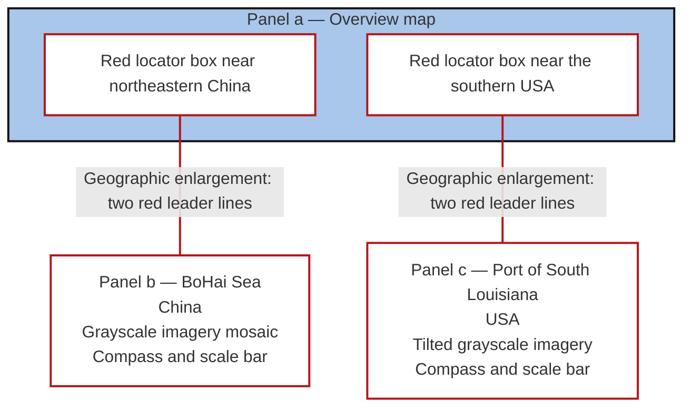

The connectors intentionally have no arrowheads. Each Mermaid connector summarizes the pair of red leader lines in the original figure; it does not specify a direction of travel or computation.

## 4. Panel descriptions

| Panel | Position | Visible label | Geographic role | Visible content |
| --- | --- | --- | --- | --- |
| a | Full-width upper panel | `a`, `CHINA`, `USA` | Shows where the two study areas lie relative to Asia, the Pacific Ocean, and North America. | Pale land, blue ocean, country/coastal outlines, and two small red locator rectangles. |
| b | Lower left | `b`, `BoHai Sea` | Enlarges the locator rectangle near northeastern China. | Several overlapping grayscale image strips or footprints across the sea area, surrounding coastal outlines, geographic coordinate labels, a compass rose, and a scale bar. |
| c | Lower right | `c`, `Port of South Louisiana` | Enlarges the locator rectangle near the southern USA. | Coastal outlines and a large tilted grayscale image footprint, with lighter imagery toward the left; geographic coordinate labels, a compass rose, and a scale bar. |

### Panel b: BoHai Sea

- **Country:** China, established by the overview and its locator connection.
- **Printed area label:** `BoHai Sea`.
- **Common spelling:** Bohai Sea.
- **Orientation marker:** Compass rose in the upper-right corner, with north pointing upward.
- **Coordinate notation:** Latitude north and longitude east, printed around the map edges.
- **Scale-bar labels:** `0`, `12.5`, `25`, `50`, `75`, `100`; unit: `Miles`.
- **Imagery appearance:** Grayscale strips with different brightness levels and visible overlaps. White or pale areas show the surrounding map background and land/coastal context.

### Panel c: Port of South Louisiana

- **Country:** USA, established by the overview and its locator connection.
- **Printed area label:** `Port of South Louisiana`, split over two lines.
- **Orientation marker:** Compass rose in the upper-right corner, with north pointing upward.
- **Coordinate notation:** Latitude north and longitude west, printed around the map edges.
- **Scale-bar labels:** `0`, `10`, `20`, `40`, `60`, `80`; unit: `Miles`.
- **Imagery appearance:** A prominent tilted grayscale footprint covers the coastal and offshore area. Brightness varies across it.

## 5. Structured semantic representation

```yaml
figure:
  id: figure_1
  caption: "Geographical location of the sea areas in this study."
  type: geographic_locator_with_regional_insets
  panel_count: 3
  layout:
    upper_row: [panel_a]
    lower_row: [panel_b, panel_c]

  panels:
    panel_a:
      label: "a"
      role: geographic_overview
      printed_country_labels: ["CHINA", "USA"]
      border_color: black
      contains_locators: [locator_b, locator_c]

    panel_b:
      label: "b"
      printed_title: "BoHai Sea"
      normalized_place_name: "Bohai Sea"
      country: "China"
      role: enlarged_study_area
      border_color: red
      imagery: overlapping_grayscale_footprints
      compass_position: upper_right
      scale_bar_position: lower_left
      scale_bar_unit_as_printed: "Miles"
      scale_bar_values: [0, 12.5, 25, 50, 75, 100]
      coordinate_hemispheres:
        latitude: north
        longitude: east

    panel_c:
      label: "c"
      printed_title: "Port of South Louisiana"
      country: "USA"
      role: enlarged_study_area
      border_color: red
      imagery: tilted_grayscale_footprint_with_brightness_variation
      compass_position: upper_right
      scale_bar_position: lower_left
      scale_bar_unit_as_printed: "Miles"
      scale_bar_values: [0, 10, 20, 40, 60, 80]
      coordinate_hemispheres:
        latitude: north
        longitude: west

  locators:
    locator_b:
      parent_panel: panel_a
      shape: red_rectangle
      position_description: near_northeastern_China
      corresponding_detail_panel: panel_b
    locator_c:
      parent_panel: panel_a
      shape: red_rectangle
      position_description: near_southern_USA
      corresponding_detail_panel: panel_c

  relationships:
    - locator: locator_b
      detail_panel: panel_b
      relation: geographic_enlargement
      connector: two_red_leader_lines
      arrowheads: false
    - locator: locator_c
      detail_panel: panel_c
      relation: geographic_enlargement
      connector: two_red_leader_lines
      arrowheads: false

  imagery_context:
    visually_observed: grayscale_remote_sensing_imagery
    identified_by_accompanying_paper: synthetic_aperture_radar
```

## 6. Interpretation limits

- This figure establishes study-area locations and displays imagery coverage; it does not show a neural-network architecture or an oil-spill detection workflow.
- The red rectangles and lines identify locations and their enlarged views. They do not mark detected oil spills.
- Grayscale brightness alone does not establish the presence of oil, identify a ship, or identify a discharge source in this figure.
- The image does not provide a legend translating grayscale intensity into a measured quantity.
- Exact coordinate tick values are not transcribed because the small labels are not consistently legible at the supplied resolution. No exact geographic bounds are inferred.
- Satellite names, acquisition times, projection details, and model outputs are not specified by this image.
- The structured representation preserves the figure's geographic relationships and visual organization; it is not a georeferenced map or a pixel-exact reconstruction.


The detection objects were oil slicks of unknown origin and OOSs. An oil slick of unknown origin refers to oil pollution far from the discharge source. Over time, oil slicks take on different forms. An ongoing OOS was the primary focus of this study. It is long, black, and belt-shaped with its narrow end connected to a white spot representing the discharge source.

### 2.5. Improving the YOLOv8 model

YOLOv8 has become the most reliable model in the YOLO series because of its advanced network structure (Fig. 2a), flexible deployment, and broad application potential. However, it still encounters many challenges in detecting OOSs in SAR images. It is difficult to distinguish between an OOS and an oil slick of unknown origin because the number of training samples is limited, and the satellite image is too large. These factors adversely affect the detection accuracy. Therefore, it was necessary to improve the model.

The LSK module was integrated into the model to improve its ability to distinguish between OOSs and oil slicks of unknown origin. The LSK module is an attention mechanism used for detecting objects in remote-sensing images (Li et al., 2023), which is fully described in Supporting Text S1. This module enhances the ability of the model to capture the shape features that distinguish linear OOSs from irregular slicks by leveraging its dynamic large receptive field, allowing the model to focus more comprehensively on object features and obtain rich background information for object recognition.

Owing to the limited number of training samples, the MPDIoU loss function (Ma and Xu, 2023) was used to replace the CIoU loss function in the YOLOv8 model, which is fully described in Supporting Text S2. Compared to CIoU, MPDIoU offers faster convergence and superior accuracy for localizing oil spills of varying scales, which is crucial given our limited and diverse dataset. This loss function can effectively prevent overfitting in the case of insufficient training samples while improving the box-positioning prediction accuracy and generalisability of the model.

In the prediction stage, the SAHI module is used (Akyon et al., 2022), which is fully described in Supporting Text S3. This module effectively reduces the feature loss caused by compressing high-resolution images and adapts to input images with different resolutions.

Among these three enhancements, the attention mechanism improves the detection and classification accuracy. However, excessive addition may increase the computational complexity and lead to model overfitting, thereby reducing the detection performance. Therefore, how the LSK module influences performance was investigated at different locations in the model's architecture (Fig.2b). In the experiment, it was integrated at five different locations: before the SPPF module (L1), in front of the small object head (L2), in front of the middle object head (L3), in front of the large object head (L4), and in front of all object heads (L5).

# Figure 2 — YOLOv8 structure and LSK integration positions

**Original caption:** Fig. 2. Schematic structure of the YOLOv8 model and the different fusion positions of the LSK module.

## 1. How to read this transcription

The figure has two panels:

- **Panel a:** The model overview, from the input image through the backbone and neck to three detection heads and example outputs.
- **Panel b:** Five alternative locations/configurations, L1–L5, for inserting an `LSK Block`.

The top cyan block is transcribed exactly as **`SHIA`**, which is what the image prints. This file does not silently change it to another acronym.

Two kinds of schematic are provided below. The overview and backbone use arrows to express the evident stage order. The detailed neck uses **undirected connections** to preserve the visible wires: the source does not supply arrowheads or enough implementation detail to establish every internal computational dependency. Junction IDs are transcription aids, not additional neural-network operations.

## 2. Legend and visual groups

| Printed element | Representation in the image | Meaning used in this transcription |
| --- | --- | --- |
| `Conv` | White rounded rectangle | Convolution block; parameters are not shown. |
| `C2f` | Blue rounded rectangle | A block labeled C2f; its internal architecture is not shown. |
| `SPPF` | Green tapered block at the backbone bottom | A block labeled SPPF; its internal architecture is not shown. |
| `C` | Small white rounded square | `Concat`, as defined by the legend. |
| `U` | Small white rounded square | `Upsample`, as defined by the legend. |
| `Small`, `Medium`, `Large` | Vertical green blocks | The three detection heads, ordered from top to bottom. |
| `LSK Block` | Orange rounded rectangle | The module inserted at the alternative locations in panel b. |
| Pale green dashed enclosure | Backbone group | Groups the sequential backbone blocks. |
| Pale blue dashed enclosure | `FPNPAN Neck` group | Groups the feature-combination blocks and wires. |
| Pale orange dashed enclosure | Integration position/group | Highlights an LSK insertion site or the three L5 sites. |
| Blue boxes on grayscale examples | Output annotations | Illustrated detection bounding boxes; no scores or coordinates are given. |

## 3. Overall architecture: panel a

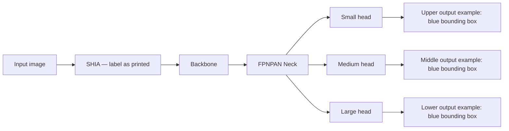

The three heads are parallel branches. They are not a sequence of Small → Medium → Large. The output column shows three grayscale examples inside red dashed borders, each with a blue detection box.

## 4. Backbone sequence and lateral taps

The following order is read from top to bottom in the green enclosure. Numeric IDs distinguish repeated labels and are not printed in the source.

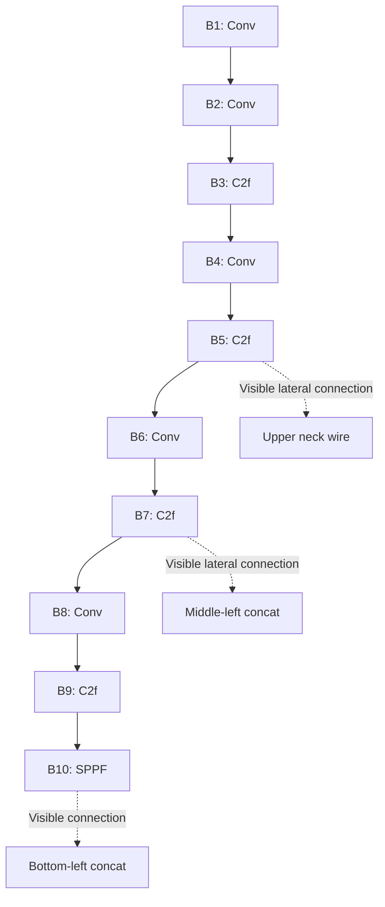

**Backbone chain:** Conv → Conv → C2f → Conv → C2f → Conv → C2f → Conv → C2f → SPPF.

**Visible taps:** the second C2f block (B5), the third C2f block (B7), and SPPF (B10). The first and fourth C2f blocks have no separate lateral output drawn in panel a.

## 5. Neck: literal wire schematic

### 5.1 Block inventory

The blue enclosure contains four C2f blocks, four Concat blocks, two Upsample blocks, and two Conv blocks. Their positions distinguish them:

| ID | Printed label | Position |
| --- | --- | --- |
| CT | C | Top row, before the top C2f. |
| FT | C2f | Top row, adjacent to the Small head. |
| CML | C | Middle row, left. |
| FML | C2f | Middle row, left C2f. |
| CMR | C | Middle row, between the two C2f blocks. |
| FMR | C2f | Middle row, right C2f, adjacent to the Medium head. |
| CB | C | Bottom row, left. |
| FB | C2f | Bottom row, adjacent to the Large head's horizontal wire. |
| UT | U | Upper upsampling connection. |
| UB | U | Lower upsampling connection. |
| VU | Conv | Right side, between the top and middle rows. |
| VL | Conv | Right side, between the middle and bottom rows. |

### 5.2 Connections as drawn

In this diagram, `---` means **connected by a visible wire**, not “must execute before.” The four small junction nodes explicitly preserve branching points in the drawing.

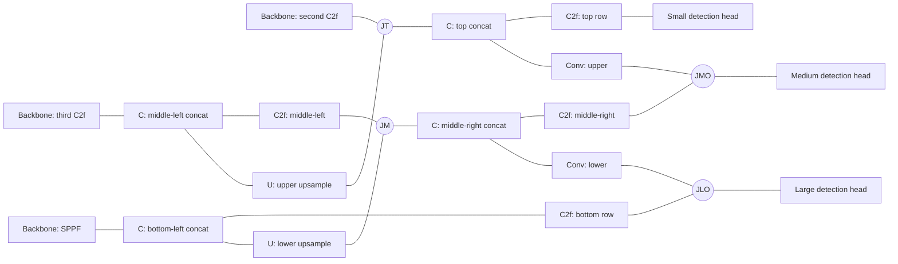

| Junction ID | Visible location |
| --- | --- |
| JT | Upper wire where the B5 lateral connection, the upper Upsample wire, and the top Concat meet. |
| JM | Wire after the middle-left C2f, also connected to the lower Upsample and middle-right Concat. |
| JMO | Medium-head input wire, where the middle-right C2f wire meets the upper Conv's routed wire. |
| JLO | Large-head input wire, where the bottom C2f wire meets the lower Conv's routed wire. |

**Important fidelity note:** The source draws the upper Conv branch from the top Concat region to the Medium-head input wire, and the lower Conv branch from the middle-right Concat region to the Large-head input wire. The diagram above preserves those visible connections. It does not silently replace them with a presumed conventional YOLOv8 implementation. A runnable, fully directed neck configuration would need implementation details beyond this figure.

## 6. LSK insertion configurations: panel b

The orange modules are labeled `LSK Block`. The pale blue shapes feeding the heads in panel b are unlabeled feature-source placeholders; their internal layers are not specified.

| Configuration | Insertion site | Number of LSK blocks shown in that configuration | Heads affected by direct pre-head insertion |
| --- | --- | --- | --- |
| L1 | After the final backbone C2f and before SPPF. | 1 | None directly; this is a backbone insertion. |
| L2 | Immediately before the Small head. | 1 | Small only. |
| L3 | Immediately before the Medium head. | 1 | Medium only. |
| L4 | Immediately before the Large head. | 1 | Large only. |
| L5 | Immediately before all three heads, using one LSK block on each branch. | 3 | Small, Medium, and Large. |

```mermaid
flowchart TB
    subgraph L1["L1 — Backbone insertion"]
        direction LR
        L1C["Final backbone Conv"] --> L1F["Final backbone C2f"]
        L1F --> L1K["LSK Block"] --> L1P["SPPF"]
    end
    subgraph L2["L2 — Small head only"]
        direction LR
        L2F["Small-head input features"] --> L2K["LSK Block"] --> L2H["Small"]
    end
    subgraph L3["L3 — Medium head only"]
        direction LR
        L3F["Medium-head input features"] --> L3K["LSK Block"] --> L3H["Medium"]
    end
    subgraph L4["L4 — Large head only"]
        direction LR
        L4F["Large-head input features"] --> L4K["LSK Block"] --> L4H["Large"]
    end
    subgraph L5["L5 — Three parallel pre-head insertions"]
        direction LR
        L5FS["Small-head input features"] --> L5KS["LSK Block: small branch"] --> L5HS["Small"]
        L5FM["Medium-head input features"] --> L5KM["LSK Block: medium branch"] --> L5HM["Medium"]
        L5FL["Large-head input features"] --> L5KL["LSK Block: large branch"] --> L5HL["Large"]
    end
```

### Configuration rules

- L1–L5 describe alternative placement configurations, not five successive operations.
- L5 combines the three head-insertion locations illustrated separately by L2, L3, and L4.
- L5 does not additionally include L1 in this drawing.
- The three LSK blocks in L5 process their respective head branches in parallel; they are not a serial chain.
- The image does not state that the three L5 blocks share parameters.
- The internal layers, kernel sizes, and mathematical operations of an LSK Block are not drawn here.

## 7. Machine-readable architecture description

This JSON is valid structured data. `neck_visible_wiring.edges` are unordered endpoint pairs representing visible connectivity; they must not be interpreted as directed computational edges. The remaining ordering and placement fields have the meanings stated above.

```json
{
  "figure_id": "Fig. 2",
  "caption": "Schematic structure of the YOLOv8 model and the different fusion positions of the LSK module.",
  "panels": {
    "a": "model_overview",
    "b": "alternative_LSK_integration_positions"
  },
  "printed_labels": {
    "input_side_block": "SHIA",
    "major_stages": [
      "Input",
      "Backbone",
      "FPNPAN Neck",
      "Head",
      "Output"
    ],
    "legend": {
      "C": "Concat",
      "U": "Upsample",
      "green_block": "Detect layer"
    }
  },
  "overview": {
    "semantic_order": [
      "Input",
      "SHIA",
      "Backbone",
      "FPNPAN Neck",
      "Head",
      "Output"
    ],
    "direction_status": "interpreted_from_layout_and_stage_labels",
    "output_branches": [
      "Small",
      "Medium",
      "Large"
    ]
  },
  "backbone": {
    "order_top_to_bottom": [
      {
        "id": "B1",
        "printed_label": "Conv"
      },
      {
        "id": "B2",
        "printed_label": "Conv"
      },
      {
        "id": "B3",
        "printed_label": "C2f"
      },
      {
        "id": "B4",
        "printed_label": "Conv"
      },
      {
        "id": "B5",
        "printed_label": "C2f"
      },
      {
        "id": "B6",
        "printed_label": "Conv"
      },
      {
        "id": "B7",
        "printed_label": "C2f"
      },
      {
        "id": "B8",
        "printed_label": "Conv"
      },
      {
        "id": "B9",
        "printed_label": "C2f"
      },
      {
        "id": "B10",
        "printed_label": "SPPF"
      }
    ],
    "lateral_taps": {
      "B5": "upper_neck_wire",
      "B7": "middle_left_concat",
      "B10": "bottom_left_concat"
    }
  },
  "neck_visible_wiring": {
    "edge_semantics": "undirected_visible_wire_connection",
    "direction_not_encoded": true,
    "junction_ids_are_transcription_aids": [
      "JT",
      "JM",
      "JMO",
      "JLO"
    ],
    "nodes": {
      "B5": "Backbone: second C2f",
      "B7": "Backbone: third C2f",
      "B10": "Backbone: SPPF",
      "CT": "C: top concat",
      "FT": "C2f: top row",
      "CML": "C: middle-left concat",
      "FML": "C2f: middle-left",
      "CMR": "C: middle-right concat",
      "FMR": "C2f: middle-right",
      "CB": "C: bottom-left concat",
      "FB": "C2f: bottom row",
      "UT": "U: upper upsample",
      "UB": "U: lower upsample",
      "VU": "Conv: upper",
      "VL": "Conv: lower",
      "JT": "Junction: upper lateral wire",
      "JM": "Junction: middle-left C2f output",
      "JMO": "Junction: medium-head input wire",
      "JLO": "Junction: large-head input wire",
      "HS": "Small detection head",
      "HM": "Medium detection head",
      "HL": "Large detection head"
    },
    "edges": [
      [
        "B5",
        "JT"
      ],
      [
        "JT",
        "CT"
      ],
      [
        "CT",
        "FT"
      ],
      [
        "FT",
        "HS"
      ],
      [
        "B7",
        "CML"
      ],
      [
        "CML",
        "FML"
      ],
      [
        "FML",
        "JM"
      ],
      [
        "JM",
        "CMR"
      ],
      [
        "CMR",
        "FMR"
      ],
      [
        "FMR",
        "JMO"
      ],
      [
        "JMO",
        "HM"
      ],
      [
        "B10",
        "CB"
      ],
      [
        "CB",
        "FB"
      ],
      [
        "FB",
        "JLO"
      ],
      [
        "JLO",
        "HL"
      ],
      [
        "CML",
        "UT"
      ],
      [
        "UT",
        "JT"
      ],
      [
        "CB",
        "UB"
      ],
      [
        "UB",
        "JM"
      ],
      [
        "CT",
        "VU"
      ],
      [
        "VU",
        "JMO"
      ],
      [
        "CMR",
        "VL"
      ],
      [
        "VL",
        "JLO"
      ]
    ]
  },
  "heads": {
    "HS": {
      "printed_label": "Small",
      "position": "upper",
      "output": "upper_grayscale_example_with_blue_box"
    },
    "HM": {
      "printed_label": "Medium",
      "position": "middle",
      "output": "middle_grayscale_example_with_blue_box"
    },
    "HL": {
      "printed_label": "Large",
      "position": "lower",
      "output": "lower_grayscale_example_with_blue_box"
    }
  },
  "LSK_variants": {
    "L1": {
      "insert_before": "B10",
      "insert_after": "B9",
      "lsk_block_count": 1,
      "target": "backbone_before_SPPF"
    },
    "L2": {
      "insert_before_heads": [
        "HS"
      ],
      "lsk_block_count": 1,
      "target": "small_head_only"
    },
    "L3": {
      "insert_before_heads": [
        "HM"
      ],
      "lsk_block_count": 1,
      "target": "medium_head_only"
    },
    "L4": {
      "insert_before_heads": [
        "HL"
      ],
      "lsk_block_count": 1,
      "target": "large_head_only"
    },
    "L5": {
      "insert_before_heads": [
        "HS",
        "HM",
        "HL"
      ],
      "lsk_block_count": 3,
      "target": "all_three_heads"
    }
  },
  "variant_rules": [
    "L1, L2, L3, L4, and L5 are alternative placement configurations.",
    "L5 places an LSK block before each of the three heads; these are parallel branch placements.",
    "L5 does not include the L1 pre-SPPF placement in the drawing.",
    "Shared weights between the three L5 blocks are not specified.",
    "Internal operations and parameters of each LSK Block are not shown."
  ],
  "not_specified": [
    "Meaning or expansion of SHIA within this image",
    "Input tensor dimensions and channel count",
    "Per-layer channel counts, kernel sizes, and strides",
    "C2f repeat counts and internal wiring",
    "Upsampling factor and interpolation method",
    "Concatenation axis and input ordering",
    "Fully directed neck computation graph",
    "Detection-head internals, classes, confidence thresholds, and post-processing"
  ]
}
```

## 8. What cannot be reconstructed from this figure alone

The image does not specify the input tensor shape, per-layer channel counts, Conv kernel sizes or strides, C2f repetition counts, upsampling factors, concatenation axis/input order, detection-head internals, training settings, or post-processing parameters. It also does not expand `SHIA` or show the internal LSK architecture.

Accordingly, this file is a schematic transcription with explicit connectivity and insertion rules, not an executable model configuration. Any implementation should resolve the ambiguous internal neck direction and the `SHIA` label from the actual implementation or additional source material.


### 2.6. Evaluating the models' performances

The model's performance was evaluated using the Mean Average Precision (mAP) metric, which measures the average precision across all categories. The mAP metric comprehensively reflects the model's ability model to detect, classify, and localise objects.

mAP values are calculated using the following formula:

$$
AP=\int_0^1 p(r)dr
$$

$$
mAP=\frac{1}{N}\sum_{i=1}^{N}AP_i
$$

where AP<sub>i</sub> represents the area under the precision-recall (P-R) curve of each object category. This study used mAP0.5–0.95, which averages mAP values over ten IoU thresholds (from 0.5 to 0.95 in 0.05 increments), to obtain a more comprehensive performance assessment than mAP0.5, which evaluates only a single IoU threshold.

### 2.7. Training details and parameters

All experiments were conducted on an experimental platform equipped with an NVIDIA RTX 4090 GPU. We adopted the default hyperparameter settings provided by the official YOLOv8 framework to ensure a standardized and reproducible baseline, as our primary focus was on the architectural improvements rather than extensive hyperparameter tuning. The following training parameters were used: epochs = 100, batch = 32, image size = 1024, cuda device = 0, workers = 8, learning rate = 0.01, and val = true.

The LSK module was implemented with the best default parameters, as proposed in the original study (Li et al., 2023), with the settings kept consistent across all experiments to ensure a fair comparison of model performance.

## 3. Results and discussion

### 3.1. The improved YOLOv8 model's performance on the testing set

Integrating or replacing multiple functional modules in a model affects performance unpredictably. The experiment set the integration positions for multiple sets of LSK modules (L1-L5). It compared the effects of integrating LSK modules individually with the combined use of the MPDIoU and LSK modules.

The experimental results (Table. 1) show that when the LSK modules were integrated at different positions without MPDIoU, respectively, the average mAPs of the YOLOv8-LSK model increased by 2.5 % (L1), 0.1 % (L2), 0.9 % (L3), 0.2 % (L4), and 1.4 % (L5) compared to the original YOLOv8 model. When using the MPDIoU loss function, the average mAP of the YOLOv8 model increased by 0.3 %, whereas the average mAPs of the YOLOv8-LSK model increased by 2.3 % (L1), 3.3 % (L2), 1.6 % (L3), and 3.3 % (L5) compared to the original YOLOv8 model. However, when the LSK module was integrated at the L4 position, the average mAP value decreased by 0.8 %. In comparison, the effect of LSK-MPDIoU collaborative improvement was found to be best at the L2 and L5 positions. The YOLOv8-LSK model achieved the highest average mAP of 71.6 % at both positions, which increased by 3.3 % compared to the original model.

At the L2 position, the LSK module was optimised for a small object detection head, and its dynamic receptive field mechanism focused on improving the representation of the local features of small oil spills. The MPDIoU improved the matching accuracy of small oil spill boundary boxes, thereby reducing the noise introduced by dynamically adjusting the receptive field. Due to the YOLOv8-LSK (L2) model's advantages, it is more suitable for detecting small oil spills in certain scenarios. The LSK module at the L5 position acts on all object detection heads simultaneously, which dynamically allocates feature extraction weights for targets of different scales by balancing the semantic information and detail retention ability of different feature levels. This enhances its ability to detect objects of different sizes in complex scenes. YOLOv8-LSK (L5) shows a more balanced and accurate detection performance in complex scenes with a wide distribution of oil spill sizes.

**Table 1**

The mean average precision (mAPs) of the YOLOv8 model when the large selective kernel (LSK) module is fused at different positions and whether the minimum point distance intersection over union (MPDIoU) loss function is used.

| Model | LSK integration | IoU | mAP (%)<br>Oil slick of an unknown origin | mAP (%)<br>OOS | mAP (%)<br>Average |
| --- | --- | --- | --- | --- | --- |
| YOLOv8- | / | / | 70.8 | 65.7 | 68.3 |
| | L1 | | 70.7 | 70.8 | 70.8 |
| | L2 | | 70.3 | 66.2 | 68.3 |
| | L3 | | 71.3 | 67.0 | 69.2 |
| | L4 | | 72.0 | 64.8 | 68.5 |
| | L5 | | 70.3 | 69.1 | 69.7 |
| | / | MPDIoU | 69.7 | 67.5 | 68.6 |
| | L1 | | 72.0 | 69.2 | 70.6 |
| | L2 | | 71.2 | 72.0 | 71.6 |
| | L3 | | 73.5 | 66.3 | 69.9 |
| | L4 | | 71.8 | 63.1 | 67.5 |
| | L5 | | 69.8 | 73.4 | 71.6 |

### 3.2. Visual comparison of the improved YOLOv8 model in different detection scenarios

To evaluate the practical application of the YOLOv8-LSK (L2) and (L5) models, Bohai SAR images from January to March 2021 were used for a visual comparison (Fig. 3–5). Three detection scenes were evaluated: detection of oil slicks of unknown origin (Fig. 3), OOSs (Fig. 4), and environmental interference (Fig. 5).

In detecting oil slicks with an unknown origin (Fig. 3), Scene (a) had three regularly shaped oil slicks; all three models were correctly detected, and YOLOv8-LSK(L2) detected an additional tiny dark spot. Scene (b) had two irregularly shaped oil slicks, and all three models detected them correctly. However, YOLOv8-LSK(L2) contains a redundant bounding box. Scene (c) involved a small oil slick and a small OOS with blurred boundaries. All three models detected small oil slicks, but only YOLOv8-LSK(L2) detected a small OOS. Scene (d) contained two broken-shaped oil slicks. All three models detected oil slicks on the right-hand side, but only YOLOv8-LSK(L5) detected narrow and broken oil slicks on the left-hand side. Scene (e) had two irregularly shaped oil slicks, which all models detected correctly.

In OOS detection (Fig. 4), Scene (a) shows the running wake of a ship in a low-wind area, and YOLOv8 and YOLOv8-LSK(L2) incorrectly identified the running wake of the ship as an OOS. Scene (b) included two oil slicks and one OOS. Two oil slicks were detected in all three models. YOLOv8-LSK(L5) accurately detected an OOS and YOLOv8-LSK (L2) detected a tiny dark spot. In Scene (c) there is an OOS that only YOLOv8-LSK(L5) correctly identified, whereas YOLOv8-LSK(L2) incorrectly classified the OOS as an oil slick. Scene (d) included an OOS and two small oil slicks. All three models detected small amounts of oil slicks. Only YOLOv8-LSK(L5) correctly classified and detected the OOS but produced a redundant bounding box for oil slicks. Scene (e) shows a low-wind area and a choppy environment with two OOSs and one oil slick. All three models detected one oil slick, while YOLOv8-LSK(L2) and YOLOv8-LSK(L5) detected only one OOS.

In the presence of look-alike images (Fig. 5), Scenes (a-e) represent SAR images including sea ice, low-wind areas, waves, biological oil slicks, and the running wakes of ships. No oil spills occurred in these scenes. The YOLOv8 model generated 14 false positives, while YOLOv8-LSK(L2) and YOLOv8-LSK(L5) generated five false positives.

The results of the visual comparison show that the three models have a high detection performance for oil slicks of unknown origin with clear boundaries and high colour contrast. Among them, the YOLOv8-LSK (L2) model has a higher sensitivity to small objects but also unnecessarily detects small dark spots. The YOLOv8 and YOLOv8-LSK (L2) models failed to detect and classify OOSs accurately. In contrast, the YOLOv8-LSK (L5) model showed the best detection and classification accuracy for OOSs while effectively reducing false detections caused by environmental factors. Therefore, YOLOv8-LSK (L5) was used as the final model. The final architecture of the proposed YOLOv8-LSK model, which integrates LSK attention mechanism and the SAHI pipeline, is shown in Fig. 6.

### 3.3. Applying the YOLOv8-LSK model to detect OOSs

The SAR images in the application case were taken in 2023 at TPSL, United States. Figs. 7–9 shows three typical OOSs detected by YOLOv8-LSK.

Based on C-band VV data acquired by Sentinel-1 at 00:02 UTC on 9 April 2023 the first OOS event was detected using the improved YOLOv8-LSK model (Fig. 7a). The oil spill exhibits narrow, banded characteristics, extending approximately 5.5 km north to south, and its northern tip is associated with the suspected source of the oil spill (Fig. 7b), which is located at 29◦6′58.176′N, 89◦37′8.076′W. In the SAR image, the oil platform and ship appear as a white spot, and this white spot and the nearby white spots (Fig. 7b) correspond very well with the position of the oil platform group in the electronic chart (Fig. 7c). In combination with the AIS data, there is no distribution of ship trajectories in the object area (radius 5 km), which excludes the possibility of ship operation or accidental oil spill and confirms that the incident is an OOS caused by oil platform leakage.

# Figure 3 — Visual comparison of oil-slick detection results

**Original caption:** Fig. 3. Visual comparison of the detection results of the YOLOv8, YOLOv8-LSK (L₂), and YOLOv8-LSK (L₅) models for unknown source oil slick.

## 1. Schematic organization

This figure is a **3-row × 5-column comparison matrix**, containing 15 result images. It is a results comparison, not a neural-network layer architecture.

- **Rows identify models:** YOLOv8; YOLOv8-LSK (L₂); YOLOv8-LSK (L₅), from top to bottom.
- **Columns identify scenes:** Scene (a), Scene (b), Scene (c), Scene (d), and Scene (e), from left to right.
- Compare **vertically** to examine different models on the same scene.
- Compare **horizontally** to examine one model across different scenes.

```text
                         Scene (a)  Scene (b)  Scene (c)  Scene (d)  Scene (e)
                         ---------  ---------  ---------  ---------  ---------
YOLOv8                      A1         B1         C1         D1         E1
YOLOv8-LSK (L2)             A2         B2         C2         D2         E2
YOLOv8-LSK (L5)             A3         B3         C3         D3         E3

Example: D3 = Scene (d), processed by YOLOv8-LSK (L5).
```

## 2. Comparison schematic

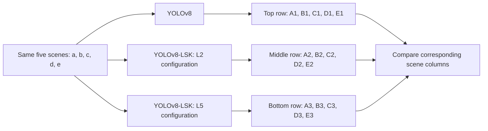

This is an explanatory comparison schematic. It does not imply that the three models run sequentially, share parameters, or combine their predictions.

## 3. Annotation conventions

| Visible element | Meaning and limitation |
| --- | --- |
| Grayscale image in each cell | Background scene being compared. |
| Red rectangles and labels | Predicted region annotations; larger readable labels say `oil slick`. |
| Cyan annotation in Scene (c), L2 row | An additional annotation in a different color. The class text and complete tiny box outline are not reliably legible. |
| Decimal number beside a readable label | Displayed confidence value, not independently measured detection accuracy. |
| Overlapping boxes | Multiple displayed predictions; not necessarily multiple distinct objects. |
| Tiny or incomplete marker | A visible annotation whose full rectangle cannot be reliably resolved at this resolution. |
| Black wedges in Scenes (b) and (d) | Visible black image regions. Their cause is not specified by the figure. |

The figure does not provide a separate ground-truth layer. This transcription therefore describes **what each model displays**, without declaring predictions correct or incorrect.

## 4. Compact annotation matrix

Counts below refer to **displayed annotations**, including the explicitly qualified tiny or partial marks. They are not counts of confirmed oil spills or distinct true objects.

| Model | Scene (a) | Scene (b) | Scene (c) | Scene (d) | Scene (e) |
| --- | --- | --- | --- | --- | --- |
| YOLOv8 | 3 red boxes | 2 red boxes | 1 tiny red annotation | 1 red box, right | 2 red boxes |
| YOLOv8-LSK (L₂) | 4 clear red rectangles, including an overlapping lower pair, plus 1 tiny right-edge annotation | 3 red boxes, including an additional lower-left box | 1 tiny red annotation + 1 cyan annotation | 1 red box, right | 2 red boxes |
| YOLOv8-LSK (L₅) | 3 red boxes | 2 red boxes | 1 tiny red annotation | 2 red boxes: narrow left and right | 2 red boxes |

## 5. Scene-by-scene comparison

### Scene (a)

**Background:** Gray background with three prominent narrow dark features arranged from upper left toward lower right.

| Model | Visible result |
| --- | --- |
| YOLOv8 | Three separate red boxes: upper-left, middle, and lower-right features. |
| YOLOv8-LSK (L₂) | Four clearly visible red rectangles, including two overlapping rectangles around the lower feature, plus one tiny red annotation near the right edge. The tiny annotation is not a fully resolved rectangle. |
| YOLOv8-LSK (L₅) | Three separate red boxes corresponding to the three prominent features; no overlapping lower pair or extra right-edge annotation is visible. |

### Scene (b)

**Background:** Dark background with a large diagonal irregular dark feature and a smaller feature near its lower-right end; a black wedge is visible along the lower edge.

| Model | Visible result |
| --- | --- |
| YOLOv8 | One large red box around the central diagonal feature and one small red box near its lower-right end. |
| YOLOv8-LSK (L₂) | One large red box and two smaller boxes near its lower-left and lower-right portions. The lower-left small box is additional relative to the first row. |
| YOLOv8-LSK (L₅) | One large red box around the central diagonal feature and one smaller red box near its lower-right end. |

### Scene (c)

**Background:** Light gray textured background; a tiny annotated feature near the top and a faint lower feature highlighted only in the second row.

| Model | Visible result |
| --- | --- |
| YOLOv8 | One tiny red annotation near the top. No cyan annotation is visible. |
| YOLOv8-LSK (L₂) | One tiny red annotation near the top and one cyan annotation near the bottom. The cyan mark and label are visible, but its complete box outline and class text are not clearly resolved. |
| YOLOv8-LSK (L₅) | One tiny red annotation near the top. No cyan annotation is visible. |

### Scene (d)

**Background:** Dark gray background with a narrow irregular feature on the left, a shorter feature on the right, and a black wedge along the bottom.

| Model | Visible result |
| --- | --- |
| YOLOv8 | One red box on the right-hand feature. The narrow left-hand feature is not enclosed by a red box. |
| YOLOv8-LSK (L₂) | One red box on the right-hand feature; no red box encloses the narrow left-hand feature. |
| YOLOv8-LSK (L₅) | One tall, narrow red box around the left-hand feature, plus one red box on the right-hand feature. |

### Scene (e)

**Background:** Gray background with a small dark feature in the upper-left area and a larger irregular dark feature below it.

| Model | Visible result |
| --- | --- |
| YOLOv8 | Two red boxes: a small upper box and a larger lower box. |
| YOLOv8-LSK (L₂) | Two red boxes: a small upper box and a larger lower box. |
| YOLOv8-LSK (L₅) | Two red boxes: a small upper box and a larger lower box. |

## 6. Reliably legible confidence labels

The following values are readable in Scenes (d) and (e). Confidence values elsewhere are left untranscribed because their small labels are not reliably legible. No values are reconstructed from the surrounding paper or inferred from color.

| Scene | Model | Annotation position within the scene | Printed class | Confidence |
| --- | --- | --- | --- | --- |
| (d) | YOLOv8 | right | oil slick | 0.88 |
| (d) | YOLOv8-LSK (L₂) | right | oil slick | 0.92 |
| (d) | YOLOv8-LSK (L₅) | left narrow | oil slick | 0.51 |
| (d) | YOLOv8-LSK (L₅) | right | oil slick | 0.92 |
| (e) | YOLOv8 | upper | oil slick | 0.84 |
| (e) | YOLOv8 | lower | oil slick | 0.92 |
| (e) | YOLOv8-LSK (L₂) | upper | oil slick | 0.89 |
| (e) | YOLOv8-LSK (L₂) | lower | oil slick | 0.95 |
| (e) | YOLOv8-LSK (L₅) | upper | oil slick | 0.88 |
| (e) | YOLOv8-LSK (L₅) | lower | oil slick | 0.97 |

## 7. Main visible differences

1. **Scene (a):** L2 displays additional annotations, including overlapping boxes around the lower feature and a tiny right-edge mark. YOLOv8 and L5 show three separated boxes.
2. **Scene (b):** L2 adds a small lower-left box overlapping the large central box. YOLOv8 and L5 each show two boxes.
3. **Scene (c):** Only L2 displays the lower cyan annotation. All three rows show the tiny upper red annotation.
4. **Scene (d):** Only L5 encloses the narrow left-hand feature with a red box. All three rows annotate the right-hand feature.
5. **Scene (e):** All three rows display two red boxes, with differences in their displayed confidence values and box placement.

These observations describe visual differences only. More boxes, fewer boxes, or higher confidence do not by themselves establish better accuracy.

## 8. Machine-readable representation

Each entry in `cells` corresponds to one model–scene pair. `null` means a fact is not established from the image. Counts include the explicitly flagged tiny/partial annotations; overlapping boxes remain separate displayed annotations. All positions are relative to their individual scene cell, not geographic coordinates.

```json
{
  "figure_id": "Fig. 3",
  "caption": "Visual comparison of the detection results of the YOLOv8, YOLOv8-LSK (L₂), and YOLOv8-LSK (L₅) models for unknown source oil slick.",
  "figure_type": "model_by_scene_visual_comparison_matrix",
  "layout": {
    "rows": 3,
    "columns": 5,
    "cell_count": 15,
    "row_axis": "model",
    "column_axis": "scene"
  },
  "models": [
    {
      "id": "yolov8",
      "label": "YOLOv8",
      "row": 1
    },
    {
      "id": "yolov8_lsk_l2",
      "label": "YOLOv8-LSK (L₂)",
      "row": 2
    },
    {
      "id": "yolov8_lsk_l5",
      "label": "YOLOv8-LSK (L₅)",
      "row": 3
    }
  ],
  "scenes": [
    {
      "id": "a",
      "label": "Scene (a)",
      "column": 1,
      "appearance": "Gray background with three prominent narrow dark features arranged from upper left toward lower right."
    },
    {
      "id": "b",
      "label": "Scene (b)",
      "column": 2,
      "appearance": "Dark background with a large diagonal irregular dark feature and a smaller feature near its lower-right end; a black wedge is visible along the lower edge."
    },
    {
      "id": "c",
      "label": "Scene (c)",
      "column": 3,
      "appearance": "Light gray textured background; a tiny annotated feature near the top and a faint lower feature highlighted only in the second row."
    },
    {
      "id": "d",
      "label": "Scene (d)",
      "column": 4,
      "appearance": "Dark gray background with a narrow irregular feature on the left, a shorter feature on the right, and a black wedge along the bottom."
    },
    {
      "id": "e",
      "label": "Scene (e)",
      "column": 5,
      "appearance": "Gray background with a small dark feature in the upper-left area and a larger irregular dark feature below it."
    }
  ],
  "annotation_semantics": {
    "red": {
      "legible_class_text": "oil slick",
      "meaning": "model-predicted region annotation; the class label is readable on larger labels"
    },
    "cyan": {
      "class_text": null,
      "meaning": "different-colored model annotation; its class name is not reliably readable in this supplied image"
    },
    "confidence_numbers": "displayed model confidence, not independently measured accuracy",
    "counting_rule": "Count displayed annotations; include explicitly flagged tiny/partial marks and overlapping boxes. Do not equate this with distinct true objects.",
    "position_reference": "Positions are relative to the individual scene cell.",
    "null_meaning": "Not established from the image, not zero."
  },
  "cells": [
    {
      "cell_id": "yolov8__scene_a",
      "model_id": "yolov8",
      "scene_id": "a",
      "row": 1,
      "column": 1,
      "red_annotation_count": 3,
      "cyan_annotation_count": 0,
      "observation": "Three separate red boxes: upper-left, middle, and lower-right features.",
      "flags": [],
      "legible_confidence_labels": [],
      "confidence_transcription_status": "not_reliably_legible",
      "ground_truth_correctness": null
    },
    {
      "cell_id": "yolov8__scene_b",
      "model_id": "yolov8",
      "scene_id": "b",
      "row": 1,
      "column": 2,
      "red_annotation_count": 2,
      "cyan_annotation_count": 0,
      "observation": "One large red box around the central diagonal feature and one small red box near its lower-right end.",
      "flags": [],
      "legible_confidence_labels": [],
      "confidence_transcription_status": "not_reliably_legible",
      "ground_truth_correctness": null
    },
    {
      "cell_id": "yolov8__scene_c",
      "model_id": "yolov8",
      "scene_id": "c",
      "row": 1,
      "column": 3,
      "red_annotation_count": 1,
      "cyan_annotation_count": 0,
      "observation": "One tiny red annotation near the top. No cyan annotation is visible.",
      "flags": [],
      "legible_confidence_labels": [],
      "confidence_transcription_status": "not_reliably_legible",
      "ground_truth_correctness": null
    },
    {
      "cell_id": "yolov8__scene_d",
      "model_id": "yolov8",
      "scene_id": "d",
      "row": 1,
      "column": 4,
      "red_annotation_count": 1,
      "cyan_annotation_count": 0,
      "observation": "One red box on the right-hand feature. The narrow left-hand feature is not enclosed by a red box.",
      "flags": [],
      "legible_confidence_labels": [
        {
          "position": "right",
          "color": "red",
          "class_text": "oil slick",
          "confidence": 0.88
        }
      ],
      "confidence_transcription_status": "transcribed",
      "ground_truth_correctness": null
    },
    {
      "cell_id": "yolov8__scene_e",
      "model_id": "yolov8",
      "scene_id": "e",
      "row": 1,
      "column": 5,
      "red_annotation_count": 2,
      "cyan_annotation_count": 0,
      "observation": "Two red boxes: a small upper box and a larger lower box.",
      "flags": [],
      "legible_confidence_labels": [
        {
          "position": "upper",
          "color": "red",
          "class_text": "oil slick",
          "confidence": 0.84
        },
        {
          "position": "lower",
          "color": "red",
          "class_text": "oil slick",
          "confidence": 0.92
        }
      ],
      "confidence_transcription_status": "transcribed",
      "ground_truth_correctness": null
    },
    {
      "cell_id": "yolov8_lsk_l2__scene_a",
      "model_id": "yolov8_lsk_l2",
      "scene_id": "a",
      "row": 2,
      "column": 1,
      "red_annotation_count": 5,
      "cyan_annotation_count": 0,
      "observation": "Four clearly visible red rectangles, including two overlapping rectangles around the lower feature, plus one tiny red annotation near the right edge. The tiny annotation is not a fully resolved rectangle.",
      "flags": [
        "overlapping_lower_boxes",
        "tiny_right_edge_annotation_not_fully_resolved"
      ],
      "legible_confidence_labels": [],
      "confidence_transcription_status": "not_reliably_legible",
      "ground_truth_correctness": null
    },
    {
      "cell_id": "yolov8_lsk_l2__scene_b",
      "model_id": "yolov8_lsk_l2",
      "scene_id": "b",
      "row": 2,
      "column": 2,
      "red_annotation_count": 3,
      "cyan_annotation_count": 0,
      "observation": "One large red box and two smaller boxes near its lower-left and lower-right portions. The lower-left small box is additional relative to the first row.",
      "flags": [
        "additional_lower_left_box_overlaps_large_box"
      ],
      "legible_confidence_labels": [],
      "confidence_transcription_status": "not_reliably_legible",
      "ground_truth_correctness": null
    },
    {
      "cell_id": "yolov8_lsk_l2__scene_c",
      "model_id": "yolov8_lsk_l2",
      "scene_id": "c",
      "row": 2,
      "column": 3,
      "red_annotation_count": 1,
      "cyan_annotation_count": 1,
      "observation": "One tiny red annotation near the top and one cyan annotation near the bottom. The cyan mark and label are visible, but its complete box outline and class text are not clearly resolved.",
      "flags": [
        "cyan_class_label_unreadable",
        "cyan_box_outline_not_fully_resolved"
      ],
      "legible_confidence_labels": [],
      "confidence_transcription_status": "not_reliably_legible",
      "ground_truth_correctness": null
    },
    {
      "cell_id": "yolov8_lsk_l2__scene_d",
      "model_id": "yolov8_lsk_l2",
      "scene_id": "d",
      "row": 2,
      "column": 4,
      "red_annotation_count": 1,
      "cyan_annotation_count": 0,
      "observation": "One red box on the right-hand feature; no red box encloses the narrow left-hand feature.",
      "flags": [],
      "legible_confidence_labels": [
        {
          "position": "right",
          "color": "red",
          "class_text": "oil slick",
          "confidence": 0.92
        }
      ],
      "confidence_transcription_status": "transcribed",
      "ground_truth_correctness": null
    },
    {
      "cell_id": "yolov8_lsk_l2__scene_e",
      "model_id": "yolov8_lsk_l2",
      "scene_id": "e",
      "row": 2,
      "column": 5,
      "red_annotation_count": 2,
      "cyan_annotation_count": 0,
      "observation": "Two red boxes: a small upper box and a larger lower box.",
      "flags": [],
      "legible_confidence_labels": [
        {
          "position": "upper",
          "color": "red",
          "class_text": "oil slick",
          "confidence": 0.89
        },
        {
          "position": "lower",
          "color": "red",
          "class_text": "oil slick",
          "confidence": 0.95
        }
      ],
      "confidence_transcription_status": "transcribed",
      "ground_truth_correctness": null
    },
    {
      "cell_id": "yolov8_lsk_l5__scene_a",
      "model_id": "yolov8_lsk_l5",
      "scene_id": "a",
      "row": 3,
      "column": 1,
      "red_annotation_count": 3,
      "cyan_annotation_count": 0,
      "observation": "Three separate red boxes corresponding to the three prominent features; no overlapping lower pair or extra right-edge annotation is visible.",
      "flags": [],
      "legible_confidence_labels": [],
      "confidence_transcription_status": "not_reliably_legible",
      "ground_truth_correctness": null
    },
    {
      "cell_id": "yolov8_lsk_l5__scene_b",
      "model_id": "yolov8_lsk_l5",
      "scene_id": "b",
      "row": 3,
      "column": 2,
      "red_annotation_count": 2,
      "cyan_annotation_count": 0,
      "observation": "One large red box around the central diagonal feature and one smaller red box near its lower-right end.",
      "flags": [],
      "legible_confidence_labels": [],
      "confidence_transcription_status": "not_reliably_legible",
      "ground_truth_correctness": null
    },
    {
      "cell_id": "yolov8_lsk_l5__scene_c",
      "model_id": "yolov8_lsk_l5",
      "scene_id": "c",
      "row": 3,
      "column": 3,
      "red_annotation_count": 1,
      "cyan_annotation_count": 0,
      "observation": "One tiny red annotation near the top. No cyan annotation is visible.",
      "flags": [],
      "legible_confidence_labels": [],
      "confidence_transcription_status": "not_reliably_legible",
      "ground_truth_correctness": null
    },
    {
      "cell_id": "yolov8_lsk_l5__scene_d",
      "model_id": "yolov8_lsk_l5",
      "scene_id": "d",
      "row": 3,
      "column": 4,
      "red_annotation_count": 2,
      "cyan_annotation_count": 0,
      "observation": "One tall, narrow red box around the left-hand feature, plus one red box on the right-hand feature.",
      "flags": [],
      "legible_confidence_labels": [
        {
          "position": "left_narrow",
          "color": "red",
          "class_text": "oil slick",
          "confidence": 0.51
        },
        {
          "position": "right",
          "color": "red",
          "class_text": "oil slick",
          "confidence": 0.92
        }
      ],
      "confidence_transcription_status": "transcribed",
      "ground_truth_correctness": null
    },
    {
      "cell_id": "yolov8_lsk_l5__scene_e",
      "model_id": "yolov8_lsk_l5",
      "scene_id": "e",
      "row": 3,
      "column": 5,
      "red_annotation_count": 2,
      "cyan_annotation_count": 0,
      "observation": "Two red boxes: a small upper box and a larger lower box.",
      "flags": [],
      "legible_confidence_labels": [
        {
          "position": "upper",
          "color": "red",
          "class_text": "oil slick",
          "confidence": 0.88
        },
        {
          "position": "lower",
          "color": "red",
          "class_text": "oil slick",
          "confidence": 0.97
        }
      ],
      "confidence_transcription_status": "transcribed",
      "ground_truth_correctness": null
    }
  ],
  "comparison_relations": {
    "vertical": "same scene across the three model rows",
    "horizontal": "different scenes within one model row",
    "models_are_parallel_comparators": true,
    "models_form_serial_pipeline": false
  },
  "limits": [
    "No ground-truth annotation layer is supplied.",
    "False-positive, false-negative, precision, recall, and mAP values cannot be established from this figure alone.",
    "Confidence labels are only transcribed where reliably legible.",
    "No geographic positions, acquisition dates, physical sizes, or exact pixel coordinates are supplied.",
    "Black wedges are visible image regions; their cause is not specified.",
    "The figure shows results, not network layer architecture or training data flow."
  ]
}
```

## 9. Interpretation limits

- No ground-truth masks, target counts, or verified class labels are provided separately from the model predictions.
- The cyan annotation's exact class name is not reliably readable in the supplied image and is not guessed here.
- The tiny L2 annotation near the right edge of Scene (a) is counted as a visible annotation, not as a confidently resolved complete rectangle.
- Exact pixel coordinates, physical dimensions, geographic positions, acquisition dates, and model thresholds cannot be recovered from this figure alone.
- This figure does not establish precision, recall, mAP, false-positive counts, or false-negative counts.
- The file preserves the comparison structure and visible results; it is not a training architecture, executable inference pipeline, or ground-truth dataset.


# Figure 4 — Operational oil-spill detection comparison

**Original caption:** Fig. 4. Visual comparison of the detection results of the YOLOv8, YOLOv8-LSK (L₂), and YOLOv8-LSK (L₅) models for operational oil spills.

## 1. Schematic organization

This figure is a **3-row × 5-column comparison matrix**, containing 15 result images. It shows detection results, not the models' internal network architecture.

| Axis | Meaning | Order |
| --- | --- | --- |
| Rows | Model | YOLOv8, YOLOv8-LSK (L₂), YOLOv8-LSK (L₅), from top to bottom. |
| Columns | Scene | Scene (a), Scene (b), Scene (c), Scene (d), Scene (e), from left to right. |
| Vertical comparison | Same scene, different models | Compare predictions within one column. |
| Horizontal comparison | Same model, different scenes | Compare predictions within one row. |

```text
                           Scene (a)  Scene (b)  Scene (c)  Scene (d)  Scene (e)
                           ---------  ---------  ---------  ---------  ---------
YOLOv8                        A1         B1         C1         D1         E1
YOLOv8-LSK (L2)               A2         B2         C2         D2         E2
YOLOv8-LSK (L5)               A3         B3         C3         D3         E3

Example: C3 = Scene (c), bottom row, YOLOv8-LSK (L5).
```

## 2. Comparison architecture

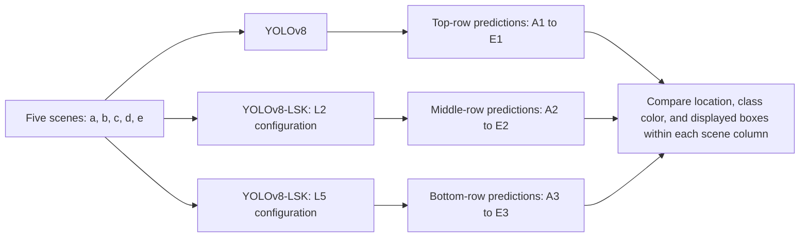

This schematic explains the comparison structure. It does not imply that the models run sequentially, share parameters, or fuse their predictions.

## 3. Annotation conventions

| Visible element | Interpretation |
| --- | --- |
| Grayscale panel | The scene being compared across the three models. |
| Red box and label | A prediction labeled `oil slick` where legible. |
| Cyan box and label | A prediction labeled `oil spill` where legible. |
| Decimal text beside a box | Displayed prediction confidence, not independently measured accuracy. |
| Overlapping same-color boxes | Multiple displayed predictions may cover the same physical feature. |
| Overlapping red and cyan outlines | Different displayed class predictions cover overlapping regions. |
| Tiny colored mark and label | A small annotation whose complete rectangle may not be resolved at this scale. |
| No annotation | No box is visibly drawn; this does not prove the absence of a spill. |

The caption concerns operational oil spills. This transcription preserves the printed class names `oil slick` and `oil spill` rather than treating them as interchangeable. No separate ground-truth layer or color legend is supplied. Small confidence values are left untranscribed where they cannot be read reliably.

## 4. Scene-by-scene transcription

### Scene (a)

**Background:** Dark background with clusters of bright point-like features; the first two rows annotate a lower-left region.

| Panel | Model | Visible predictions |
| --- | --- | --- |
| A1 | YOLOv8 | One cyan box in the lower-left portion. |
| A2 | YOLOv8-LSK (L2) | One cyan box in approximately the same lower-left region as in A1. |
| A3 | YOLOv8-LSK (L5) | No visible red or cyan prediction box. |

**Comparison:** L5 displays no annotation, whereas YOLOv8 and L2 each display a cyan prediction. The image alone does not establish whether removing that prediction is correct.

### Scene (b)

**Background:** Gray background with several small annotations toward the left and darker irregular texture near the lower edge.

| Panel | Model | Visible predictions |
| --- | --- | --- |
| B1 | YOLOv8 | One narrow upper-left red box and two overlapping red boxes below it. |
| B2 | YOLOv8-LSK (L2) | A narrow upper-left red box, a tightly overlapping lower-left box group, and a tiny additional red mark higher and farther right. At least four annotations are visible; the exact count in the overlapping group is unresolved. |
| B3 | YOLOv8-LSK (L5) | Two red boxes on the left and one cyan box on the right. |

**Comparison:** L2 adds a small red annotation. L5 shows a separate cyan prediction on the right and fewer overlapping red boxes on the left.

### Scene (c)

**Background:** A narrow, elongated dark feature extending from the upper-middle toward the lower-right portion of the scene.

| Panel | Model | Visible predictions |
| --- | --- | --- |
| C1 | YOLOv8 | No visible prediction box. |
| C2 | YOLOv8-LSK (L2) | One red box around the elongated feature; displayed class: oil slick. |
| C3 | YOLOv8-LSK (L5) | One cyan box around approximately the feature annotated in C2; displayed class: oil spill. |

**Comparison:** This column shows a detection-presence difference and a displayed class difference: no box in YOLOv8, a red oil-slick box in L2, and a cyan oil-spill box in L5.

### Scene (d)

**Background:** A curved central dark trace, with two much smaller annotated regions to its right.

| Panel | Model | Visible predictions |
| --- | --- | --- |
| D1 | YOLOv8 | One central red box and two tiny red annotations on the right. |
| D2 | YOLOv8-LSK (L2) | One central red box and two tiny red annotations on the right. |
| D3 | YOLOv8-LSK (L5) | A larger central red box overlaps a cyan outline around the curved feature; two tiny right-side red annotations remain. |

**Comparison:** L5 adds a cyan prediction around the central feature while retaining an overlapping red prediction. These overlapping predictions do not establish two distinct physical spills.

### Scene (e)

**Background:** Strong dark and bright texture in the upper region, and a lower dark feature annotated in red.

| Panel | Model | Visible predictions |
| --- | --- | --- |
| E1 | YOLOv8 | Two tightly overlapping red boxes surround the lower feature. |
| E2 | YOLOv8-LSK (L2) | One cyan box in the upper-middle region and one red box around the lower feature. |
| E3 | YOLOv8-LSK (L5) | One cyan box above and one red box below; the cyan placement and extent differ from E2. |

**Comparison:** Only L2 and L5 show an upper cyan prediction. The lower feature remains annotated in red in all three rows.

## 5. Compact annotation matrix

`R` = red annotation (`oil slick` where legible); `C` = cyan annotation (`oil spill` where legible). Counts refer to displayed predictions, not confirmed objects. Tiny and overlapping marks are qualified explicitly.

| Model | Scene (a) | Scene (b) | Scene (c) | Scene (d) | Scene (e) |
| --- | --- | --- | --- | --- | --- |
| YOLOv8 | 0 R, 1 C | 3 R, 0 C | 0 R, 0 C | 3 R, 0 C | 2 overlapping R, 0 C |
| YOLOv8-LSK (L₂) | 0 R, 1 C | At least 4 R including a tiny mark; exact overlapping-group count uncertain; 0 C | 1 R, 0 C | 3 R, 0 C | 1 R, 1 C |
| YOLOv8-LSK (L₅) | 0 R, 0 C | 2 R, 1 C | 0 R, 1 C | 3 R, 1 partly obscured C | 1 R, 1 C |

## 6. Readable confidence labels

The following labels in Scene (e) are legible. Other small or obscured confidence values are left untranscribed; none are inferred. The top-row value belongs to the overlapping lower group, and the second label in that group is obscured.

| Panel | Position within the scene | Printed class | Confidence |
| --- | --- | --- | --- |
| E1 | Lower overlapping group | oil slick | 0.62 |
| E2 | Upper | oil spill | 0.61 |
| E2 | Lower | oil slick | 0.82 |
| E3 | Upper | oil spill | 0.76 |
| E3 | Lower | oil slick | 0.83 |

## 7. Machine-readable representation

The JSON below contains all 15 model–scene pairs. `null` means unresolved or not transcribed, not zero. A known minimum is supplied where the exact box count is uncertain. Confidence fields include only the legible labels listed above; `null` indicates that no confidence value was reliably transcribed for that panel. Positions refer to individual scene panels, not geographic coordinates.

```json
{
  "figure_id": "Fig. 4",
  "caption": "Fig. 4. Visual comparison of the detection results of the YOLOv8, YOLOv8-LSK (L₂), and YOLOv8-LSK (L₅) models for operational oil spills.",
  "figure_type": "model_by_scene_detection_comparison",
  "layout": {
    "rows": 3,
    "columns": 5,
    "cell_count": 15,
    "row_order": [
      "YOLOv8",
      "YOLOv8-LSK (L2)",
      "YOLOv8-LSK (L5)"
    ],
    "column_order": [
      "a",
      "b",
      "c",
      "d",
      "e"
    ]
  },
  "class_colors": {
    "red": "oil slick",
    "cyan": "oil spill",
    "evidence": "Readable prediction labels, not a separate ground-truth legend."
  },
  "scenes": {
    "a": "Dark background with clusters of bright point-like features; the first two rows annotate a lower-left region.",
    "b": "Gray background with several small annotations toward the left and darker irregular texture near the lower edge.",
    "c": "A narrow, elongated dark feature extending from the upper-middle toward the lower-right portion of the scene.",
    "d": "A curved central dark trace, with two much smaller annotated regions to its right.",
    "e": "Strong dark and bright texture in the upper region, and a lower dark feature annotated in red."
  },
  "cells": [
    {
      "id": "A1",
      "row": 1,
      "column": 1,
      "model": "YOLOv8",
      "scene": "a",
      "red_annotation_count": 0,
      "cyan_annotation_count": 1,
      "observation": "One cyan box in the lower-left portion.",
      "flags": [],
      "confidence_values": null,
      "ground_truth_correctness": null
    },
    {
      "id": "B1",
      "row": 1,
      "column": 2,
      "model": "YOLOv8",
      "scene": "b",
      "red_annotation_count": 3,
      "cyan_annotation_count": 0,
      "observation": "One narrow upper-left red box and two overlapping red boxes below it.",
      "flags": [
        "overlapping_red_boxes"
      ],
      "confidence_values": null,
      "ground_truth_correctness": null
    },
    {
      "id": "C1",
      "row": 1,
      "column": 3,
      "model": "YOLOv8",
      "scene": "c",
      "red_annotation_count": 0,
      "cyan_annotation_count": 0,
      "observation": "No visible prediction box.",
      "flags": [],
      "confidence_values": null,
      "ground_truth_correctness": null
    },
    {
      "id": "D1",
      "row": 1,
      "column": 4,
      "model": "YOLOv8",
      "scene": "d",
      "red_annotation_count": 3,
      "cyan_annotation_count": 0,
      "observation": "One central red box and two tiny red annotations on the right.",
      "flags": [
        "tiny_annotations_included"
      ],
      "confidence_values": null,
      "ground_truth_correctness": null
    },
    {
      "id": "E1",
      "row": 1,
      "column": 5,
      "model": "YOLOv8",
      "scene": "e",
      "red_annotation_count": 2,
      "cyan_annotation_count": 0,
      "observation": "Two tightly overlapping red boxes surround the lower feature.",
      "flags": [
        "overlapping_red_boxes",
        "one_confidence_label_obscured"
      ],
      "confidence_values": [
        {
          "position": "lower_overlapping_group",
          "class_text": "oil slick",
          "color": "red",
          "confidence": 0.62
        }
      ],
      "ground_truth_correctness": null
    },
    {
      "id": "A2",
      "row": 2,
      "column": 1,
      "model": "YOLOv8-LSK (L2)",
      "scene": "a",
      "red_annotation_count": 0,
      "cyan_annotation_count": 1,
      "observation": "One cyan box in approximately the same lower-left region as in A1.",
      "flags": [],
      "confidence_values": null,
      "ground_truth_correctness": null
    },
    {
      "id": "B2",
      "row": 2,
      "column": 2,
      "model": "YOLOv8-LSK (L2)",
      "scene": "b",
      "red_annotation_count": null,
      "cyan_annotation_count": 0,
      "observation": "A narrow upper-left red box, a tightly overlapping lower-left box group, and a tiny additional red mark higher and farther right. At least four annotations are visible; the exact count in the overlapping group is unresolved.",
      "flags": [
        "tiny_marker_included",
        "overlapping_red_boxes",
        "exact_red_count_uncertain"
      ],
      "confidence_values": null,
      "ground_truth_correctness": null,
      "red_annotation_count_minimum": 4
    },
    {
      "id": "C2",
      "row": 2,
      "column": 3,
      "model": "YOLOv8-LSK (L2)",
      "scene": "c",
      "red_annotation_count": 1,
      "cyan_annotation_count": 0,
      "observation": "One red box around the elongated feature; displayed class: oil slick.",
      "flags": [],
      "confidence_values": null,
      "ground_truth_correctness": null
    },
    {
      "id": "D2",
      "row": 2,
      "column": 4,
      "model": "YOLOv8-LSK (L2)",
      "scene": "d",
      "red_annotation_count": 3,
      "cyan_annotation_count": 0,
      "observation": "One central red box and two tiny red annotations on the right.",
      "flags": [
        "tiny_annotations_included"
      ],
      "confidence_values": null,
      "ground_truth_correctness": null
    },
    {
      "id": "E2",
      "row": 2,
      "column": 5,
      "model": "YOLOv8-LSK (L2)",
      "scene": "e",
      "red_annotation_count": 1,
      "cyan_annotation_count": 1,
      "observation": "One cyan box in the upper-middle region and one red box around the lower feature.",
      "flags": [],
      "confidence_values": [
        {
          "position": "upper",
          "class_text": "oil spill",
          "color": "cyan",
          "confidence": 0.61
        },
        {
          "position": "lower",
          "class_text": "oil slick",
          "color": "red",
          "confidence": 0.82
        }
      ],
      "ground_truth_correctness": null
    },
    {
      "id": "A3",
      "row": 3,
      "column": 1,
      "model": "YOLOv8-LSK (L5)",
      "scene": "a",
      "red_annotation_count": 0,
      "cyan_annotation_count": 0,
      "observation": "No visible red or cyan prediction box.",
      "flags": [],
      "confidence_values": null,
      "ground_truth_correctness": null
    },
    {
      "id": "B3",
      "row": 3,
      "column": 2,
      "model": "YOLOv8-LSK (L5)",
      "scene": "b",
      "red_annotation_count": 2,
      "cyan_annotation_count": 1,
      "observation": "Two red boxes on the left and one cyan box on the right.",
      "flags": [],
      "confidence_values": null,
      "ground_truth_correctness": null
    },
    {
      "id": "C3",
      "row": 3,
      "column": 3,
      "model": "YOLOv8-LSK (L5)",
      "scene": "c",
      "red_annotation_count": 0,
      "cyan_annotation_count": 1,
      "observation": "One cyan box around approximately the feature annotated in C2; displayed class: oil spill.",
      "flags": [],
      "confidence_values": null,
      "ground_truth_correctness": null
    },
    {
      "id": "D3",
      "row": 3,
      "column": 4,
      "model": "YOLOv8-LSK (L5)",
      "scene": "d",
      "red_annotation_count": 3,
      "cyan_annotation_count": 1,
      "observation": "A larger central red box overlaps a cyan outline around the curved feature; two tiny right-side red annotations remain.",
      "flags": [
        "central_red_and_cyan_overlap",
        "cyan_outline_partly_obscured",
        "tiny_annotations_included"
      ],
      "confidence_values": null,
      "ground_truth_correctness": null
    },
    {
      "id": "E3",
      "row": 3,
      "column": 5,
      "model": "YOLOv8-LSK (L5)",
      "scene": "e",
      "red_annotation_count": 1,
      "cyan_annotation_count": 1,
      "observation": "One cyan box above and one red box below; the cyan placement and extent differ from E2.",
      "flags": [],
      "confidence_values": [
        {
          "position": "upper",
          "class_text": "oil spill",
          "color": "cyan",
          "confidence": 0.76
        },
        {
          "position": "lower",
          "class_text": "oil slick",
          "color": "red",
          "confidence": 0.83
        }
      ],
      "ground_truth_correctness": null
    }
  ],
  "key_comparisons": {
    "a": "L5 displays no annotation, whereas YOLOv8 and L2 each display a cyan prediction. The image alone does not establish whether removing that prediction is correct.",
    "b": "L2 adds a small red annotation. L5 shows a separate cyan prediction on the right and fewer overlapping red boxes on the left.",
    "c": "This column shows a detection-presence difference and a displayed class difference: no box in YOLOv8, a red oil-slick box in L2, and a cyan oil-spill box in L5.",
    "d": "L5 adds a cyan prediction around the central feature while retaining an overlapping red prediction. These overlapping predictions do not establish two distinct physical spills.",
    "e": "Only L2 and L5 show an upper cyan prediction. The lower feature remains annotated in red in all three rows."
  },
  "counting_rule": "Count displayed annotations, including flagged tiny or overlapping marks; do not equate this with distinct true objects.",
  "null_meaning": "Unresolved or not transcribed, not zero.",
  "ground_truth_provided": false,
  "models_are_parallel_comparators": true,
  "models_form_serial_pipeline": false
}
```

## 8. Interpretation limits

- Detection boxes are predictions. This image alone does not establish which predictions are true positives, false positives, or false negatives.
- No displayed box does not mean no oil spill. More boxes or higher displayed confidence do not automatically mean better accuracy.
- A red-to-cyan difference is a displayed class change, not automatically a verified correction.
- Overlapping boxes must not be counted as distinct physical spills without further evidence.
- Tiny annotations and overlapping strokes reduce certainty about exact outlines and counts; these limitations are recorded above.
- No exact pixel coordinates, physical dimensions, geographic positions, acquisition dates, class thresholds, or quantitative accuracy metrics are reconstructed here.
- L2 and L5 are model configuration names. Their internal module placements are not shown in this results image.
- This is a schematic transcription, not an executable inference pipeline or a ground-truth dataset.


At 00:02 UTC on 15 May 2023, an OOS was detected with YOLOv8-LSK (Fig. 8a). The oil spill exhibits narrow strip features. The length of the oil spill was approximately 19 km, and the width of the head and tail showed distinct changes (Fig. 8b). The southern tip was connected to the suspected source at 28◦21′31.968′N and 89◦13′31.332′W. In combination with the AIS data (Fig. 8c), only one ship in the object area coincides with the white spot during the time the satellite image was acquired. The vessel's trajectory well matched the shape of the oil spill, and the suspect ship was identified as BOCHEM LONDON. The incident was confirmed as an OOS caused by illegal discharges by moving ships.

# Figure 5 — Visual comparison of detection results

**Original caption:** Fig. 5. Visual comparison of the detection results of the YOLOv8, YOLOv8-LSK (L₂), and YOLOv8-LSK (L₅) models for operational oil spills.

## 1. Schematic organization

This figure is a **3-row × 5-column comparison matrix**, containing 15 result images. It shows detection results, not the models' internal network architecture.

| Axis | Meaning | Order |
| --- | --- | --- |
| Rows | Model | YOLOv8, YOLOv8-LSK (L₂), YOLOv8-LSK (L₅), from top to bottom. |
| Columns | Scene | Scene (a), Scene (b), Scene (c), Scene (d), Scene (e), from left to right. |
| Vertical comparison | Same scene, different models | Compare predictions within one column. |
| Horizontal comparison | Same model, different scenes | Compare predictions within one row. |

```text
                           Scene (a)  Scene (b)  Scene (c)  Scene (d)  Scene (e)
                           ---------  ---------  ---------  ---------  ---------
YOLOv8                        A1         B1         C1         D1         E1
YOLOv8-LSK (L2)               A2         B2         C2         D2         E2
YOLOv8-LSK (L5)               A3         B3         C3         D3         E3

Example: C3 = Scene (c), bottom row, YOLOv8-LSK (L5).
```

Panel identifiers are added for this transcription; they are not printed in the source image.

## 2. Comparison architecture


This schematic explains the comparison structure. It does not imply that the models run sequentially, share parameters, or fuse their predictions.

## 3. Annotation conventions

| Visible element | Interpretation |
| --- | --- |
| Red rectangle or mark | A visible red prediction annotation. |
| Cyan rectangle or mark | A visible cyan prediction annotation. |
| Tiny colored text near an outline | A prediction label, potentially including a class name and confidence. Its exact text is not reliably readable in the supplied image. |
| A visible annotation group | One spatial cluster of colored marks. It may contain more than one overlapping prediction. |
| No visible annotation | No red or cyan prediction overlay is visible in that panel at the supplied resolution. |
| Bright or dark scene texture | Image content, not a ground-truth label. |
| Approximate position | Relative to the individual panel, not to the entire figure or a geographic coordinate system. |

No readable color legend, ground-truth overlay, or exact box-coordinate list is supplied. Therefore, this transcription preserves the observable colors without assigning an unverified class name to either color. It does not invent confidence values or pixel-precise bounding boxes.

A colored box is a **prediction**, not proof that oil is present. Conversely, a panel without a colored box does not by itself prove that the scene contains no oil.

## 4. Scene-by-scene transcription

### Scene (a)

**Background:** Dense, mottled bright and dark texture. A darker branching area occupies much of the left and lower-left region.

| Panel | Model | Visible predictions |
| --- | --- | --- |
| A1 | YOLOv8 | A small cyan annotation in the upper-right to middle-right region, plus a small red annotation farther right and slightly lower. |
| A2 | YOLOv8-LSK (L₂) | A cyan annotation near the upper-left corner. No red annotation is visibly drawn. |
| A3 | YOLOv8-LSK (L₅) | A cyan annotation in the upper-right to middle-right region. No red annotation is visibly drawn. |

**Comparison:** All three rows contain a cyan annotation, but L₂ places it in a different part of the scene. Only YOLOv8 visibly displays a red annotation. The image does not establish that these differently positioned cyan predictions refer to the same physical feature.

### Scene (b)

**Background:** Broad diagonal gray bands and elongated dark, curved features. A black area touches the upper-right edge.

| Panel | Model | Visible predictions |
| --- | --- | --- |
| B1 | YOLOv8 | A narrow red rectangle around an upper-right dark feature, with a red label extending to its right. |
| B2 | YOLOv8-LSK (L₂) | A red rectangle in approximately the same upper-right region as B1. |
| B3 | YOLOv8-LSK (L₅) | No visible red or cyan annotation. |

**Comparison:** The upper-right prediction is visible for YOLOv8 and L₂, but not for L₅.

### Scene (c)

**Background:** Strong diagonal and curved bright-dark bands, a relatively light upper area, and a black region along the lower-left edge.

| Panel | Model | Visible predictions |
| --- | --- | --- |
| C1 | YOLOv8 | A compact red annotation group near the upper-left, plus a separate narrow horizontal red box near the right edge around mid-height. |
| C2 | YOLOv8-LSK (L₂) | A small red annotation near the upper-left. The separate right-side rectangle seen in C1 is not visible. |
| C3 | YOLOv8-LSK (L₅) | A small red annotation near the upper-left. The separate right-side rectangle seen in C1 is not visible. |

**Comparison:** All rows retain an upper-left red annotation. Only YOLOv8 visibly annotates the separate right-side region. The tiny upper-left marks should not be used to infer an exact number of individual detections.

### Scene (d)

**Background:** Gray textured imagery with branching and curved dark traces. Black regions occur along the upper-right boundary and near the lower-left edge.

| Panel | Model | Visible predictions |
| --- | --- | --- |
| D1 | YOLOv8 | Multiple cyan marks distributed across the left and central portions, including a taller narrow central outline. Several red annotations occur on the right, including upper-right marks and a small mark below mid-height. |
| D2 | YOLOv8-LSK (L₂) | A small red annotation in the upper-middle portion. No cyan annotation is clearly visible. |
| D3 | YOLOv8-LSK (L₅) | A small red annotation in the upper-left to upper-middle portion and a larger vertical red rectangle farther right, near the middle of the panel. No cyan annotation is clearly visible. |

**Comparison:** YOLOv8 displays the most spatially distributed annotations. The L₂ result shows a small red annotation group. The L₅ result contains a small red annotation plus a larger red box farther right. The L₅ output is not simply identical to the L₂ output with fewer boxes.

### Scene (e)

**Background:** A mostly smooth gray field with faint curved or linear dark traces in the middle and lower portions.

| Panel | Model | Visible predictions |
| --- | --- | --- |
| E1 | YOLOv8 | One prominent, wide horizontal red rectangle extends across the middle-right region, with a red label along its upper edge. |
| E2 | YOLOv8-LSK (L₂) | No visible red or cyan annotation. |
| E3 | YOLOv8-LSK (L₅) | No visible red or cyan annotation. |

**Comparison:** Only YOLOv8 visibly annotates this scene.

## 5. Compact annotation matrix

Entries describe visible prediction annotations, not confirmed objects. Tiny or overlapping annotation groups are described without assigning an exact detection count.

| Model | Scene (a) | Scene (b) | Scene (c) | Scene (d) | Scene (e) |
| --- | --- | --- | --- | --- | --- |
| YOLOv8 | cyan and red annotations | red annotation | upper-left red group and right-side red box | multiple red and cyan annotations | large red box |
| YOLOv8-LSK (L₂) | cyan annotation | red annotation | small upper-left red annotation | small red annotation | no visible colored annotation |
| YOLOv8-LSK (L₅) | cyan annotation | no visible colored annotation | small upper-left red annotation | small red annotation and larger red box | no visible colored annotation |

## 6. Readable confidence labels

No numeric confidence value can be reliably transcribed from the supplied image. The small labels are left untranscribed; none are inferred. Accordingly, every `confidence_values` field below is `null`, which means not transcribed, not zero confidence.

## 7. Machine-readable representation

The JSON below uses the same layout and cell fields as the preceding comparison files and contains all 15 model–scene pairs. `null` means unresolved or not transcribed, not zero. Minimum counts record clearly separate visible annotation groups; they are not exact prediction totals. Positions refer to individual scene panels, not geographic coordinates. The optional `paper_context` block preserves separately attributed information from the accompanying paper.

```json
{
  "figure_id": "Fig. 5",
  "caption": "Fig. 5. Visual comparison of the detection results of the YOLOv8, YOLOv8-LSK (L₂), and YOLOv8-LSK (L₅) models for operational oil spills.",
  "figure_type": "model_by_scene_detection_comparison",
  "layout": {
    "rows": 3,
    "columns": 5,
    "cell_count": 15,
    "row_order": [
      "YOLOv8",
      "YOLOv8-LSK (L2)",
      "YOLOv8-LSK (L5)"
    ],
    "column_order": [
      "a",
      "b",
      "c",
      "d",
      "e"
    ]
  },
  "class_colors": {
    "red": null,
    "cyan": null,
    "evidence": "Red and cyan prediction annotations are visible, but class labels are not reliably transcribed from this image. Class mappings from other figures are not assumed."
  },
  "scenes": {
    "a": "Dense, mottled bright and dark texture. A darker branching area occupies much of the left and lower-left region.",
    "b": "Broad diagonal gray bands and elongated dark, curved features. A black area touches the upper-right edge.",
    "c": "Strong diagonal and curved bright-dark bands, a relatively light upper area, and a black region along the lower-left edge.",
    "d": "Gray textured imagery with branching and curved dark traces. Black regions occur along the upper-right boundary and near the lower-left edge.",
    "e": "A mostly smooth gray field with faint curved or linear dark traces in the middle and lower portions."
  },
  "cells": [
    {
      "id": "A1",
      "row": 1,
      "column": 1,
      "model": "YOLOv8",
      "scene": "a",
      "red_annotation_count": null,
      "cyan_annotation_count": null,
      "observation": "A small cyan annotation in the upper-right to middle-right region, plus a small red annotation farther right and slightly lower.",
      "flags": [
        "exact_red_count_not_transcribed",
        "exact_cyan_count_not_transcribed"
      ],
      "confidence_values": null,
      "ground_truth_correctness": null,
      "red_annotation_count_minimum": 1,
      "cyan_annotation_count_minimum": 1
    },
    {
      "id": "B1",
      "row": 1,
      "column": 2,
      "model": "YOLOv8",
      "scene": "b",
      "red_annotation_count": null,
      "cyan_annotation_count": 0,
      "observation": "A narrow red rectangle around an upper-right dark feature, with a red label extending to its right.",
      "flags": [
        "exact_red_count_not_transcribed"
      ],
      "confidence_values": null,
      "ground_truth_correctness": null,
      "red_annotation_count_minimum": 1
    },
    {
      "id": "C1",
      "row": 1,
      "column": 3,
      "model": "YOLOv8",
      "scene": "c",
      "red_annotation_count": null,
      "cyan_annotation_count": 0,
      "observation": "A compact red annotation group near the upper-left, plus a separate narrow horizontal red box near the right edge around mid-height.",
      "flags": [
        "exact_red_count_not_transcribed"
      ],
      "confidence_values": null,
      "ground_truth_correctness": null,
      "red_annotation_count_minimum": 2
    },
    {
      "id": "D1",
      "row": 1,
      "column": 4,
      "model": "YOLOv8",
      "scene": "d",
      "red_annotation_count": null,
      "cyan_annotation_count": null,
      "observation": "Multiple cyan marks distributed across the left and central portions, including a taller narrow central outline. Several red annotations occur on the right, including upper-right marks and a small mark below mid-height.",
      "flags": [
        "exact_red_count_not_transcribed",
        "exact_cyan_count_not_transcribed"
      ],
      "confidence_values": null,
      "ground_truth_correctness": null,
      "red_annotation_count_minimum": 2,
      "cyan_annotation_count_minimum": 2
    },
    {
      "id": "E1",
      "row": 1,
      "column": 5,
      "model": "YOLOv8",
      "scene": "e",
      "red_annotation_count": null,
      "cyan_annotation_count": 0,
      "observation": "One prominent, wide horizontal red rectangle extends across the middle-right region, with a red label along its upper edge.",
      "flags": [
        "exact_red_count_not_transcribed"
      ],
      "confidence_values": null,
      "ground_truth_correctness": null,
      "red_annotation_count_minimum": 1
    },
    {
      "id": "A2",
      "row": 2,
      "column": 1,
      "model": "YOLOv8-LSK (L2)",
      "scene": "a",
      "red_annotation_count": 0,
      "cyan_annotation_count": null,
      "observation": "A cyan annotation near the upper-left corner. No red annotation is visibly drawn.",
      "flags": [
        "exact_cyan_count_not_transcribed"
      ],
      "confidence_values": null,
      "ground_truth_correctness": null,
      "cyan_annotation_count_minimum": 1
    },
    {
      "id": "B2",
      "row": 2,
      "column": 2,
      "model": "YOLOv8-LSK (L2)",
      "scene": "b",
      "red_annotation_count": null,
      "cyan_annotation_count": 0,
      "observation": "A red rectangle in approximately the same upper-right region as B1.",
      "flags": [
        "exact_red_count_not_transcribed"
      ],
      "confidence_values": null,
      "ground_truth_correctness": null,
      "red_annotation_count_minimum": 1
    },
    {
      "id": "C2",
      "row": 2,
      "column": 3,
      "model": "YOLOv8-LSK (L2)",
      "scene": "c",
      "red_annotation_count": null,
      "cyan_annotation_count": 0,
      "observation": "A small red annotation near the upper-left. The separate right-side rectangle seen in C1 is not visible.",
      "flags": [
        "exact_red_count_not_transcribed"
      ],
      "confidence_values": null,
      "ground_truth_correctness": null,
      "red_annotation_count_minimum": 1
    },
    {
      "id": "D2",
      "row": 2,
      "column": 4,
      "model": "YOLOv8-LSK (L2)",
      "scene": "d",
      "red_annotation_count": null,
      "cyan_annotation_count": 0,
      "observation": "A small red annotation in the upper-middle portion. No cyan annotation is clearly visible.",
      "flags": [
        "exact_red_count_not_transcribed"
      ],
      "confidence_values": null,
      "ground_truth_correctness": null,
      "red_annotation_count_minimum": 1
    },
    {
      "id": "E2",
      "row": 2,
      "column": 5,
      "model": "YOLOv8-LSK (L2)",
      "scene": "e",
      "red_annotation_count": 0,
      "cyan_annotation_count": 0,
      "observation": "No visible red or cyan annotation.",
      "flags": [],
      "confidence_values": null,
      "ground_truth_correctness": null
    },
    {
      "id": "A3",
      "row": 3,
      "column": 1,
      "model": "YOLOv8-LSK (L5)",
      "scene": "a",
      "red_annotation_count": 0,
      "cyan_annotation_count": null,
      "observation": "A cyan annotation in the upper-right to middle-right region. No red annotation is visibly drawn.",
      "flags": [
        "exact_cyan_count_not_transcribed"
      ],
      "confidence_values": null,
      "ground_truth_correctness": null,
      "cyan_annotation_count_minimum": 1
    },
    {
      "id": "B3",
      "row": 3,
      "column": 2,
      "model": "YOLOv8-LSK (L5)",
      "scene": "b",
      "red_annotation_count": 0,
      "cyan_annotation_count": 0,
      "observation": "No visible red or cyan annotation.",
      "flags": [],
      "confidence_values": null,
      "ground_truth_correctness": null
    },
    {
      "id": "C3",
      "row": 3,
      "column": 3,
      "model": "YOLOv8-LSK (L5)",
      "scene": "c",
      "red_annotation_count": null,
      "cyan_annotation_count": 0,
      "observation": "A small red annotation near the upper-left. The separate right-side rectangle seen in C1 is not visible.",
      "flags": [
        "exact_red_count_not_transcribed"
      ],
      "confidence_values": null,
      "ground_truth_correctness": null,
      "red_annotation_count_minimum": 1
    },
    {
      "id": "D3",
      "row": 3,
      "column": 4,
      "model": "YOLOv8-LSK (L5)",
      "scene": "d",
      "red_annotation_count": null,
      "cyan_annotation_count": 0,
      "observation": "A small red annotation in the upper-left to upper-middle portion and a larger vertical red rectangle farther right, near the middle of the panel. No cyan annotation is clearly visible.",
      "flags": [
        "exact_red_count_not_transcribed"
      ],
      "confidence_values": null,
      "ground_truth_correctness": null,
      "red_annotation_count_minimum": 2
    },
    {
      "id": "E3",
      "row": 3,
      "column": 5,
      "model": "YOLOv8-LSK (L5)",
      "scene": "e",
      "red_annotation_count": 0,
      "cyan_annotation_count": 0,
      "observation": "No visible red or cyan annotation.",
      "flags": [],
      "confidence_values": null,
      "ground_truth_correctness": null
    }
  ],
  "key_comparisons": {
    "a": "All three rows contain a cyan annotation, but L₂ places it in a different part of the scene. Only YOLOv8 visibly displays a red annotation. The image does not establish that these differently positioned cyan predictions refer to the same physical feature.",
    "b": "The upper-right prediction is visible for YOLOv8 and L₂, but not for L₅.",
    "c": "All rows retain an upper-left red annotation. Only YOLOv8 visibly annotates the separate right-side region. The tiny upper-left marks should not be used to infer an exact number of individual detections.",
    "d": "YOLOv8 displays the most spatially distributed annotations. The L₂ result shows a small red annotation group. The L₅ result contains a small red annotation plus a larger red box farther right. The L₅ output is not simply identical to the L₂ output with fewer boxes.",
    "e": "Only YOLOv8 visibly annotates this scene."
  },
  "counting_rule": "Counts describe visible annotations, not confirmed objects. Positive exact counts are left unresolved; minimum counts record only clearly separate visible annotation groups. A zero means no visible annotation of that color.",
  "null_meaning": "Unresolved or not transcribed, not zero.",
  "ground_truth_provided": false,
  "models_are_parallel_comparators": true,
  "models_form_serial_pipeline": false,
  "paper_context": {
    "source_doi": "10.1016/j.marpolbul.2025.118608",
    "figure_discussion_section": "3.2",
    "configuration_section": "2.5",
    "scene_category": "environmental interference and oil-spill look-alikes",
    "paper_states_no_actual_oil_spills_in_these_scenes": true,
    "phenomena_listed": [
      "sea ice",
      "low-wind areas",
      "waves",
      "biological oil slicks",
      "running wakes of ships"
    ],
    "confirmed_phenomenon_assignment_per_scene_letter": null,
    "reported_false_positives": {
      "YOLOv8": 14,
      "YOLOv8-LSK (L2)": 5,
      "YOLOv8-LSK (L5)": 5
    },
    "false_positive_totals_independently_verified_from_image": false,
    "L2_module_placement": "in front of the small-object detection head",
    "L5_module_placement": "in front of all object detection heads",
    "caption_discussion_discrepancy": "Caption says operational oil spills; discussion identifies no-spill look-alike scenes."
  }
}
```

## 8. Interpretation limits

- Detection boxes are predictions. The image alone does not establish which predictions are true positives, false positives, or false negatives.
- No displayed box does not mean no oil spill. More boxes do not automatically mean better accuracy.
- Tiny annotations and overlapping strokes limit certainty about exact outlines and counts; visible groups must not be summed as an exact detection total.
- Red and cyan are preserved as observed colors. Class names and unreadable confidence values are not inferred from other figures.
- No exact pixel coordinates, physical dimensions, geographic positions, acquisition dates, class thresholds, precision, recall, or mAP values are reconstructed here.
- L2 and L5 are model configuration names. Their internal module placements are not shown in this results image.
- The models are parallel comparators. This schematic does not imply sequential execution, shared weights, or prediction fusion.
- This is a schematic transcription, not an executable inference pipeline or a ground-truth dataset.

**Separate paper context:** Section 3.2 of the previously supplied paper (DOI: `10.1016/j.marpolbul.2025.118608`) describes Figure 5 as look-alike scenes with no actual oil spills, although the printed caption says “for operational oil spills.” It reports 14 false positives for YOLOv8 and 5 each for L2 and L5. These are paper-reported totals, not independently verified image counts. The caption is retained unchanged. The paper lists sea ice, low-wind areas, waves, biological oil slicks, and running wakes of ships without explicitly assigning each phenomenon to a scene letter. Section 2.5 defines L2 as placement before the small-object detection head and L5 as placement before all object detection heads. These contextual statements are encoded separately from image observations in `paper_context`.


# Figure 6 — YOLOv8-LSK architecture and SAR detection workflow

**Original caption:** Fig. 6. Architecture of the improved YOLOv8-LSK model and end-to-end SAR satellite imagery detection workflow.

## 1. How to read this transcription

This figure is a single left-to-right workflow: a large grayscale SAR image is sliced into smaller images, processed by a model with feature extraction, feature fusion, attention, and detection stages, then represented as a stitched full-scene output with detection boxes.

The two cyan blocks are transcribed exactly as **`SHIA`**, which is what the image prints. The left block points to the input-to-slices transition; the right block points to the detected-slices-to-output transition. The figure does not expand the acronym. These blocks are annotations associated with those transitions, not two additional layers inside the feature-extraction network.

Two kinds of schematic are provided below. Directed arrows in the overview express the evident stage order. The detailed feature-fusion graph uses **undirected connections** to preserve visible wires where internal execution direction is not explicitly marked. Node and junction IDs are transcription aids, not additional neural-network operations.

```text
Input -> Slicing -> Feature Extraction -> Feature Fusion
             ^                                 |
           SHIA                                +-> LSK Block -> Small  --+
                                               +-> LSK Block -> Medium --+-> Detected slices
                                               +-> LSK Block -> Large  --+         |
                                                                                  v
                                                                            Stitching -> Output
                                                                                ^
                                                                              SHIA

The three LSK/head branches are parallel. The arrows from SHIA indicate association
with the slicing/stitching transitions, not additional tensor-processing layers.
```

## 2. Legend and visual groups

| Printed element | Representation in the image | Meaning used in this transcription |
| --- | --- | --- |
| `SHIA` | Two cyan rounded rectangles with downward black arrows | Printed labels associated with slicing and stitching; expansion is not given. |
| `Conv` | White rounded rectangle | A convolution block; parameters and internal operations are not shown. |
| `C2f` | Blue rounded rectangle | A block labeled C2f; internal layers are not drawn. |
| `SPPF` | Tapered green block at the bottom of feature extraction | A block labeled SPPF; internal operations are not drawn. |
| `C` | Small white rounded square | `Concat`, as defined in the legend. |
| `U` | Small white rounded square | `Upsample`, as defined in the legend. |
| `LSK Block` | Orange rounded rectangle | One attention block on each of three detection branches. |
| `Small`, `Medium`, `Large` | Vertical green blocks, top to bottom | Three detection heads; the legend calls a green block a `Detect layer`. |
| Pale green dashed enclosure | Feature Extraction group | Groups the backbone blocks. |
| Pale blue dashed enclosure | Feature Fusion group | Groups the feature-fusion blocks and wires. |
| Pale orange dashed enclosure | Attention module group | Groups the three LSK blocks. |
| Thick red arrows | Between major image-processing stages | Indicate the overall left-to-right workflow. |
| Red dashed outlines | Around illustrated detected slices and the final scene | Image/frame outlines, distinct from object boxes. |
| Small solid red rectangles | Within the output illustrations | Illustrated detection bounding boxes; classes and confidence values are not shown. |
| Dashed strip along the bottom | Stage labels | Input, Slicing, Feature Extraction, Feature Fusion, Attention module, Detection, Stitching, Output. |

The legend is a key, not a sequence of executable blocks. Its C, U, and green symbols are not counted as extra network nodes.

## 3. Overall architecture: end-to-end workflow

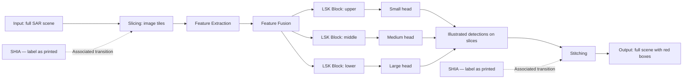

| Stage | Visible content | Relationship to the next stage |
| --- | --- | --- |
| Input | One large grayscale scene illustration | A red arrow leads toward the slice stack. |
| Slicing | Overlapping image-slice illustrations | A red arrow leads into Feature Extraction. |
| Feature Extraction | Vertical Conv/C2f/SPPF stack | Three lateral feature connections enter Feature Fusion. |
| Feature Fusion | Concat, Upsample, Conv, and C2f blocks | Three output wires lead into three LSK blocks. |
| Attention module | Three LSK blocks | Each block is immediately before its corresponding detection head. |
| Detection | Small, Medium, and Large heads | The overall stage leads to a stack of annotated slices. |
| Stitching | Transition from annotated slices to a full scene | A red arrow and the right SHIA label mark this transition. |
| Output | Full scene inside a red dashed outline | Small solid red boxes illustrate the final detections. |

The overview groups the three heads' contributions conceptually. The source draws one large red output arrow at the height of the Medium head; it does not show an explicit three-input merger or specify that only Medium contributes. Likewise, the stacked image tiles are not assigned individually to Small, Medium, or Large. Their drawn number is illustrative, not a prescribed tile count.

## 4. Backbone sequence and lateral taps

The following order is read from top to bottom in the green enclosure. Numeric IDs distinguish repeated labels and are not printed in the source.

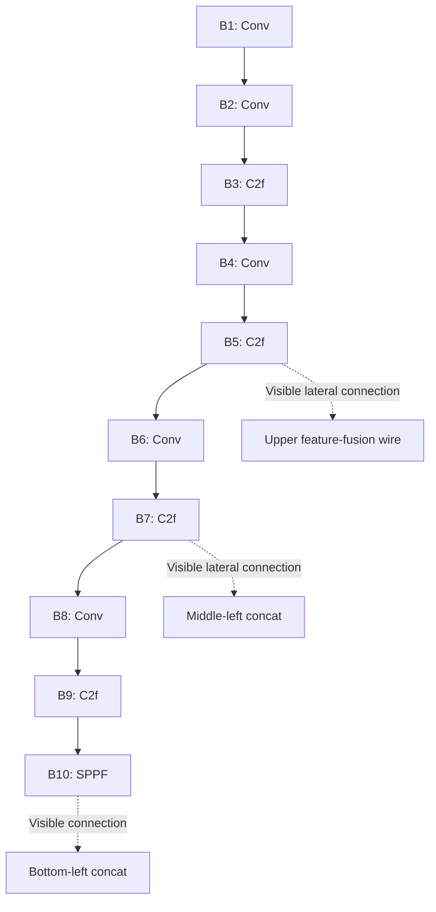

**Backbone chain:** Conv → Conv → C2f → Conv → C2f → Conv → C2f → Conv → C2f → SPPF.

**Visible taps:** the second C2f block (B5), the third C2f block (B7), and SPPF (B10). The first and fourth C2f blocks have no separate lateral output drawn in this figure.

There are **five Conv blocks, four C2f blocks, and one SPPF block** in the feature-extraction enclosure. The large red input arrow enters the enclosure near the middle of the drawing; that placement does not specify that processing starts at B5 or skips B1–B4. The vertical stack supplies the architectural order represented here.

## 5. Feature fusion: literal wire schematic

### 5.1 Block inventory

The blue enclosure contains four C2f blocks, four Concat blocks, two Upsample blocks, and two Conv blocks. The legend's example symbols are excluded from these counts.

| ID | Printed label | Position |
| --- | --- | --- |
| CT | C | Top row, before the top C2f. |
| FT | C2f | Top row, before the upper LSK block. |
| CML | C | Middle row, left. |
| FML | C2f | Middle row, left C2f. |
| CMR | C | Middle row, between the two C2f blocks. |
| FMR | C2f | Middle row, right C2f. |
| CB | C | Bottom row, left. |
| FB | C2f | Bottom row. |
| UT | U | Upper upsampling connection. |
| UB | U | Lower upsampling connection. |
| VU | Conv | Right side, between the top and middle rows. |
| VL | Conv | Right side, between the middle and bottom rows. |

### 5.2 Connections as drawn

In this diagram, `---` means **connected by a visible wire**, not “must execute before.” KS, KM, and KL are the upper, middle, and lower LSK blocks. HS, HM, and HL are the corresponding heads. These attention and head nodes lie outside the blue enclosure but are included to show where its output wires terminate.

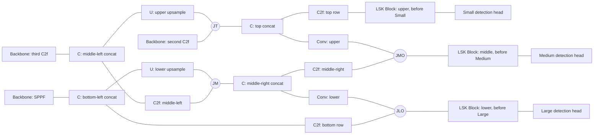

| Junction ID | Visible location |
| --- | --- |
| JT | Upper wire joining the B5 lateral connection, upper Upsample connection, and top Concat. |
| JM | Wire between the middle-left C2f and middle-right Concat, also joined by the lower Upsample connection. |
| JMO | Wire before the middle LSK block, where the middle-right C2f wire meets the routed upper Conv wire. |
| JLO | Wire before the lower LSK block, where the bottom C2f wire meets the routed lower Conv wire. |

**Fidelity note:** The upper Conv is connected from the top Concat region to the middle-branch wire before its LSK block. The lower Conv is connected from the middle-right Concat region to the lower-branch wire before its LSK block. These are the connections shown; they are not replaced with a presumed standard YOLOv8 implementation. Intersecting lines are not automatically additional junctions. The four explicit junction IDs record the branch connections used in this transcription.

## 6. Attention, detection, and stitching

### 6.1 Three parallel attention/head branches

| Branch | Feature-fusion connection | Attention block | Detection head |
| --- | --- | --- | --- |
| Upper | Top C2f output, FT | KS: LSK Block | HS: Small |
| Middle | Middle output wire, JMO | KM: LSK Block | HM: Medium |
| Lower | Bottom output wire, JLO | KL: LSK Block | HL: Large |


- There are three distinct drawn LSK blocks, one immediately before each head.
- The LSK blocks are on parallel branches, not a three-block serial chain.
- No LSK block is drawn inside Feature Extraction or between the final backbone C2f and SPPF.
- Parameter sharing between the three LSK blocks is not specified.
- This all-head arrangement corresponds structurally to the all-head placement shown in the preceding Figure 2 transcription; Figure 6 itself does not print an L1–L5 configuration label.
- Small, Medium, and Large name the head branches. The image does not give their strides, tensor dimensions, or exact object-size thresholds.

### 6.2 Slice predictions and full-scene output

After the detection heads, a stack of grayscale slices is shown inside red dashed frame outlines. Small solid red rectangles illustrate predictions within slices. A red arrow leads to a single large output scene, also with a red dashed outline and small red detection boxes. The second SHIA label points to that transition.

The schematic communicates slice-based detection followed by a full-scene output. It does not provide the coordinate-remapping formula, stitching implementation, overlap ratio, or duplicate-removal method. No particular non-maximum-suppression or merging algorithm is inferred. The output rectangles illustrate predictions, not independently verified ground-truth objects.

## 7. Machine-readable architecture description

This JSON follows the architecture-oriented structure used for Figure 2, including `printed_labels`, `overview`, `backbone`, `neck_visible_wiring`, `heads`, and `not_specified`. Figure 6 adds explicit attention and slicing/stitching fields. `neck_visible_wiring.edges` contains unordered endpoint pairs: these are visible connections, not a runnable directed computational graph. `null` means not specified, not zero.

```json
{
  "figure_id": "Fig. 6",
  "caption": "Fig. 6. Architecture of the improved YOLOv8-LSK model and end-to-end SAR satellite imagery detection workflow.",
  "figure_type": "end_to_end_detection_workflow_with_model_architecture",
  "panels": {
    "single_diagram": "input_slicing_feature_extraction_feature_fusion_attention_detection_stitching_output"
  },
  "printed_labels": {
    "input_side_block": "SHIA",
    "output_side_block": "SHIA",
    "major_stages": [
      "Input",
      "Slicing",
      "Feature Extraction",
      "Feature Fusion",
      "Attention module",
      "Detection",
      "Stitching",
      "Output"
    ],
    "legend": {
      "C": "Concat",
      "U": "Upsample",
      "green_block": "Detect layer"
    },
    "attention_block": "LSK Block",
    "head_labels_top_to_bottom": [
      "Small",
      "Medium",
      "Large"
    ]
  },
  "overview": {
    "semantic_order": [
      "Input",
      "Slicing",
      "Feature Extraction",
      "Feature Fusion",
      "Attention module",
      "Detection",
      "Stitching",
      "Output"
    ],
    "direction_status": "stage_order_interpreted_from_left_to_right_layout_stage_labels_and_red_arrows",
    "input": "one_large_grayscale_SAR_scene_illustration",
    "intermediate_input": "illustrative_stack_of_image_slices",
    "output_branches": [
      "Small",
      "Medium",
      "Large"
    ],
    "intermediate_output": "illustrative_stack_of_slices_with_red_detection_boxes",
    "output": "one_full_scene_illustration_with_red_detection_boxes",
    "tile_stack_count_is_fixed_hyperparameter": false,
    "per_head_to_per_tile_assignment_specified": false
  },
  "SHIA_annotations": [
    {
      "position": "above_input_to_slices_transition",
      "printed_label": "SHIA",
      "associated_stage": "Slicing",
      "visible_connector": "downward_black_arrow_to_transition",
      "acronym_expansion": null
    },
    {
      "position": "above_detected_slices_to_full_scene_transition",
      "printed_label": "SHIA",
      "associated_stage": "Stitching",
      "visible_connector": "downward_black_arrow_to_transition",
      "acronym_expansion": null
    }
  ],
  "backbone": {
    "order_top_to_bottom": [
      {
        "id": "B1",
        "printed_label": "Conv"
      },
      {
        "id": "B2",
        "printed_label": "Conv"
      },
      {
        "id": "B3",
        "printed_label": "C2f"
      },
      {
        "id": "B4",
        "printed_label": "Conv"
      },
      {
        "id": "B5",
        "printed_label": "C2f"
      },
      {
        "id": "B6",
        "printed_label": "Conv"
      },
      {
        "id": "B7",
        "printed_label": "C2f"
      },
      {
        "id": "B8",
        "printed_label": "Conv"
      },
      {
        "id": "B9",
        "printed_label": "C2f"
      },
      {
        "id": "B10",
        "printed_label": "SPPF"
      }
    ],
    "lateral_taps": {
      "B5": "upper_feature_fusion_wire",
      "B7": "middle_left_concat",
      "B10": "bottom_left_concat"
    }
  },
  "neck_visible_wiring": {
    "edge_semantics": "undirected_visible_wire_connection",
    "direction_not_encoded": true,
    "junction_ids_are_transcription_aids": [
      "JT",
      "JM",
      "JMO",
      "JLO"
    ],
    "nodes": {
      "B5": "Backbone: second C2f",
      "B7": "Backbone: third C2f",
      "B10": "Backbone: SPPF",
      "CT": "C: top concat",
      "FT": "C2f: top row",
      "CML": "C: middle-left concat",
      "FML": "C2f: middle-left",
      "CMR": "C: middle-right concat",
      "FMR": "C2f: middle-right",
      "CB": "C: bottom-left concat",
      "FB": "C2f: bottom row",
      "UT": "U: upper upsample",
      "UB": "U: lower upsample",
      "VU": "Conv: upper",
      "VL": "Conv: lower",
      "JT": "Junction: upper lateral wire",
      "JM": "Junction: middle-left C2f output",
      "JMO": "Junction: medium-branch wire before its LSK Block",
      "JLO": "Junction: large-branch wire before its LSK Block",
      "HS": "Small detection head",
      "HM": "Medium detection head",
      "HL": "Large detection head",
      "KS": "LSK Block: upper, before Small",
      "KM": "LSK Block: middle, before Medium",
      "KL": "LSK Block: lower, before Large"
    },
    "edges": [
      [
        "B5",
        "JT"
      ],
      [
        "JT",
        "CT"
      ],
      [
        "CT",
        "FT"
      ],
      [
        "FT",
        "KS"
      ],
      [
        "KS",
        "HS"
      ],
      [
        "B7",
        "CML"
      ],
      [
        "CML",
        "FML"
      ],
      [
        "FML",
        "JM"
      ],
      [
        "JM",
        "CMR"
      ],
      [
        "CMR",
        "FMR"
      ],
      [
        "FMR",
        "JMO"
      ],
      [
        "JMO",
        "KM"
      ],
      [
        "KM",
        "HM"
      ],
      [
        "B10",
        "CB"
      ],
      [
        "CB",
        "FB"
      ],
      [
        "FB",
        "JLO"
      ],
      [
        "JLO",
        "KL"
      ],
      [
        "KL",
        "HL"
      ],
      [
        "CML",
        "UT"
      ],
      [
        "UT",
        "JT"
      ],
      [
        "CB",
        "UB"
      ],
      [
        "UB",
        "JM"
      ],
      [
        "CT",
        "VU"
      ],
      [
        "VU",
        "JMO"
      ],
      [
        "CMR",
        "VL"
      ],
      [
        "VL",
        "JLO"
      ]
    ]
  },
  "visible_block_counts": {
    "feature_extraction": {
      "Conv": 5,
      "C2f": 4,
      "SPPF": 1
    },
    "feature_fusion": {
      "Concat": 4,
      "C2f": 4,
      "Upsample": 2,
      "Conv": 2
    },
    "attention": {
      "LSK Block": 3
    },
    "detection": {
      "Small": 1,
      "Medium": 1,
      "Large": 1
    },
    "counting_note": "Legend symbols are excluded. Repeated labels count distinct drawn blocks, not internal layers."
  },
  "attention": {
    "stage_label": "Attention module",
    "lsk_block_count": 3,
    "placement": "one_LSK_Block_immediately_before_each_detection_head",
    "branches": [
      {
        "branch": "small",
        "position": "upper",
        "feature_wire": "FT",
        "attention_node": "KS",
        "attention_label": "LSK Block",
        "head_node": "HS",
        "head_label": "Small"
      },
      {
        "branch": "medium",
        "position": "middle",
        "feature_wire": "JMO",
        "attention_node": "KM",
        "attention_label": "LSK Block",
        "head_node": "HM",
        "head_label": "Medium"
      },
      {
        "branch": "large",
        "position": "lower",
        "feature_wire": "JLO",
        "attention_node": "KL",
        "attention_label": "LSK Block",
        "head_node": "HL",
        "head_label": "Large"
      }
    ],
    "parallel_branches": true,
    "serial_LSK_chain": false,
    "backbone_LSK_insertion_shown": false,
    "shared_parameters_specified": false,
    "configuration_name_printed": null
  },
  "heads": {
    "HS": {
      "printed_label": "Small",
      "position": "upper",
      "preceded_by": "KS",
      "output": "conceptual_contribution_to_tile_level_predictions",
      "individual_head_output_routing_shown": false
    },
    "HM": {
      "printed_label": "Medium",
      "position": "middle",
      "preceded_by": "KM",
      "output": "conceptual_contribution_to_tile_level_predictions",
      "individual_head_output_routing_shown": false
    },
    "HL": {
      "printed_label": "Large",
      "position": "lower",
      "preceded_by": "KL",
      "output": "conceptual_contribution_to_tile_level_predictions",
      "individual_head_output_routing_shown": false
    }
  },
  "slicing_and_stitching": {
    "slicing_visual_relation": "full_scene_to_image_slice_stack",
    "stitching_visual_relation": "annotated_slice_stack_to_annotated_full_scene",
    "black_arrows_from_SHIA_labels": "associate_labels_with_corresponding_transitions",
    "red_arrows": "major_workflow_transitions",
    "red_dashed_borders": "illustrated_output_slice_and_full_scene_outlines_not_individual_object_boxes",
    "red_solid_rectangles": "illustrated_detection_bounding_boxes",
    "tile_width": null,
    "tile_height": null,
    "tile_overlap": null,
    "tile_count": null,
    "coordinate_remapping_formula": null,
    "duplicate_removal_method": null,
    "stitching_algorithm": null
  },
  "representation_rules": [
    "SHIA is transcribed as printed in both cyan labels; no acronym correction or expansion is asserted.",
    "Use directed overview arrows only for semantic stage order and the three pre-head attention branches.",
    "neck_visible_wiring.edges are unordered endpoint pairs; they are not an executable directed computation graph.",
    "JT, JM, JMO, and JLO label visible junctions and do not add neural-network operations.",
    "The three attention/head branches are parallel, not Small then Medium then Large.",
    "The central output arrow depicts the detection stage as a whole; it does not establish that only the Medium head produces detections.",
    "The tile illustrations do not specify a tile count, overlap ratio, or one-head-per-tile mapping."
  ],
  "not_specified": [
    "Meaning or expansion of SHIA within the image",
    "Satellite name, acquisition date, polarization, spatial resolution, geographic footprint, and preprocessing",
    "Input tensor dimensions, tile dimensions, number of channels, overlap, and batching",
    "Per-layer channel counts, kernel sizes, strides, C2f repetitions, and internal operations",
    "Upsampling factors, interpolation methods, concatenation axes, and input ordering",
    "Fully directed feature-fusion computation graph",
    "Internal LSK operations, kernel sizes, parameter sharing, and numerical weights",
    "Detection-head internals, output tensor sizes, class names, confidence scores, and thresholds",
    "Exact per-head to output-tile routing and head-output aggregation method",
    "Coordinate remapping, stitching, and duplicate-detection suppression algorithms",
    "Training loss, optimizer, training schedule, measured accuracy, and inference time"
  ]
}
```

## 8. What cannot be reconstructed from this figure alone

- The acronym expansion or implementation associated with the two printed SHIA labels.
- Satellite identity, acquisition details, preprocessing, image dimensions, channels, tile size, overlap, tile count, or batching.
- Convolution channels, kernel sizes, strides, C2f repetitions, SPPF internals, or the internal LSK architecture.
- Upsampling factors, interpolation method, concatenation axis and ordering, or every directed feature-fusion dependency.
- Whether the three attention blocks share learned weights.
- Detection-head internals, class names, confidence values, thresholds, output tensor shapes, or quantitative accuracy.
- Exact correspondence between an individual head and an illustrated output slice.
- Coordinate remapping, full-scene stitching, suppression of duplicate detections, or a specific aggregation algorithm.
- Training losses, optimizer, training schedule, inference time, or memory requirements.

This is a faithful schematic transcription with explicitly identified interpretation limits. It is not an executable model configuration, trained model, or implementation specification.


At 23:57:19 UTC on December 05, 2023, the YOLOv8-LSK model detected three OOSs (Fig. 9a). One of the oil spills is characterized by a slender band extending approximately 5 km from north to south, the northern peak of which is associated with a suspected oil spill source (Fig. 9b). The position is 28◦56′12.876′N, 89◦58′7.356′W. In combination with the AIS data (Fig. 9c), the ship's trajectory does not match the shape of the oil spill. The data show that the suspect ship, named BRANDON BORDELON, was sailing from southwest to northeast at 18:06:50 UTC on December 03, 2023, and moored at 18:59:12 UTC on December 03, 2023, until the SAR satellite detected the ongoing OOS at 23:57:19 UTC on December 05, 2023. This OOS incident was confirmed to be illegal discharges by berthed vessels. The other two OOSs were analysed and identified as oil platform leaks.

### 3.4. Analysis of training stability and convergence before and after model improvement

The training process of the model allows for a comparative observation of the differences introduced by the improvements. A comparison of the loss and mAP curves of the YOLOv8 and YOLOv8-LSK(L5) models revealed that (Fig. 10), although both models ultimately exhibited good convergence characteristics, YOLOv8's val/cls_loss encountered severe learning difficulties in the early stage of training; its loss curve dropped instantaneously from an extremely high initial value following a nearly right-angle trajectory. This indicates that the model has significant instability when learning to identify different classes; it is verified in Section 3.2 that the original model was indeed unable to correctly distinguish the targets. By contrast, YOLOv8-LSK(L5) could distinguish targets well, with its val/cls_loss curve starting from a lower initial value and descending smoothly and stably, proving that the model based on the improvement significantly enhances the stability and efficiency of learning. Furthermore, after reaching the performance plateau, the mAP curve of the YOLOv8-LSK(L5) model had a significantly smaller oscillation amplitude than the original model, exhibiting a more robust state of convergence and higher precision, with mAP50 increasing from 0.89 to 0.92 and mAP50–95 from 0.66 to 0.69. Notably, the differences between the data in the validation and final test sets cause the mAP values presented in the training curves to differ from the final reported test results; nevertheless, the trend in performance improvement on both datasets is completely consistent, with both confirming the effectiveness of our method.

# Figure 7 — Oil-spill detection, enlarged SAR view, and chart comparison

**Original caption:** Fig. 7. YOLOv8-LSK model detected the operational oil spill in the Sentinel-1 SAR image acquired at 00: 02 UTC on April 9, 2023.

## 1. Schematic organization

This is a **three-panel observation and comparison figure**. Panel a shows a broad SAR scene with model annotations. A white locator rectangle selects the region enlarged in panel b. Panel c supplies a chart view with a similar yellow outline for comparison with the enlarged SAR view.

| Panel | Position | Role |
| --- | --- | --- |
| a | Left, partly covered by the central inset | Overview of the SAR scene and detection annotations. |
| b | Center, overlapping the right portion of panel a | Enlarged view of the region selected by the white locator rectangle in a. |
| c | Right, separate from a and b | Chart view used for comparison with b. |

The figure does not show three consecutive times, three different models, or a neural-network architecture. The white connecting lines represent magnification. The related yellow outlines support a spatial comparison across two views.

```text
PANEL a: SAR overview
  Tan coastal land + grayscale sea
  Red prediction marks
  White locator rectangle containing a cyan prediction mark
                         |
              Two white leader lines
                (spatial enlargement)
                         |
                         v
PANEL b: Enlarged SAR view                 PANEL c: Chart comparison
  White rectangular inset border            Light-blue chart background
  Narrow dark feature                       Magenta chart lines/symbols
  Compact bright spots                      Small chart labels
  Yellow outline             <---------->   Similar yellow outline
                              Comparison

Panel b overlaps the right side of panel a in the original layout.
The comparison arrow above is explanatory; no b-to-c arrow is drawn in the image.
```

## 2. Mermaid relationship diagram

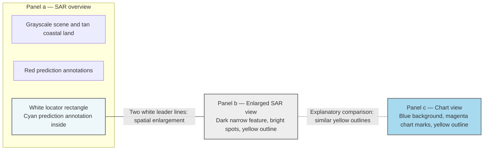

The solid undirected connector summarizes the two visible white leader lines. The dashed connector is added to express the comparison between b and c; there is no physical b-to-c connector in the source. Neither connection represents a vessel trajectory, model execution, or a time sequence. The diagram's gray borders keep white source outlines visible on a white page; source colors are recorded in the tables and JSON.

## 3. Annotation conventions

| Visible element | Interpretation | Limit |
| --- | --- | --- |
| Tan region in panel a | Land/coastal context over the overview imagery. | It is not an oil-spill prediction mask. |
| Grayscale imagery in a and b | SAR scene and enlarged SAR detail, as identified by the caption. | Brightness alone does not establish oil or identify the source. |
| Red annotation groups in a | Visible model prediction annotations. | Small labels and exact class names are not reliably readable. |
| Cyan annotation in a | Prediction annotation inside the selected region. | Its class text and confidence are not transcribed. |
| White rectangle in a | Locator for the enlarged region. | It is not another model prediction box. |
| Two white slanted lines | Connect the locator to the enlarged inset. | They indicate zoom correspondence, not movement. |
| White border around b | Boundary of the enlarged inset. | It is not the spill boundary. |
| Narrow dark feature in b | Prominent elongated feature extending down the panel. | The caption and paper identify the oil-spill case; the grayscale appearance alone is not proof. |
| Compact bright spots in b | Bright SAR features near the highlighted area. | The image alone cannot uniquely distinguish a ship from a platform. |
| Yellow outlines in b and c | Similar geometric highlights for comparison across views. | They are not established spill contours, vessel routes, or geographic boundaries. |
| Blue background in c | Chart background. | No scale or projection is supplied in this crop. |
| Magenta dotted/dashed lines and symbols in c | Chart overlays. | Their meanings are not defined by a readable legend; they are not automatically AIS tracks. |

## 4. Panel-by-panel transcription

### Panel a: SAR overview and selected region

**Background:** A broad grayscale scene with an irregular tan coastline and land area across the upper portion. Darker and lighter texture covers the sea.

**Visible annotations:** Two small red annotation groups appear left of center. A cyan annotation appears farther right, inside a white rectangular locator. The small prediction labels cannot be reliably transcribed. The number of visible annotation groups is not treated as an exact count of individual detections.

**Relationship:** Two white leader lines extend from the locator toward the upper-left and lower-left corners of panel b's white border. The central inset overlaps and obscures part of the original overview.

### Panel b: Enlarged SAR region

**Background:** Speckled grayscale imagery inside a white rectangular border.

**Visible features:** A narrow, dark, approximately vertical feature extends toward the lower edge. Compact bright spots appear above and around its upper region. An irregular closed yellow outline lies near the upper end of the dark feature; a prominent bright cluster is visible above the outline.

**Relationship:** This is the enlargement of the region selected in a. The yellow outline has a recognizable geometric correspondence to the yellow outline in c. The outline is a comparison aid; it should not be interpreted as a traced perimeter of the long dark feature.

### Panel c: Chart view

**Background:** A light-blue chart with magenta dotted or dashed connections, small symbols, and small dark numeric and text labels.

**Visible overlay:** A large irregular closed yellow outline spans much of the panel. Its top peak, rightward extension, inward notch, and lower-left portion resemble the corresponding arrangement of the outline in b.

**Relationship:** The two yellow overlays invite a comparison of spatial arrangements between the enlarged SAR view and the chart. No linking arrow, vertex labels, registration grid, or numeric coordinate transformation is supplied. The small chart labels are left untranscribed rather than guessing a facility identity or a unit for the numeric markings.

## 5. Cross-panel interpretation

| Relationship | Evidence in the image | Supported reading |
| --- | --- | --- |
| a → b | White locator and two white leader lines | The selected region in the overview is enlarged in b. |
| b ↔ c | Similar irregular yellow outlines | Features in the enlarged SAR scene are being compared with the chart's spatial arrangement. |
| Dark feature in b and the event caption | Caption describes a detected operational oil spill | The figure presents this region as part of the oil-spill case. |
| Bright features in b and chart features in c | Matching visual highlights; additional explanation in the paper | The panels support a source-location comparison, but the screenshot alone does not prove source identity or causation. |

### Separately attributed paper context

Section 3.3 of the previously supplied paper, DOI `10.1016/j.marpolbul.2025.118608`, describes this as an application case near the Port of South Louisiana, United States. It reports a narrow oil spill approximately 5.5 km long from north to south and a suspected source at `29◦6′58.176′N, 89◦37′8.076′W`. Those values come from the paper, not from measurements or coordinate axes in the image.

The paper says the bright source-area spot and nearby bright spots in b correspond to an oil-platform group in the electronic chart in c. It also reports no ship trajectories in the target area within a radius of 5 km in the AIS data and attributes the event to oil-platform leakage. This is the paper's reported analysis, not an independent verification from the screenshot. The magenta lines in c must not be relabeled as ship trajectories based on their appearance.

## 6. Readable labels and acquisition metadata

| Field | Transcription | Evidence |
| --- | --- | --- |
| Figure number | Fig. 7 | Caption. |
| Panel labels | a, b, c | Large white letters within the three panels. |
| Model | YOLOv8-LSK | Caption. |
| Event description | operational oil spill | Caption. |
| Satellite | Sentinel-1 | Caption. |
| Image type | SAR | Caption. |
| Acquisition date | April 9, 2023 | Caption. |
| Acquisition time as printed | 00: 02 UTC | Caption. |
| Normalized date and time | 2023-04-09, 00:02 UTC | Formatting of caption metadata; no seconds are supplied. |
| Prediction class labels and confidence values | Not reliably transcribed | Too small in the supplied image. |
| Small chart text and numeric labels | Not reliably transcribed | No uncertain names, coordinate values, or units are inferred. |

The caption gives the satellite image acquisition time. It does not establish when the spill began, its duration, or its discharge rate.

## 7. Machine-readable representation

This JSON preserves the same numbered-section and structured-data approach used in the other figure files. Panel IDs and relationship IDs are transcription aids. Image observations, caption metadata, and paper context are stored separately. `null` means not specified or not reliably recoverable, not zero.

```json
{
  "figure_id": "Fig. 7",
  "caption": "Fig. 7. YOLOv8-LSK model detected the operational oil spill in the Sentinel-1 SAR image acquired at 00: 02 UTC on April 9, 2023.",
  "figure_type": "SAR_detection_overview_with_zoom_and_chart_comparison",
  "layout": {
    "panel_count": 3,
    "left_to_right_order": [
      "panel_a",
      "panel_b",
      "panel_c"
    ],
    "overlap": {
      "foreground": "panel_b",
      "background": "panel_a",
      "description": "panel_b_overlaps_right_part_of_panel_a"
    },
    "panel_c_is_separate": true
  },
  "caption_metadata": {
    "model": "YOLOv8-LSK",
    "detected_phenomenon_as_captioned": "operational oil spill",
    "satellite": "Sentinel-1",
    "imaging_method": "SAR",
    "acquisition_date": "2023-04-09",
    "acquisition_time_as_printed": "00: 02 UTC",
    "acquisition_time_normalized": "00:02",
    "timezone": "UTC",
    "time_precision": "minute",
    "seconds_specified": false,
    "acquisition_time_is_spill_start_time": null
  },
  "panels": {
    "panel_a": {
      "printed_label": "a",
      "position": "left_background_panel_partly_overlapped_by_panel_b",
      "role": "SAR_detection_overview",
      "background": "grayscale_sea_scene_with_tan_coastal_land_in_upper_portion",
      "visible_features": [
        "two_small_red_annotation_groups_left_of_center",
        "small_cyan_annotation_within_white_locator_rectangle_near_right_side",
        "white_locator_rectangle_connected_to_panel_b_by_two_white_leader_lines"
      ],
      "contains_locator": "locator_b",
      "red_class_text": null,
      "cyan_class_text": null,
      "confidence_values": null,
      "independent_exact_detection_count": null
    },
    "panel_b": {
      "printed_label": "b",
      "position": "center_enlarged_inset_overlapping_right_portion_of_panel_a",
      "role": "enlarged_SAR_region_selected_in_panel_a",
      "border": "white_rectangle",
      "background": "grayscale_speckled_SAR_texture",
      "visible_features": [
        "narrow_dark_near_vertical_feature_extending_down_toward_lower_edge",
        "bright_compact_spots_in_upper_and_middle_regions",
        "irregular_closed_yellow_outline_near_upper_end_of_dark_feature"
      ],
      "yellow_overlay": "yellow_b",
      "feature_identity_from_image_alone": null,
      "physical_length_from_image_alone": null
    },
    "panel_c": {
      "printed_label": "c",
      "position": "right_separate_rectangular_panel",
      "role": "chart_view_for_comparison_with_panel_b",
      "background": "light_blue_chart",
      "visible_features": [
        "magenta_dotted_or_dashed_lines_and_small_symbols",
        "small_dark_numeric_and_text_labels",
        "large_irregular_closed_yellow_outline_with_similar_shape_to_panel_b_outline"
      ],
      "yellow_overlay": "yellow_c",
      "small_chart_labels_exact_transcription": null,
      "magenta_line_meaning_from_image_alone": null,
      "AIS_tracks_explicitly_identified": false
    }
  },
  "locators": {
    "locator_b": {
      "parent_panel": "panel_a",
      "shape": "white_rectangle",
      "position": "right_side_of_visible_overview",
      "contains": "cyan_prediction_annotation",
      "corresponding_detail_panel": "panel_b"
    }
  },
  "overlays": {
    "yellow_b": {
      "panel": "panel_b",
      "shape": "irregular_closed_polygonal_outline",
      "color": "yellow",
      "paired_with": "yellow_c"
    },
    "yellow_c": {
      "panel": "panel_c",
      "shape": "irregular_closed_polygonal_outline",
      "color": "yellow",
      "paired_with": "yellow_b"
    }
  },
  "relationships": [
    {
      "id": "zoom_a_to_b",
      "source": "locator_b",
      "target": "panel_b",
      "relation": "spatial_enlargement",
      "evidence": "two_visible_white_leader_lines_from_locator_to_inset",
      "connector_color": "white",
      "connector_count": 2,
      "arrowheads": false,
      "is_time_sequence": false
    },
    {
      "id": "compare_b_c",
      "source": "panel_b",
      "target": "panel_c",
      "relation": "geometric_correspondence_for_visual_comparison",
      "evidence": "similar_yellow_outline_shapes_in_both_panels",
      "explicit_interpanel_connector_drawn": false,
      "overlay_pair": [
        "yellow_b",
        "yellow_c"
      ],
      "is_trajectory": false,
      "exact_coordinate_correspondence_provided": false
    }
  ],
  "annotation_conventions": {
    "red_and_cyan_marks_in_a": "prediction_annotations_with_untranscribed_small_labels",
    "white_locator_and_leaders": "selection_and_magnification",
    "yellow_outlines": "matched_visual_highlights_for_cross_panel_comparison",
    "magenta_marks_in_c": "chart_overlays_with_unspecified_symbol_meanings",
    "yellow_outline_is_confirmed_spill_boundary": false,
    "yellow_outline_is_confirmed_vessel_track": false,
    "bright_SAR_spot_unambiguously_identifies_platform": false
  },
  "paper_context": {
    "source_doi": "10.1016/j.marpolbul.2025.118608",
    "source_section": "3.3",
    "location_as_described": "Port of South Louisiana, United States",
    "radar_band_as_described": "C-band",
    "polarization_as_described": "VV",
    "spill_length_km_approximate": 5.5,
    "spill_extent_as_described": "north to south",
    "suspected_source_position_as_transcribed": "29◦6′58.176′N, 89◦37′8.076′W",
    "position_is_not_read_from_figure_axes": true,
    "cross_panel_comparison_as_described": "white_spot_and_nearby_white_spots_in_b_match_oil_platform_group_positions_in_electronic_chart_c",
    "AIS_statement_as_reported": "no_ship_trajectories_in_target_area_with_radius_5_km",
    "source_attribution_as_reported": "operational_oil_spill_caused_by_oil_platform_leakage",
    "independently_verified_here": false
  },
  "interpretation_limits": [
    "This is an observation and source-comparison figure, not a neural-network layer architecture.",
    "The white connectors represent enlargement, not motion or elapsed time.",
    "The figure does not draw a connector between panels b and c; the Mermaid comparison link is explanatory.",
    "The yellow outline must not be treated as a verified spill footprint, vessel track, or measured geographic boundary.",
    "Magenta chart lines cannot be identified as AIS tracks without a legend or other evidence.",
    "Small prediction labels, confidence values, and chart labels are not reliably transcribed.",
    "The image alone does not establish the identity of a particular platform or prove source causation.",
    "Paper-context quantities and conclusions are attributed statements, not measurements derived from image pixels."
  ],
  "not_specified_by_image": [
    "readable_class_color_mapping",
    "prediction_confidence_values_and_thresholds",
    "exact_prediction_box_coordinates",
    "scale_bar_and_physical_pixel_size",
    "geographic_axis_bounds_and_projection",
    "unique_platform_or_vessel_identifier",
    "magenta_chart_symbol_legend",
    "spill_start_time_duration_volume_or_discharge_rate",
    "precise_vertex_coordinates_or_geometric_transform_between_yellow_outlines"
  ],
  "null_meaning": "not specified or not reliably recoverable, not zero"
}
```

## 8. Interpretation limits

- This is a three-panel detection and source-comparison figure, not a neural-network layer diagram.
- Panel b is an enlarged view of a selected part of a. It is not evidence of a later acquisition or of movement between frames.
- The white locator, white leader lines, and white inset border are layout annotations, not oil-spill predictions.
- The yellow shapes must not be used as confirmed spill footprints, vessel tracks, or measured geographic boundaries.
- The image does not define the magenta chart symbols or establish that the magenta lines are AIS trajectories.
- Bright SAR spots alone do not establish a unique platform or vessel identity. Source attribution requires the additional context reported in the paper.
- No class names, confidence values, exact box coordinates, map bounds, projection, physical pixel size, or chart-label meanings are inferred from unreadable details.
- The approximately 5.5 km length, source position, 5 km AIS search radius, and leakage attribution are paper-reported information, not image-derived measurements or independently verified conclusions.
- The acquisition date and time are preserved from the caption; they are not assumed to be the spill's start date and time.
- The output is a semantic schematic, not a georeferenced dataset, registered overlay, or pixel-exact reconstruction.


# Figure 8 — Oil-spill detection, enlarged SAR view, and vessel-trajectory comparison

**Original caption:** Fig. 8. YOLOv8-LSK model detected the operational oil spill in the Sentinel-1 SAR image acquired at 00: 02 UTC on May 15, 2023.

## 1. Schematic organization

This is a **three-panel observation and comparison figure**. Panel a shows a broad SAR scene with model annotations. A white locator rectangle selects a region enlarged in panel b. Panel c shows a geographically annotated SAR view with the same readable detection label and an additional green dotted or dashed overlay.

| Panel | Position | Role |
| --- | --- | --- |
| a | Left, partly covered by the central inset | Overview of the SAR scene and detection annotations. |
| b | Center, overlapping the right portion of panel a | Enlarged view associated with the selected region in a. |
| c | Right, separate from a and b | Coordinate-labeled SAR view for comparing the detected feature with the green overlay. |

The figure does not show three different models, three consecutive acquisitions, or a neural-network architecture. The white connecting lines indicate enlargement. Panel c adds geographic context and a track-like overlay; the accompanying paper describes the comparison as involving AIS vessel-trajectory data.

```text
PANEL a: SAR overview
  Grayscale sea and tan coastal land
  Multiple red prediction annotations
  White locator rectangle near the lower end of a long annotated feature
                         |
              Two white leader lines
                (spatial enlargement)
                         |
                         v
PANEL b: Enlarged SAR view                  PANEL c: Geographic SAR view
  Narrow dark feature                        Same narrow dark feature
  Red prediction rectangles                  Red prediction rectangles
  Cyan box and label:                         Cyan box and label:
    "oil spill 0.62"                           "oil spill 0.62"
  Small bright spot near lower end           Additional green dotted/dashed overlay
                              <---------->   Latitude/longitude ticks
                               Comparison    Nearby compass and Miles scale bar

Panel b overlaps the right side of panel a in the original layout.
The comparison arrow is explanatory; no b-to-c arrow is drawn in the source.
```

## 2. Mermaid relationship diagram

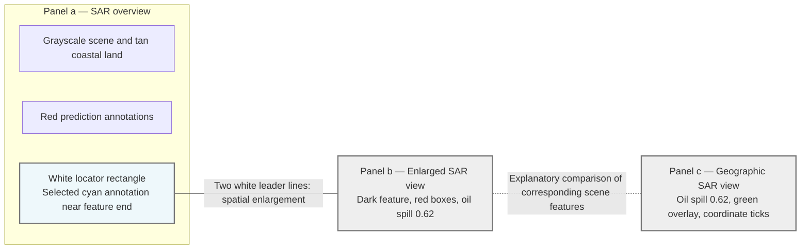

The solid undirected connector summarizes the two white leader lines visible in the source. The dashed connector is added to express the comparison between b and c; no physical connector joins those panels in the image. These schematic connectors do not represent a vessel's movement or a time sequence. Gray borders in the schematic keep the source's white outlines visible against a white page.

## 3. Annotation conventions

| Visible element | Interpretation | Limit |
| --- | --- | --- |
| Tan areas in a | Land/coastal context around the SAR imagery. | They are not predicted oil-spill masks. |
| Grayscale imagery | SAR scene texture, as identified by the caption. | Darkness or brightness alone does not establish oil or identify a vessel. |
| Red rectangles and small labels | Visible model prediction annotations. | The small red class labels and confidence values are not reliably transcribed. |
| Cyan narrow outline | Prediction annotation associated with the readable cyan label. | It is a bounding-box annotation, not a precise spill contour. |
| `oil spill 0.62` | Readable displayed class and confidence label in both b and c. | The score is not independently measured accuracy or proof of correctness. |
| White locator rectangle in a | Selection associated with the enlarged view. | It is not an additional prediction box. |
| Two white slanted lines | Enlargement connectors from the locator to b. | They do not show motion, flow direction, or elapsed time. |
| White border around b | Inset boundary. | It is not a geographic or oil-spill boundary. |
| Narrow dark feature in b and c | Elongated scene feature associated with the illustrated detection. | The figure does not provide an exact segmented perimeter. |
| Small bright spot near the lower feature end | Compact bright SAR feature. | Vessel identity and source attribution require additional information. |
| Green dotted/dashed line in c | Additional track-like overlay near the dark feature and lower bright spot. | No readable legend identifies it directly; its AIS interpretation comes from the accompanying paper. |
| Black coordinate ticks and labels | Geographic reference for panel c. | The displayed ticks are not the exact outer bounds of the panel. |
| Compass rose and scale bar | Orientation and distance reference displayed between b and c, beside c. | The figure does not establish that the scale applies unchanged to the enlarged inset b. |

The two appearances of `oil spill 0.62` are repeated views of the illustrated detection. They are not evidence of two independent detections, two different models, or two separate confidence estimates.

## 4. Panel-by-panel transcription

### Panel a: SAR overview and selected region

**Background:** A broad grayscale scene with tan coastal land toward the upper-right and a tan area along part of the lower edge. A dark curved band crosses the upper portion of the sea imagery.

**Visible annotations:** Red prediction rectangles appear in the upper-left, along a long feature near the right side of the visible overview, and near the lower-left. A cyan annotation appears near the lower end of the long right-side feature. The tiny overview labels are not reliably readable.

**Relationship:** A white locator rectangle surrounds the area near the cyan annotation. Two white leader lines link this locator to the upper-left and lower-left corners of the enlarged panel b. Panel b overlaps and obscures part of the overview.

### Panel b: Enlarged detection view

**Background:** Speckled grayscale SAR imagery inside a white rectangular border.

**Visible features:** A narrow, dark, approximately vertical feature extends downward from the upper edge. Red rectangular prediction outlines cover or overlap portions of that feature. Some upper outlines reach the panel boundary. Near its lower end is a small bright spot and a narrow cyan outline.

**Readable label:** A large cyan label reads exactly `oil spill 0.62`. It extends horizontally across the image and obscures part of the underlying feature and annotation geometry.

**Relationship:** The enlarged view reveals the target area selected in a. Its dark feature, lower bright spot, red outlines, and cyan label correspond visually to the same region shown with geographic annotations in c. A full spill length cannot be measured from the visible portion of this inset alone.

### Panel c: Geographic SAR view and green overlay

**Background:** A separate rectangular grayscale SAR view with a black border and geographic tick labels on its edges. It is a SAR image with overlays, not a blue electronic-chart panel.

**Visible annotations:** Red prediction rectangles cover portions of the narrow dark feature. The cyan label again reads `oil spill 0.62`. A green dotted or dashed line runs approximately vertically near the left side of the dark feature, from the upper edge toward the small bright spot near the lower end. The green overlay and cyan annotation are distinct colors and elements.

**Geographic context:** Longitude ticks appear along the top and bottom; latitude ticks appear along the left and right. A compass rose and a scale bar are placed just outside the panel on its left. North points upward and east points right.

**Relationship:** Panel c supports a spatial comparison between the detected feature and the green overlay. Its appearance is consistent with the AIS trajectory comparison discussed in the paper, but no visible legend independently defines the line as AIS data. The image supplies no direction arrow or timestamps along the green line, so travel direction and speed are not reconstructed.

## 5. Cross-panel interpretation

| Relationship | Evidence | Supported reading |
| --- | --- | --- |
| a → b | White locator and two white leader lines | The selected target region is shown in greater detail in b. |
| b ↔ c | Corresponding dark feature, bright endpoint, prediction outlines, and repeated `oil spill 0.62` label | The panels present corresponding views of the illustrated detection. |
| Detection and green overlay in c | Spatial proximity and similar overall alignment | The figure supports comparison of the detected feature with an additional line overlay. |
| Green overlay and vessel-source analysis | Explanation in the accompanying paper | The paper interprets the comparison using AIS vessel trajectories. |

### Separately attributed paper context

Section 3.3 of the previously supplied paper, DOI `10.1016/j.marpolbul.2025.118608`, describes this as an application case near the Port of South Louisiana, United States. It reports an oil spill approximately 19 km long, with changes in the width of its head and tail, and a suspected source at the southern tip at `28◦21′31.968′N` and `89◦13′31.332′W`.

The paper reports that only one ship in the target area coincided with the bright spot at the satellite acquisition time and that the vessel's trajectory closely matched the spill shape. It identifies the suspect ship as **BOCHEM LONDON** and attributes the incident to illegal discharges by a moving ship.

These lengths, coordinates, vessel identity, and attribution are statements from the paper, not independently verified measurements or conclusions from the screenshot. In particular, the figure itself does not display the vessel name, AIS timestamps, vessel identifier, or a discharge record.

## 6. Readable labels and acquisition metadata

### Caption and prediction labels

| Field | Transcription | Evidence |
| --- | --- | --- |
| Figure number | Fig. 8 | Caption. |
| Panel labels | a, b, c | Large white letters within the panels. |
| Model | YOLOv8-LSK | Caption. |
| Event description | operational oil spill | Caption. |
| Satellite | Sentinel-1 | Caption. |
| Image type | SAR | Caption. |
| Acquisition date | May 15, 2023 | Caption. |
| Acquisition time as printed | 00: 02 UTC | Caption. |
| Normalized date and time | 2023-05-15, 00:02 UTC | Formatting of caption metadata; no seconds are supplied. |
| Panel b prediction label | oil spill 0.62 | Readable cyan label. |
| Panel c prediction label | oil spill 0.62 | Readable cyan label repeated in the geographic view. |
| Printed class | oil spill | Cyan labels in b and c. |
| Displayed confidence | 0.62 | Cyan labels in b and c; not an accuracy metric. |

### Map labels and scale

Degree/minute/second symbols and spacing below are normalized for readable transcription. The numeric values and hemisphere letters are retained.

| Map element | Readable values | Position |
| --- | --- | --- |
| Longitude ticks | 89°15′0″W; 89°10′0″W | Top and bottom of c. |
| Latitude ticks | 28°25′0″N; 28°20′0″N | Left and right of c. |
| Compass directions | N, E, S, W | Compass between b and c; north upward. |
| Scale-bar values | 0; 0.75; 1.5 | Beside c, below the compass. |
| Scale-bar unit as printed | Miles | Right of the scale bar. |

The displayed coordinate ticks are reference positions within the map frame, not a complete geographic bounding box. `Miles` is preserved as printed; it is not silently converted to nautical miles. The figure's acquisition time is not assumed to be the time when discharge began.

## 7. Machine-readable representation

This JSON follows the panel-based structure used for Figure 7. Image observations, readable labels, geographic annotations, and paper context are stored separately. Panel IDs and relationship IDs are transcription aids. `null` means unknown or not reliably transcribed, not zero.

```json
{
  "figure_id": "Fig. 8",
  "caption": "Fig. 8. YOLOv8-LSK model detected the operational oil spill in the Sentinel-1 SAR image acquired at 00: 02 UTC on May 15, 2023.",
  "figure_type": "SAR_detection_overview_with_zoom_and_geographic_trajectory_comparison",
  "layout": {
    "panel_count": 3,
    "left_to_right_order": ["panel_a", "panel_b", "panel_c"],
    "overlap": {
      "foreground": "panel_b",
      "background": "panel_a",
      "description": "panel_b_overlaps_right_part_of_panel_a"
    },
    "panel_c_is_separate": true,
    "compass_and_scale_position": "between_panels_b_and_c_adjacent_to_c"
  },
  "caption_metadata": {
    "model": "YOLOv8-LSK",
    "detected_phenomenon_as_captioned": "operational oil spill",
    "satellite": "Sentinel-1",
    "imaging_method": "SAR",
    "acquisition_date": "2023-05-15",
    "acquisition_time_as_printed": "00: 02 UTC",
    "acquisition_time_normalized": "00:02",
    "timezone": "UTC",
    "time_precision": "minute",
    "seconds_specified": false,
    "acquisition_time_is_spill_start_time": null
  },
  "panels": {
    "panel_a": {
      "printed_label": "a",
      "position": "left_background_panel_partly_overlapped_by_panel_b",
      "role": "SAR_detection_overview",
      "background": "grayscale_SAR_with_tan_coastal_land",
      "visible_features": [
        "red_prediction_annotations_in_upper_left_right_side_and_lower_left",
        "long_annotated_feature_near_right_side_of_visible_overview",
        "cyan_annotation_near_lower_end_of_long_feature",
        "white_locator_rectangle_near_cyan_annotation"
      ],
      "contains_locator": "locator_b",
      "small_prediction_labels": null,
      "independent_exact_detection_count": null
    },
    "panel_b": {
      "printed_label": "b",
      "position": "center_inset_overlapping_panel_a",
      "role": "enlarged_SAR_detection_view",
      "border": "white_rectangle",
      "visible_features": [
        "narrow_dark_feature_extending_down_from_upper_edge",
        "multiple_red_rectangular_prediction_outlines_along_feature",
        "small_bright_spot_near_lower_end",
        "narrow_cyan_prediction_outline",
        "large_cyan_label_obscuring_some_underlying_detail"
      ],
      "readable_prediction": {
        "text_as_printed": "oil spill 0.62",
        "class_text": "oil spill",
        "confidence": 0.62,
        "color": "cyan"
      },
      "red_class_text": null,
      "red_confidence_values": null,
      "full_spill_extent_visible": null
    },
    "panel_c": {
      "printed_label": "c",
      "position": "right_separate_rectangular_panel",
      "role": "geographically_annotated_SAR_comparison_view",
      "border": "black_rectangle",
      "background": "grayscale_SAR_not_electronic_chart",
      "visible_features": [
        "corresponding_narrow_dark_feature_and_lower_bright_spot",
        "red_rectangular_prediction_outlines",
        "cyan_prediction_label",
        "green_dotted_or_dashed_overlay_near_feature",
        "latitude_and_longitude_tick_labels"
      ],
      "readable_prediction": {
        "text_as_printed": "oil spill 0.62",
        "class_text": "oil spill",
        "confidence": 0.62,
        "color": "cyan"
      },
      "overlay": "green_track_overlay",
      "readable_overlay_legend_present": false,
      "vessel_name_printed": null,
      "trajectory_timestamps_printed": null
    }
  },
  "locators": {
    "locator_b": {
      "parent_panel": "panel_a",
      "shape": "white_rectangle",
      "position": "near_lower_end_of_long_right_side_annotated_feature",
      "contains": "selected_cyan_annotation",
      "corresponding_detail_panel": "panel_b"
    }
  },
  "overlays": {
    "green_track_overlay": {
      "panel": "panel_c",
      "color": "green",
      "line_style": "dotted_or_dashed",
      "visible_path": "approximately_vertical_near_left_side_of_dark_feature_toward_lower_bright_spot",
      "interpretation_in_paper_context": "AIS_vessel_trajectory_comparison",
      "interpretation_explicitly_labeled_in_image": false,
      "travel_direction": null,
      "speed": null,
      "timestamps": null,
      "is_prediction_bounding_box": false
    }
  },
  "relationships": [
    {
      "id": "zoom_a_to_b",
      "source": "locator_b",
      "target": "panel_b",
      "relation": "spatial_enlargement",
      "evidence": "two_visible_white_leader_lines",
      "connector_color": "white",
      "connector_count": 2,
      "arrowheads": false,
      "is_time_sequence": false
    },
    {
      "id": "compare_b_c",
      "source": "panel_b",
      "target": "panel_c",
      "relation": "corresponding_detection_views_with_added_geographic_and_track_overlay",
      "evidence": "corresponding_scene_features_prediction_outlines_and_repeated_readable_label",
      "explicit_interpanel_connector_drawn": false,
      "repeated_label_is_independent_detection_evidence": false,
      "exact_image_registration_transform_provided": false
    }
  ],
  "map_annotations": {
    "panel": "panel_c",
    "coordinate_notation": "degrees_minutes_seconds_with_hemisphere",
    "longitude_ticks": ["89°15′0″W", "89°10′0″W"],
    "longitude_tick_edges": ["top", "bottom"],
    "latitude_ticks": ["28°25′0″N", "28°20′0″N"],
    "latitude_tick_edges": ["left", "right"],
    "notation_spacing_and_symbols_normalized": true,
    "ticks_define_exact_outer_bounds": false,
    "compass": {
      "labels": ["N", "E", "S", "W"],
      "north_direction_on_page": "up",
      "east_direction_on_page": "right",
      "position": "outside_c_to_its_left"
    },
    "scale_bar": {
      "values_as_printed": [0, 0.75, 1.5],
      "unit_as_printed": "Miles",
      "position": "below_compass_beside_c",
      "applies_unchanged_to_panel_b": null,
      "nautical_miles_assumed": false
    },
    "projection": null,
    "exact_geographic_bounds": null
  },
  "annotation_conventions": {
    "white_locator_and_leaders": "selection_and_magnification",
    "red_rectangles": "prediction_annotations_with_untranscribed_class_labels",
    "cyan_prediction_class": "oil spill",
    "cyan_readable_confidence": 0.62,
    "green_overlay": "track_like_line_distinct_from_cyan_prediction",
    "confidence_is_independently_measured_accuracy": false,
    "bounding_box_is_precise_spill_contour": false,
    "repeated_label_across_b_and_c": true
  },
  "paper_context": {
    "source_doi": "10.1016/j.marpolbul.2025.118608",
    "source_section": "3.3",
    "location_as_described": "Port of South Louisiana, United States",
    "spill_length_km_approximate": 19,
    "spill_shape_as_described": "narrow_strip_with_distinct_width_changes_at_head_and_tail",
    "suspected_source_at": "southern_tip",
    "source_latitude_as_transcribed": "28◦21′31.968′N",
    "source_longitude_as_transcribed": "89◦13′31.332′W",
    "position_is_not_derived_from_figure_ticks": true,
    "AIS_statement_as_reported": "only_one_ship_in_target_area_coincided_with_bright_spot_at_acquisition_time",
    "trajectory_comparison_as_reported": "vessel_trajectory_well_matched_spill_shape",
    "suspect_vessel_as_reported": "BOCHEM LONDON",
    "source_attribution_as_reported": "illegal_discharges_by_a_moving_ship",
    "independently_verified_here": false
  },
  "interpretation_limits": [
    "This is a detection and trajectory-comparison figure, not an internal model architecture.",
    "White leaders show enlargement, not motion or elapsed time.",
    "No b-to-c connector is drawn in the source; the diagram's comparison link is explanatory.",
    "The green line's AIS interpretation uses paper context because the image lacks a readable line legend.",
    "No travel direction, vessel speed, or trajectory timestamp is reconstructed.",
    "The label 0.62 is a displayed model confidence, not verified accuracy.",
    "Map ticks are reference positions, not exact panel bounds.",
    "Paper-reported vessel identity, spill length, source coordinates, and attribution are not independently verified from the screenshot."
  ],
  "null_meaning": "not specified or not reliably recoverable, not zero"
}
```

## 8. Interpretation limits

- This is a detection and trajectory-comparison figure, not a neural-network layer architecture.
- Panel b enlarges the selected region of a. It is not a later frame or a different model's result.
- The white rectangle, leader lines, and inset border are layout annotations, not predicted spills.
- Repeated `oil spill 0.62` labels in b and c do not establish two independent detections. The confidence is a displayed prediction score, not measured accuracy.
- The green overlay's AIS interpretation is supported by the accompanying paper, not by a readable legend in the image. Its direction, speed, and timestamps are not reconstructed.
- Red and cyan rectangles are bounding-box annotations, not precise spill contours or measurements of polluted area.
- The visible map ticks do not supply exact outer bounds. The scale bar's unit is retained as `Miles`, and its scale is not automatically applied to the enlarged inset.
- The approximately 19 km length, source coordinates, vessel name, and discharge attribution come from the paper and are not independently established by the image.
- The satellite acquisition date and time are not assumed to be the spill's start date and time.
- This file is a semantic schematic, not an AIS dataset, registered geospatial overlay, executable model, or pixel-exact reconstruction.


# Figure 9 — Oil-spill detection and berthed-vessel trajectory comparison

**Original caption:** Fig. 9. YOLOv8-LSK model detected the operational oil spill in the Sentinel-1 SAR image acquired at 23:57 UTC on December 5, 2023.

## 1. Schematic organization

This is a **three-panel observation and comparison figure**. Panel a presents an SAR overview with prediction annotations. A white locator selects a cyan-annotated region enlarged in panel b. Panel c presents the corresponding SAR feature with geographic references and a diagonal green dotted overlay.

| Panel | Position | Role |
| --- | --- | --- |
| a | Left, partly covered by the enlarged inset | Overview of the SAR scene and prediction annotations. |
| b | Center, overlapping the right portion of a | Enlarged view of the selected cyan-annotated feature. |
| c | Right, separate from a and b | Geographic SAR view for comparing the detected feature and the green overlay. |

The panels are not separate neural-network stages, model comparisons, or consecutive acquisitions. The description of a berthed vessel comes from the accompanying paper; the image itself displays scene features, predictions, and a line overlay without a readable vessel name or mooring label.

```text
PANEL a: SAR overview
  Tan coastal land and grayscale sea
  Multiple red and cyan prediction annotations
  White locator around one selected cyan annotation
                         |
              Two white leader lines
                (spatial enlargement)
                         |
                         v
PANEL b: Enlarged SAR view                   PANEL c: Geographic SAR view
  Narrow cyan box                             Corresponding cyan box
  Slender dark feature within box             Same slender dark feature
  Label: "oil spill 0.87"        <---------->  Label: "oil spill 0.87"
  Separate bright point below/right           Green dotted diagonal near upper end
                                  Comparison  Coordinate ticks, compass, Miles scale

In c, the green overlay spans a southwest–northeast axis, while the dark feature
extends approximately north–south. The green line does not trace the feature.
The comparison arrow is explanatory; no b-to-c arrow is drawn in the source.
```

## 2. Mermaid relationship diagram

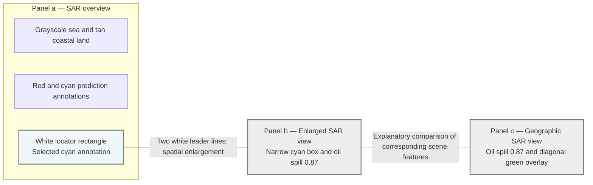

The solid undirected connector summarizes the two visible white leader lines. The dashed connector is an explanatory addition: the source draws no interpanel connector between b and c. These connectors describe enlargement and comparison, not vessel movement, elapsed time, or model execution. The diagram uses gray borders so the source's white boundaries remain visible on a white page.

## 3. Annotation conventions

| Visible element | Interpretation | Limit |
| --- | --- | --- |
| Tan regions in a | Coastal land/context around the grayscale imagery. | Not an oil-spill prediction mask. |
| Grayscale imagery | SAR scene texture, as identified by the caption. | Brightness alone does not identify a ship, platform, or pollutant. |
| Red rectangles in a | Prediction annotations, including overlapping groups. | Small red class labels and confidence values are not reliably transcribed. |
| Cyan annotations in a | Additional predictions, including the selected target. | Tiny overview labels do not support a complete independent detection count. |
| Narrow cyan box in b and c | Bounding box associated with the readable prediction label. | It is not a precise spill contour. |
| `oil spill 0.87` | Displayed class text and confidence. | The score is not independently measured accuracy or proof of correctness. |
| White rectangle and two leader lines | Selection and enlargement. | Not prediction boxes, vessel tracks, or spill-flow arrows. |
| White border around b | Inset boundary. | Not a geographic or polluted-area boundary. |
| Slender dark feature inside the cyan box | Scene feature associated with the illustrated detection. | Its exact outline and physical dimensions are not supplied as measurements. |
| Small bright feature near the upper end | Compact bright SAR feature near the selected target's top. | Its identity and role require context beyond brightness alone. |
| Separate bright point below and right of the box | Another visible scene feature. | It is not automatically the selected discharge source. |
| Green dotted diagonal in c | Additional track-like overlay. | No readable legend or arrowhead supplies its type, timestamps, or travel direction. |
| Black coordinate labels, compass, and scale | Geographic reference for the mapped view. | Tick labels are not exact outer bounds, and the scale is not automatically transferable to b. |

The matching `oil spill 0.87` labels in b and c are repeated views of the illustrated detection. They are not two independent detections or two separate confidence estimates.

## 4. Panel-by-panel transcription

### Panel a: SAR overview and selected region

**Background:** A broad grayscale coastal scene with prominent tan land across the upper-left and smaller tan areas at other image edges.

**Visible annotations:** Several red rectangles occur across the scene, including overlapping groups near the upper-right of the visible overview. Multiple cyan annotations are visible: the selected annotation near the middle-right, another above it, and another toward the lower-left. The inset covers part of the overview, so the visible annotations are not treated as a complete object inventory.

**Relationship:** A white locator rectangle surrounds the selected cyan annotation. Two white leader lines connect it to the upper-left and lower-left corners of the enlarged panel b, which overlaps the right part of a.

### Panel b: Enlarged selected detection

**Background:** Dark, speckled grayscale SAR imagery inside a white rectangular border.

**Visible features:** A narrow vertical cyan rectangle encloses a slender, slightly irregular dark feature. A small bright feature appears near the upper end, immediately below the left edge of the cyan label. Another bright point lies farther down and to the right, outside the selected box.

**Readable label:** The large cyan label reads exactly `oil spill 0.87`. It sits above the box and extends rightward over the image. No red prediction rectangle is clearly visible within this enlarged panel.

**Relationship:** Panel b shows the selected detection from a at larger scale. The cyan box, dark feature, label, and separate lower-right bright point have corresponding appearances in c.

### Panel c: Geographic SAR view and diagonal overlay

**Background:** A separate grayscale SAR view inside a black rectangular border, with longitude labels above and below and latitude labels on both sides.

**Visible annotations:** The narrow cyan box again surrounds the dark feature, with the repeated label `oil spill 0.87`. A green dotted line spans from the lower-left part of the panel toward the upper end of the selected box. A separate bright point is visible below and to the right of the box.

**Spatial comparison:** With north upward, the green overlay spans a southwest–northeast axis, while the dark feature extends approximately north–south. The green line approaches the top of the selected region rather than following the dark feature along its length. This is a comparison of alignment, not proof of travel direction or source causation.

**Geographic context:** A compass rose and scale bar are placed between b and c, immediately beside c. The green line carries no readable timestamps, arrowheads, vessel name, or speed information.

## 5. Cross-panel interpretation

| Relationship | Evidence | Supported reading |
| --- | --- | --- |
| a → b | White locator and two white leader lines | The selected cyan-annotated region is enlarged in b. |
| b ↔ c | Corresponding cyan box, label, dark feature, and lower-right bright point | The panels show corresponding views of the selected detection. |
| Green overlay versus dark feature in c | Diagonal overlay versus near-vertical feature | Their alignments differ; the green overlay does not trace the full dark feature. |
| Green overlay and vessel analysis | Additional explanation in the accompanying paper | The paper interprets the comparison using AIS data and a mooring history. |

### Separately attributed paper context

Section 3.3 of the previously supplied paper, DOI `10.1016/j.marpolbul.2025.118608`, describes this as an application case near the Port of South Louisiana, United States. It reports three operational oil spills in the overview. For the selected spill, it describes a slender band approximately 5 km long from north to south and a suspected source at its northern peak, at `28◦56′12.876′N, 89◦58′7.356′W`.

The paper states that the ship's trajectory did not match the spill shape. It identifies the suspect vessel as **BRANDON BORDELON** and reports the following timeline:

| Date | UTC time | State reported in the paper |
| --- | --- | --- |
| December 03, 2023 | 18:06:50 | Sailing from southwest to northeast. |
| December 03, 2023 | 18:59:12 | Moored. |
| December 05, 2023 | 23:57:19 | Still moored when the SAR acquisition detected the ongoing operational oil spill. |

The paper attributes the selected event to illegal discharges by berthed vessels and the other two reported events to oil-platform leaks. These are paper-reported identities, times, quantities, and conclusions. They are not independently verified from the screenshot. The mooring time is not assumed to be the discharge start time, and the overview's colored boxes are not summed to reproduce the reported event count.

The caption supplies `23:57 UTC` at minute precision. The more precise `23:57:19 UTC` comes from the paper's discussion and is kept separate rather than silently inserted into the caption.

## 6. Readable labels and acquisition metadata

### Caption and prediction labels

| Field | Transcription | Evidence |
| --- | --- | --- |
| Figure number | Fig. 9 | Caption. |
| Panel labels | a, b, c | Large white letters within the panels. |
| Model | YOLOv8-LSK | Caption. |
| Event description | operational oil spill | Caption. |
| Satellite | Sentinel-1 | Caption. |
| Image type | SAR | Caption. |
| Acquisition date | December 5, 2023 | Caption. |
| Acquisition time as printed | 23:57 UTC | Caption. |
| Normalized date and time | 2023-12-05, 23:57 UTC | Formatting of caption metadata; seconds are not supplied by the caption. |
| Panel b prediction label | oil spill 0.87 | Readable cyan label. |
| Panel c prediction label | oil spill 0.87 | Repeated readable cyan label. |
| Printed class | oil spill | Cyan labels in b and c. |
| Displayed confidence | 0.87 | Model prediction score, not an accuracy metric. |

### Map labels and scale

Degree/minute/second symbols and spacing below are normalized for readable transcription. The numeric values and hemisphere letters are retained.

| Map element | Readable values | Position |
| --- | --- | --- |
| Longitude ticks | 89°0′0″W; 88°55′0″W | Top and bottom of c. |
| Latitude ticks | 28°55′0″N; 28°50′0″N | Left and right of c. |
| Compass directions | N, E, S, W | Between b and c; north upward and east rightward. |
| Scale-bar values | 0; 0.75; 1.5 | Below the compass beside c. |
| Scale-bar unit as printed | Miles | Right of the scale bar. |

The ticks are reference positions within the map frame, not its exact outer geographic bounds. `Miles` is retained as printed and is not silently interpreted as nautical miles. No travel direction is derived from the green dots alone.

## 7. Machine-readable representation

This JSON follows the panel-based structure used for Figures 7 and 8. Image observations, caption metadata, map annotations, and paper context are stored separately. `null` means unknown or not reliably transcribed, not zero. Timeline seconds belong to `paper_context`, not `caption_metadata`.

```json
{
  "figure_id": "Fig. 9",
  "caption": "Fig. 9. YOLOv8-LSK model detected the operational oil spill in the Sentinel-1 SAR image acquired at 23:57 UTC on December 5, 2023.",
  "figure_type": "SAR_detection_overview_with_zoom_and_geographic_trajectory_comparison",
  "layout": {
    "panel_count": 3,
    "left_to_right_order": [
      "panel_a",
      "panel_b",
      "panel_c"
    ],
    "overlap": {
      "foreground": "panel_b",
      "background": "panel_a",
      "description": "panel_b_overlaps_right_part_of_panel_a"
    },
    "panel_c_is_separate": true,
    "compass_and_scale_position": "between_panels_b_and_c_adjacent_to_c"
  },
  "caption_metadata": {
    "model": "YOLOv8-LSK",
    "detected_phenomenon_as_captioned": "operational oil spill",
    "satellite": "Sentinel-1",
    "imaging_method": "SAR",
    "acquisition_date": "2023-12-05",
    "acquisition_time_as_printed": "23:57 UTC",
    "acquisition_time_normalized": "23:57",
    "timezone": "UTC",
    "time_precision": "minute",
    "seconds_specified": false,
    "acquisition_time_is_spill_start_time": null
  },
  "panels": {
    "panel_a": {
      "printed_label": "a",
      "position": "left_background_panel_partly_overlapped_by_panel_b",
      "role": "SAR_detection_overview",
      "background": "grayscale_SAR_with_tan_coastal_land_prominent_in_upper_left",
      "visible_features": [
        "multiple_red_prediction_rectangles_including_overlapping_groups",
        "multiple_small_cyan_annotations",
        "white_locator_rectangle_around_selected_cyan_annotation_near_middle_right",
        "additional_cyan_annotations_above_selected_region_and_toward_lower_left"
      ],
      "contains_locator": "locator_b",
      "small_prediction_labels": null,
      "independent_exact_detection_count": null
    },
    "panel_b": {
      "printed_label": "b",
      "position": "center_inset_overlapping_panel_a",
      "role": "enlarged_SAR_detection_view",
      "border": "white_rectangle",
      "visible_features": [
        "narrow_cyan_vertical_bounding_box",
        "slender_dark_near_vertical_feature_inside_cyan_box",
        "small_bright_feature_near_upper_end_under_label_edge",
        "separate_bright_point_farther_down_and_right_outside_selected_box"
      ],
      "readable_prediction": {
        "text_as_printed": "oil spill 0.87",
        "class_text": "oil spill",
        "confidence": 0.87,
        "color": "cyan"
      },
      "confidence_label_position": "above_selected_cyan_box_extending_to_right",
      "red_prediction_rectangles_clearly_visible": false,
      "green_overlay_present": false
    },
    "panel_c": {
      "printed_label": "c",
      "position": "right_separate_rectangular_panel",
      "role": "geographically_annotated_SAR_comparison_view",
      "border": "black_rectangle",
      "background": "grayscale_SAR",
      "visible_features": [
        "corresponding_cyan_box_and_narrow_dark_feature",
        "green_dotted_overlay_spanning_lower_left_to_upper_end_of_selected_box",
        "separate_bright_point_lower_right_of_selected_box",
        "latitude_and_longitude_tick_labels"
      ],
      "readable_prediction": {
        "text_as_printed": "oil spill 0.87",
        "class_text": "oil spill",
        "confidence": 0.87,
        "color": "cyan"
      },
      "overlay": "green_track_overlay",
      "readable_overlay_legend_present": false,
      "vessel_name_printed": null,
      "trajectory_timestamps_printed": null,
      "green_line_has_visible_travel_direction_arrow": false
    }
  },
  "locators": {
    "locator_b": {
      "parent_panel": "panel_a",
      "shape": "white_rectangle",
      "position": "around_selected_cyan_annotation_near_middle_right_of_visible_overview",
      "contains": "selected_cyan_annotation",
      "corresponding_detail_panel": "panel_b"
    }
  },
  "overlays": {
    "green_track_overlay": {
      "panel": "panel_c",
      "color": "green",
      "line_style": "dotted",
      "visible_path": "diagonal_from_lower_left_of_panel_toward_upper_end_of_selected_cyan_box",
      "geographic_alignment_using_compass": "southwest_northeast_axis",
      "dark_feature_alignment": "approximately_north_south",
      "follows_dark_feature_lengthwise": false,
      "interpretation_in_paper_context": "AIS_vessel_trajectory_comparison",
      "interpretation_explicitly_labeled_in_image": false,
      "travel_direction_from_image_alone": null,
      "speed": null,
      "timestamps_from_image": null,
      "is_prediction_bounding_box": false
    }
  },
  "relationships": [
    {
      "id": "zoom_a_to_b",
      "source": "locator_b",
      "target": "panel_b",
      "relation": "spatial_enlargement",
      "evidence": "two_visible_white_leader_lines",
      "connector_color": "white",
      "connector_count": 2,
      "arrowheads": false,
      "is_time_sequence": false
    },
    {
      "id": "compare_b_c",
      "source": "panel_b",
      "target": "panel_c",
      "relation": "corresponding_detection_views_with_added_geographic_and_track_overlay",
      "evidence": "corresponding_dark_feature_cyan_box_repeated_label_and_separate_lower_right_bright_point",
      "explicit_interpanel_connector_drawn": false,
      "repeated_label_is_independent_detection_evidence": false,
      "exact_image_registration_transform_provided": false
    }
  ],
  "map_annotations": {
    "panel": "panel_c",
    "coordinate_notation": "degrees_minutes_seconds_with_hemisphere",
    "longitude_ticks": [
      "89°0′0″W",
      "88°55′0″W"
    ],
    "longitude_tick_edges": [
      "top",
      "bottom"
    ],
    "latitude_ticks": [
      "28°55′0″N",
      "28°50′0″N"
    ],
    "latitude_tick_edges": [
      "left",
      "right"
    ],
    "notation_spacing_and_symbols_normalized": true,
    "ticks_define_exact_outer_bounds": false,
    "compass": {
      "labels": [
        "N",
        "E",
        "S",
        "W"
      ],
      "north_direction_on_page": "up",
      "east_direction_on_page": "right",
      "position": "outside_c_to_its_left"
    },
    "scale_bar": {
      "values_as_printed": [
        0,
        0.75,
        1.5
      ],
      "unit_as_printed": "Miles",
      "position": "below_compass_beside_c",
      "applies_unchanged_to_panel_b": null,
      "nautical_miles_assumed": false
    },
    "projection": null,
    "exact_geographic_bounds": null
  },
  "annotation_conventions": {
    "white_locator_and_leaders": "selection_and_magnification",
    "red_rectangles_in_a": "prediction_annotations_with_untranscribed_class_labels",
    "cyan_prediction_class": "oil spill",
    "cyan_readable_confidence": 0.87,
    "green_overlay": "diagonal_track_like_line_distinct_from_cyan_prediction",
    "confidence_is_independently_measured_accuracy": false,
    "bounding_box_is_precise_spill_contour": false,
    "repeated_label_across_b_and_c": true,
    "separate_lower_right_bright_spot_is_identified_source": null
  },
  "paper_context": {
    "source_doi": "10.1016/j.marpolbul.2025.118608",
    "source_section": "3.3",
    "location_as_described": "Port of South Louisiana, United States",
    "OOS_events_reported_in_overview": 3,
    "selected_spill_length_km_approximate": 5,
    "selected_spill_extent_as_described": "north to south",
    "suspected_source_at": "northern_peak",
    "source_latitude_as_transcribed": "28◦56′12.876′N",
    "source_longitude_as_transcribed": "89◦58′7.356′W",
    "position_is_not_derived_from_figure_ticks": true,
    "suspect_vessel_as_reported": "BRANDON BORDELON",
    "trajectory_comparison_as_reported": "ship_trajectory_does_not_match_oil_spill_shape",
    "timeline": [
      {
        "date": "2023-12-03",
        "time": "18:06:50",
        "timezone": "UTC",
        "reported_state": "sailing_from_southwest_to_northeast"
      },
      {
        "date": "2023-12-03",
        "time": "18:59:12",
        "timezone": "UTC",
        "reported_state": "moored"
      },
      {
        "date": "2023-12-05",
        "time": "23:57:19",
        "timezone": "UTC",
        "reported_state": "still_moored_when_satellite_detected_ongoing_OOS"
      }
    ],
    "seconds_in_timeline_come_from_paper_not_caption": true,
    "selected_event_attribution_as_reported": "illegal_discharges_by_berthed_vessels",
    "other_two_OOS_attribution_as_reported": "oil_platform_leaks",
    "discharge_start_time": null,
    "independently_verified_here": false
  },
  "interpretation_limits": [
    "This is a detection and trajectory-comparison figure, not an internal model architecture.",
    "White leaders represent enlargement rather than motion or elapsed time.",
    "The green line has a southwest-northeast alignment, but its travel direction is not supplied by arrowheads in the image.",
    "The green overlay does not follow the nearly north-south dark feature lengthwise.",
    "The mooring state, vessel name, and detailed times are paper context, not visible labels in the figure.",
    "The confidence 0.87 is a displayed model score, not independently measured accuracy.",
    "Repeated b/c labels are not independent detection evidence.",
    "The separate lower-right bright point is not automatically the selected source.",
    "Paper-reported event counts are not obtained by summing visible colored boxes.",
    "Map ticks are reference positions, not exact panel bounds."
  ],
  "null_meaning": "not specified or not reliably recoverable, not zero"
}
```

## 8. Interpretation limits

- This is a detection and trajectory-comparison figure, not a neural-network layer architecture.
- Panel b enlarges the selected region of a; the panels are not consecutive times or different models' results.
- White locator and inset boundaries are layout annotations, not predicted spills or vessel tracks.
- The repeated `oil spill 0.87` labels are not independent detection evidence. The confidence is a displayed score, not measured accuracy.
- The diagonal green overlay does not follow the narrow dark feature lengthwise. Its AIS interpretation uses paper context because the image lacks a readable line legend.
- The compass supports a southwest–northeast alignment for the green line, but arrowheads and timestamps are absent. Travel direction is reported by the paper, not recovered from the dots.
- The separate lower-right bright point must not be automatically identified as the source associated with the selected box.
- Vessel identity, mooring state, detailed timestamps, spill length, source coordinates, reported event count, and discharge attribution come from the paper and are not independently verified here.
- The mooring time and satellite acquisition time are not assumed to be the spill's start time.
- Map tick labels are not exact outer bounds. The scale bar is not automatically applied to the enlarged inset, and its printed `Miles` unit is preserved.
- This file is a semantic schematic, not an AIS dataset, georeferenced reconstruction, executable model, or independent source-attribution analysis.


# Figure 10 — Training and validation curve comparison

**Original caption:** Fig. 10. Training and validation losses and mAP curves for the YOLOv8 and YOLOv8-LSK(L₅) models.

## 1. Schematic organization

The two supplied images form **one Figure 10**, with two model panels:

- **Panel a:** YOLOv8, supplied in the first image.
- **Panel b:** YOLOv8-LSK (L₅), supplied in the second image.

Each panel contains a **2-row × 5-column grid of ten plots**, giving 20 plots in the combined figure. Corresponding positions show the same metric for different models. This is a training/evaluation-results comparison, not a neural-network layer architecture.

| Grid position | Column 1 | Column 2 | Column 3 | Column 4 | Column 5 |
| --- | --- | --- | --- | --- | --- |
| Top row, both panels | train/box_loss | train/cls_loss | train/dfl_loss | metrics/precision(B) | metrics/recall(B) |
| Bottom row, both panels | val/box_loss | val/cls_loss | val/dfl_loss | metrics/mAP50(B) | metrics/mAP50-95(B) |

```text
FIGURE 10: two model panels, one combined comparison

Panel a — YOLOv8
  Top:       A1         A2         A3         A4         A5
  Bottom:    A6         A7         A8         A9         A10

Panel b — YOLOv8-LSK (L5)
  Top:       B1         B2         B3         B4         B5
  Bottom:    B6         B7         B8         B9         B10

Compare A1 with B1, A2 with B2, ... A10 with B10.
Within each panel, the first three columns contain loss curves.
The last two columns contain precision, recall, and mAP curves.
```

Plot IDs are added for this transcription and are not printed in the source. A1–A10 belong to panel a; B1–B10 belong to panel b. These IDs are not epoch numbers.

## 2. Mermaid relationship diagram

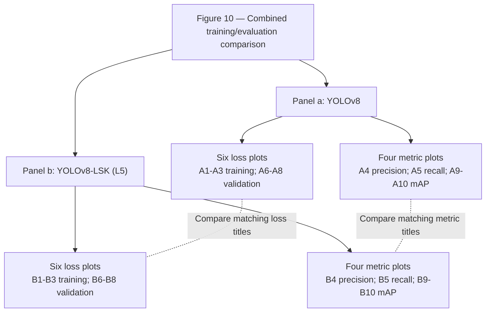

The arrows describe the figure's organization. They do not imply that one model feeds another, that losses execute sequentially, or that the plotted measurements form neural-network layers. The dashed links denote comparisons, not data flow or causation.

## 3. Plot and annotation conventions

| Visible element | Interpretation | Limit |
| --- | --- | --- |
| Blue line with small round markers | Displayed sequence of results across training progression. | Exact underlying data points are not supplied. |
| Legend `results` | Label of the plotted series, visible in the classification-training-loss plot in each panel. | It does not distinguish two overlaid models; each panel represents one model. |
| Horizontal ticks 0, 50, 100 | Training progression; interpreted as epochs using the paper's training context. | No explicit horizontal-axis title is printed, and the exact sample count/indexing is not reconstructed. |
| Subplot title | Identifies the quantity being plotted. | The title is preserved exactly, including slashes, underscores, hyphens, and `(B)`. |
| `train/` prefix | Training-loss series. | Different loss components are not interchangeable or necessarily on the same scale. |
| `val/` prefix | Validation-loss series. | A loss curve alone does not quantify detection accuracy. |
| `metrics/` prefix | Precision, recall, or mAP result series. | The title does not itself name a data split; the paper distinguishes these curves from final test-set scores. |
| Different vertical-axis ranges | Each subplot has its own numeric scale. | Equal screen heights do not imply equal values, even for matching plots across models. |
| Jagged late metric curve | Visible variation among displayed results. | No statistical variability across repeated runs is supplied. |

For a given loss definition, lower values are generally preferred; for precision, recall, and mAP, higher values are generally preferred. This does not justify comparing the magnitudes of different losses, or claiming that one model is better at every epoch. The image does not expand the `dfl` or `(B)` labels or supply their implementation formulas.

### Metric inventory and plot pairing

| Plot pair | Row, column | Exact subplot title | Quantity described | Usual preferred direction |
| --- | --- | --- | --- | --- |
| A1 / B1 | Top, 1 | `train/box_loss` | Box-related training loss; internal definition is not shown. | Lower |
| A2 / B2 | Top, 2 | `train/cls_loss` | Classification-related training loss; internal definition is not shown. | Lower |
| A3 / B3 | Top, 3 | `train/dfl_loss` | Training loss component named dfl_loss; its formula is not shown. | Lower |
| A4 / B4 | Top, 4 | `metrics/precision(B)` | Displayed precision metric; the (B) suffix is retained as printed. | Higher |
| A5 / B5 | Top, 5 | `metrics/recall(B)` | Displayed recall metric; the (B) suffix is retained as printed. | Higher |
| A6 / B6 | Bottom, 1 | `val/box_loss` | Box-related validation loss; internal definition is not shown. | Lower |
| A7 / B7 | Bottom, 2 | `val/cls_loss` | Classification-related validation loss; internal definition is not shown. | Lower |
| A8 / B8 | Bottom, 3 | `val/dfl_loss` | Validation loss component named dfl_loss; its formula is not shown. | Lower |
| A9 / B9 | Bottom, 4 | `metrics/mAP50(B)` | Displayed mAP50 metric; the exact title is preserved. | Higher |
| A10 / B10 | Bottom, 5 | `metrics/mAP50-95(B)` | Displayed mAP50-95 metric; the exact title is preserved. | Higher |

## 4. Panel-by-panel transcription

### Panel a: YOLOv8

The three training losses decrease rapidly early and then taper. The validation box and classification losses approach low plateaus. The validation dfl loss falls early but shows a shallow later rise. Precision, recall, and mAP increase during the early part of training and then approach plateaus with visible fluctuations.

| Plot | Exact title | Visible trajectory |
| --- | --- | --- |
| A1 | `train/box_loss` | Drops sharply at the beginning, then decreases progressively with a gentler slope through the end. |
| A2 | `train/cls_loss` | Drops sharply from a high initial value, followed by a smooth, gradually flattening decline. |
| A3 | `train/dfl_loss` | Falls rapidly early and then declines more slowly toward a low terminal level. |
| A4 | `metrics/precision(B)` | Rises quickly early, then fluctuates around a high plateau with visible dips and oscillations. |
| A5 | `metrics/recall(B)` | Rises strongly during the early portion and then approaches a fluctuating high plateau. |
| A6 | `val/box_loss` | Falls steeply early, then remains near a low plateau with small fluctuations. |
| A7 | `val/cls_loss` | Has an initial point near 25, an abrupt drop to a much lower level, then a gradual decline toward a low plateau. |
| A8 | `val/dfl_loss` | Falls steeply to a low region, then shows a shallow late upward drift with fluctuations. |
| A9 | `metrics/mAP50(B)` | Rises rapidly early, followed by slower improvement and a high plateau with visible fluctuations. |
| A10 | `metrics/mAP50-95(B)` | Rises steeply early, then increases more gradually toward a late plateau with modest fluctuations. |

**Distinctive feature:** A7 (`val/cls_loss`) begins near the tick value 25 before dropping very sharply. That value is a visual approximation, not a recovered training-log entry. Its y-axis differs substantially from B7's scale.

### Panel b: YOLOv8-LSK (L₅)

The training losses again decrease rapidly and then taper. Validation box and classification losses settle gradually toward low levels. Validation dfl loss reaches a low plateau with small fluctuations and a slight late upward tendency. The precision, recall, and mAP curves rise quickly early and then show smaller gains toward the end; fluctuations remain visible.

| Plot | Exact title | Visible trajectory |
| --- | --- | --- |
| B1 | `train/box_loss` | Drops sharply at the beginning, then decreases progressively with a gentler slope through the end. |
| B2 | `train/cls_loss` | Drops sharply from a high initial value, followed by a smooth, gradually flattening decline. |
| B3 | `train/dfl_loss` | Falls rapidly early and then declines more slowly toward a low terminal level. |
| B4 | `metrics/precision(B)` | Rises sharply early with a pronounced transition, then improves more gradually with noticeable point-to-point variation. |
| B5 | `metrics/recall(B)` | Rises rapidly early and then fluctuates around a high plateau; it is not strictly monotonic. |
| B6 | `val/box_loss` | Falls steeply early and then stays near a low plateau with small fluctuations. |
| B7 | `val/cls_loss` | Starts near 5 and declines over multiple early points before tapering toward a low terminal level, without the baseline panel's very large initial spike. |
| B8 | `val/dfl_loss` | Falls rapidly to a low plateau, followed by small fluctuations and a slight late upward drift. |
| B9 | `metrics/mAP50(B)` | Rises rapidly through an early transition, then improves gradually and levels off with relatively small late fluctuations. |
| B10 | `metrics/mAP50-95(B)` | Rises rapidly early, then continues a gentler increase toward a late plateau with relatively small fluctuations. |

**Distinctive feature:** B7 (`val/cls_loss`) starts near 5 and descends over multiple early points. It does not have A7's very large initial spike. This comparison concerns the plotted values and shape, not a claim that every loss component is smaller for L₅.

## 5. Cross-panel comparison

Compare each subplot with its same-title counterpart. Do not compare absolute pixel heights between charts without reading their axes.

| Plot pair | Metric | Comparison |
| --- | --- | --- |
| A1 ↔ B1 | `train/box_loss` | Both training box-loss curves decline strongly and then taper; the figure does not establish that every L5 training-loss value is lower. |
| A2 ↔ B2 | `train/cls_loss` | Both training classification-loss curves decline similarly in shape. Their initial values and axis ranges differ. |
| A3 ↔ B3 | `train/dfl_loss` | Both training dfl-loss curves decline rapidly and then taper toward low values. |
| A4 ↔ B4 | `metrics/precision(B)` | Both precision curves rise and remain noisy. L5 appears to reach a higher late-run level; exact endpoints and statistical significance are not supplied. |
| A5 ↔ B5 | `metrics/recall(B)` | Both recall curves rise toward a high plateau. L5 appears somewhat higher late in the run; visible fluctuations remain in both. |
| A6 ↔ B6 | `val/box_loss` | Both validation box-loss curves settle near a low plateau after an early steep decline. |
| A7 ↔ B7 | `val/cls_loss` | The baseline has a much larger initial validation classification-loss value, about 25 versus about 5 for L5. Compare the numeric axes, not plotted heights. |
| A8 ↔ B8 | `val/dfl_loss` | Both validation dfl-loss curves flatten after the initial decrease and show a small late upward tendency. L5 appears to remain at a lower late-run level. |
| A9 ↔ B9 | `metrics/mAP50(B)` | L5 reaches a higher displayed late-run mAP50 level. The paper reports curve values of 0.89 for YOLOv8 and 0.92 for L5. |
| A10 ↔ B10 | `metrics/mAP50-95(B)` | L5 reaches a higher displayed late-run mAP50-95 level. The paper reports curve values of 0.66 for YOLOv8 and 0.69 for L5. |

The most visually prominent difference is the initial validation classification-loss spike: approximately 25 in A7 versus approximately 5 in B7. Both models show decreasing training losses and rising evaluation metrics. The L₅ panel appears to reach higher late mAP levels, but it is not strictly monotonic and the image does not support a superiority claim at every epoch.

### Separately attributed paper context

Section 3.4 of the previously supplied paper, DOI `10.1016/j.marpolbul.2025.118608`, interprets the L₅ model as having a smoother initial validation classification-loss descent and smaller late oscillations in the mAP curves. It reports the following curve values:

| Metric | YOLOv8 | YOLOv8-LSK (L₅) | Value provenance |
| --- | --- | --- | --- |
| mAP50 | 0.89 | 0.92 | Paper Section 3.4; not independent digitization of the screenshots. |
| mAP50–95 | 0.66 | 0.69 | Paper Section 3.4; not independent digitization of the screenshots. |

The paper explicitly explains that the values in the training curves differ from the final reported test-set results because the validation and test sets differ. These curve values must therefore not be relabeled as final test-set scores. The paper's stability interpretation is recorded as the authors' analysis; raw logs and repeated-run statistics were not supplied with these images.

## 6. Readable labels and axis information

| Field | Transcription | Evidence or limitation |
| --- | --- | --- |
| Figure number | Fig. 10 | Caption under the second supplied image. |
| Panel a model label | YOLOv8 | First image. |
| Panel b model label | YOLOv8-LSK (L₅) | Second image. |
| Series legend | results | Visible in A2 and B2. |
| Common visible horizontal ticks | 0, 50, 100 | Repeated across the subplot grids. |
| Horizontal-axis interpretation | Training progression in epochs | Training-curve context; Section 2.7 reports 100 epochs. No explicit x-axis title is printed. |
| Training-loss titles | train/box_loss; train/cls_loss; train/dfl_loss | Top row, first three columns. |
| Validation-loss titles | val/box_loss; val/cls_loss; val/dfl_loss | Bottom row, first three columns. |
| Precision and recall titles | metrics/precision(B); metrics/recall(B) | Top row, last two columns. |
| mAP titles | metrics/mAP50(B); metrics/mAP50-95(B) | Bottom row, last two columns. |
| Approximate initial validation classification loss | YOLOv8: about 25; L₅: about 5 | Visual estimates from labeled axes, not exact logged values. |
| Exact per-epoch data | Not transcribed | Raw numerical series are not supplied. |

All subplot titles are preserved as printed. The prose uses `mAP50–95` where appropriate, while exact-title fields retain the printed ASCII hyphen in `metrics/mAP50-95(B)`. No missing axis titles, units, confidence intervals, or data-point values are invented.

## 7. Machine-readable representation

This JSON combines both supplied images into one Figure 10. It records two panels, a shared ten-metric layout, all 20 plots, and ten same-metric comparison relationships. Exact curve samples are `null`; approximate image readings and paper-reported values have separate fields. `null` means unavailable or not reliably recoverable, not zero.

```json
{
  "figure_id": "Fig. 10",
  "caption": "Fig. 10. Training and validation losses and mAP curves for the YOLOv8 and YOLOv8-LSK(L₅) models.",
  "figure_type": "two_model_training_validation_curve_comparison",
  "source_image_count": 2,
  "one_combined_figure": true,
  "layout": {
    "panel_count": 2,
    "combined_panel_order": [
      "a",
      "b"
    ],
    "combined_representation": "panel_a_then_panel_b",
    "plots_per_panel": 10,
    "total_plot_count": 20,
    "grid_per_panel": {
      "rows": 2,
      "columns": 5
    },
    "plot_order": "row_major_left_to_right",
    "plot_id_rule": "uppercase_panel_letter_followed_by_row_major_index_1_to_10"
  },
  "panels": {
    "a": {
      "source_image": 1,
      "printed_panel_label": "a",
      "printed_model_label": "YOLOv8",
      "model": "YOLOv8",
      "role": "baseline_model",
      "plot_ids": [
        "A1",
        "A2",
        "A3",
        "A4",
        "A5",
        "A6",
        "A7",
        "A8",
        "A9",
        "A10"
      ]
    },
    "b": {
      "source_image": 2,
      "printed_panel_label": "b",
      "printed_model_label": "YOLOv8-LSK (L₅)",
      "model": "YOLOv8-LSK (L5)",
      "role": "LSK_L5_model_configuration",
      "plot_ids": [
        "B1",
        "B2",
        "B3",
        "B4",
        "B5",
        "B6",
        "B7",
        "B8",
        "B9",
        "B10"
      ]
    }
  },
  "common_axes_and_style": {
    "x_axis_title_printed": null,
    "x_tick_values_visible": [
      0,
      50,
      100
    ],
    "x_axis_interpretation": "training_progression_in_epochs",
    "epoch_interpretation_source": "training_curve_context_and_paper_section_2.7_reporting_100_epochs",
    "exact_sample_count": null,
    "zero_or_one_based_epoch_indexing": null,
    "y_axis_quantity": "quantity_named_in_each_subplot_title",
    "y_axis_limits_shared_across_plots": false,
    "matching_metric_y_limits_guaranteed_equal_across_models": false,
    "line_color": "blue",
    "point_markers": "small_round_markers",
    "legend_text": "results",
    "legend_visible_in": [
      "A2",
      "B2"
    ],
    "legend_indicates_one_model_per_panel_not_two_overlaid_models": true,
    "raw_numeric_data_supplied": false,
    "error_bands_or_multiple_run_statistics_shown": false
  },
  "metric_inventory": [
    {
      "index": 1,
      "title_as_printed": "train/box_loss",
      "row": 1,
      "column": 1,
      "category": "loss",
      "split": "training",
      "description": "Box-related training loss; internal definition is not shown.",
      "usual_preferred_direction_for_same_metric": "lower",
      "comparison_pair": [
        "A1",
        "B1"
      ]
    },
    {
      "index": 2,
      "title_as_printed": "train/cls_loss",
      "row": 1,
      "column": 2,
      "category": "loss",
      "split": "training",
      "description": "Classification-related training loss; internal definition is not shown.",
      "usual_preferred_direction_for_same_metric": "lower",
      "comparison_pair": [
        "A2",
        "B2"
      ]
    },
    {
      "index": 3,
      "title_as_printed": "train/dfl_loss",
      "row": 1,
      "column": 3,
      "category": "loss",
      "split": "training",
      "description": "Training loss component named dfl_loss; its formula is not shown.",
      "usual_preferred_direction_for_same_metric": "lower",
      "comparison_pair": [
        "A3",
        "B3"
      ]
    },
    {
      "index": 4,
      "title_as_printed": "metrics/precision(B)",
      "row": 1,
      "column": 4,
      "category": "metric",
      "split": "evaluation",
      "description": "Displayed precision metric; the (B) suffix is retained as printed.",
      "usual_preferred_direction_for_same_metric": "higher",
      "comparison_pair": [
        "A4",
        "B4"
      ]
    },
    {
      "index": 5,
      "title_as_printed": "metrics/recall(B)",
      "row": 1,
      "column": 5,
      "category": "metric",
      "split": "evaluation",
      "description": "Displayed recall metric; the (B) suffix is retained as printed.",
      "usual_preferred_direction_for_same_metric": "higher",
      "comparison_pair": [
        "A5",
        "B5"
      ]
    },
    {
      "index": 6,
      "title_as_printed": "val/box_loss",
      "row": 2,
      "column": 1,
      "category": "loss",
      "split": "validation",
      "description": "Box-related validation loss; internal definition is not shown.",
      "usual_preferred_direction_for_same_metric": "lower",
      "comparison_pair": [
        "A6",
        "B6"
      ]
    },
    {
      "index": 7,
      "title_as_printed": "val/cls_loss",
      "row": 2,
      "column": 2,
      "category": "loss",
      "split": "validation",
      "description": "Classification-related validation loss; internal definition is not shown.",
      "usual_preferred_direction_for_same_metric": "lower",
      "comparison_pair": [
        "A7",
        "B7"
      ]
    },
    {
      "index": 8,
      "title_as_printed": "val/dfl_loss",
      "row": 2,
      "column": 3,
      "category": "loss",
      "split": "validation",
      "description": "Validation loss component named dfl_loss; its formula is not shown.",
      "usual_preferred_direction_for_same_metric": "lower",
      "comparison_pair": [
        "A8",
        "B8"
      ]
    },
    {
      "index": 9,
      "title_as_printed": "metrics/mAP50(B)",
      "row": 2,
      "column": 4,
      "category": "metric",
      "split": "evaluation",
      "description": "Displayed mAP50 metric; the exact title is preserved.",
      "usual_preferred_direction_for_same_metric": "higher",
      "comparison_pair": [
        "A9",
        "B9"
      ]
    },
    {
      "index": 10,
      "title_as_printed": "metrics/mAP50-95(B)",
      "row": 2,
      "column": 5,
      "category": "metric",
      "split": "evaluation",
      "description": "Displayed mAP50-95 metric; the exact title is preserved.",
      "usual_preferred_direction_for_same_metric": "higher",
      "comparison_pair": [
        "A10",
        "B10"
      ]
    }
  ],
  "plots": [
    {
      "id": "A1",
      "panel": "a",
      "model": "YOLOv8",
      "row": 1,
      "column": 1,
      "title_as_printed": "train/box_loss",
      "category": "loss",
      "split_indicated_by_title": "training",
      "trend": "Drops sharply at the beginning, then decreases progressively with a gentler slope through the end.",
      "line_color": "blue",
      "point_markers_visible": true,
      "exact_per_epoch_values": null,
      "exact_initial_value_from_image": null,
      "exact_final_value_from_image": null,
      "counterpart_plot": "B1"
    },
    {
      "id": "A2",
      "panel": "a",
      "model": "YOLOv8",
      "row": 1,
      "column": 2,
      "title_as_printed": "train/cls_loss",
      "category": "loss",
      "split_indicated_by_title": "training",
      "trend": "Drops sharply from a high initial value, followed by a smooth, gradually flattening decline.",
      "line_color": "blue",
      "point_markers_visible": true,
      "exact_per_epoch_values": null,
      "exact_initial_value_from_image": null,
      "exact_final_value_from_image": null,
      "counterpart_plot": "B2"
    },
    {
      "id": "A3",
      "panel": "a",
      "model": "YOLOv8",
      "row": 1,
      "column": 3,
      "title_as_printed": "train/dfl_loss",
      "category": "loss",
      "split_indicated_by_title": "training",
      "trend": "Falls rapidly early and then declines more slowly toward a low terminal level.",
      "line_color": "blue",
      "point_markers_visible": true,
      "exact_per_epoch_values": null,
      "exact_initial_value_from_image": null,
      "exact_final_value_from_image": null,
      "counterpart_plot": "B3"
    },
    {
      "id": "A4",
      "panel": "a",
      "model": "YOLOv8",
      "row": 1,
      "column": 4,
      "title_as_printed": "metrics/precision(B)",
      "category": "metric",
      "split_indicated_by_title": null,
      "trend": "Rises quickly early, then fluctuates around a high plateau with visible dips and oscillations.",
      "line_color": "blue",
      "point_markers_visible": true,
      "exact_per_epoch_values": null,
      "exact_initial_value_from_image": null,
      "exact_final_value_from_image": null,
      "counterpart_plot": "B4"
    },
    {
      "id": "A5",
      "panel": "a",
      "model": "YOLOv8",
      "row": 1,
      "column": 5,
      "title_as_printed": "metrics/recall(B)",
      "category": "metric",
      "split_indicated_by_title": null,
      "trend": "Rises strongly during the early portion and then approaches a fluctuating high plateau.",
      "line_color": "blue",
      "point_markers_visible": true,
      "exact_per_epoch_values": null,
      "exact_initial_value_from_image": null,
      "exact_final_value_from_image": null,
      "counterpart_plot": "B5"
    },
    {
      "id": "A6",
      "panel": "a",
      "model": "YOLOv8",
      "row": 2,
      "column": 1,
      "title_as_printed": "val/box_loss",
      "category": "loss",
      "split_indicated_by_title": "validation",
      "trend": "Falls steeply early, then remains near a low plateau with small fluctuations.",
      "line_color": "blue",
      "point_markers_visible": true,
      "exact_per_epoch_values": null,
      "exact_initial_value_from_image": null,
      "exact_final_value_from_image": null,
      "counterpart_plot": "B6"
    },
    {
      "id": "A7",
      "panel": "a",
      "model": "YOLOv8",
      "row": 2,
      "column": 2,
      "title_as_printed": "val/cls_loss",
      "category": "loss",
      "split_indicated_by_title": "validation",
      "trend": "Has an initial point near 25, an abrupt drop to a much lower level, then a gradual decline toward a low plateau.",
      "line_color": "blue",
      "point_markers_visible": true,
      "exact_per_epoch_values": null,
      "exact_initial_value_from_image": null,
      "exact_final_value_from_image": null,
      "counterpart_plot": "B7",
      "approximate_initial_value_from_image": 25,
      "approximation_status": "visual_estimate_from_labeled_axis_not_raw_data"
    },
    {
      "id": "A8",
      "panel": "a",
      "model": "YOLOv8",
      "row": 2,
      "column": 3,
      "title_as_printed": "val/dfl_loss",
      "category": "loss",
      "split_indicated_by_title": "validation",
      "trend": "Falls steeply to a low region, then shows a shallow late upward drift with fluctuations.",
      "line_color": "blue",
      "point_markers_visible": true,
      "exact_per_epoch_values": null,
      "exact_initial_value_from_image": null,
      "exact_final_value_from_image": null,
      "counterpart_plot": "B8"
    },
    {
      "id": "A9",
      "panel": "a",
      "model": "YOLOv8",
      "row": 2,
      "column": 4,
      "title_as_printed": "metrics/mAP50(B)",
      "category": "metric",
      "split_indicated_by_title": null,
      "trend": "Rises rapidly early, followed by slower improvement and a high plateau with visible fluctuations.",
      "line_color": "blue",
      "point_markers_visible": true,
      "exact_per_epoch_values": null,
      "exact_initial_value_from_image": null,
      "exact_final_value_from_image": null,
      "counterpart_plot": "B9",
      "curve_value_reported_in_paper": 0.89,
      "reported_value_source": "paper_section_3.4_not_independent_curve_digitization"
    },
    {
      "id": "A10",
      "panel": "a",
      "model": "YOLOv8",
      "row": 2,
      "column": 5,
      "title_as_printed": "metrics/mAP50-95(B)",
      "category": "metric",
      "split_indicated_by_title": null,
      "trend": "Rises steeply early, then increases more gradually toward a late plateau with modest fluctuations.",
      "line_color": "blue",
      "point_markers_visible": true,
      "exact_per_epoch_values": null,
      "exact_initial_value_from_image": null,
      "exact_final_value_from_image": null,
      "counterpart_plot": "B10",
      "curve_value_reported_in_paper": 0.66,
      "reported_value_source": "paper_section_3.4_not_independent_curve_digitization"
    },
    {
      "id": "B1",
      "panel": "b",
      "model": "YOLOv8-LSK (L5)",
      "row": 1,
      "column": 1,
      "title_as_printed": "train/box_loss",
      "category": "loss",
      "split_indicated_by_title": "training",
      "trend": "Drops sharply at the beginning, then decreases progressively with a gentler slope through the end.",
      "line_color": "blue",
      "point_markers_visible": true,
      "exact_per_epoch_values": null,
      "exact_initial_value_from_image": null,
      "exact_final_value_from_image": null,
      "counterpart_plot": "A1"
    },
    {
      "id": "B2",
      "panel": "b",
      "model": "YOLOv8-LSK (L5)",
      "row": 1,
      "column": 2,
      "title_as_printed": "train/cls_loss",
      "category": "loss",
      "split_indicated_by_title": "training",
      "trend": "Drops sharply from a high initial value, followed by a smooth, gradually flattening decline.",
      "line_color": "blue",
      "point_markers_visible": true,
      "exact_per_epoch_values": null,
      "exact_initial_value_from_image": null,
      "exact_final_value_from_image": null,
      "counterpart_plot": "A2"
    },
    {
      "id": "B3",
      "panel": "b",
      "model": "YOLOv8-LSK (L5)",
      "row": 1,
      "column": 3,
      "title_as_printed": "train/dfl_loss",
      "category": "loss",
      "split_indicated_by_title": "training",
      "trend": "Falls rapidly early and then declines more slowly toward a low terminal level.",
      "line_color": "blue",
      "point_markers_visible": true,
      "exact_per_epoch_values": null,
      "exact_initial_value_from_image": null,
      "exact_final_value_from_image": null,
      "counterpart_plot": "A3"
    },
    {
      "id": "B4",
      "panel": "b",
      "model": "YOLOv8-LSK (L5)",
      "row": 1,
      "column": 4,
      "title_as_printed": "metrics/precision(B)",
      "category": "metric",
      "split_indicated_by_title": null,
      "trend": "Rises sharply early with a pronounced transition, then improves more gradually with noticeable point-to-point variation.",
      "line_color": "blue",
      "point_markers_visible": true,
      "exact_per_epoch_values": null,
      "exact_initial_value_from_image": null,
      "exact_final_value_from_image": null,
      "counterpart_plot": "A4"
    },
    {
      "id": "B5",
      "panel": "b",
      "model": "YOLOv8-LSK (L5)",
      "row": 1,
      "column": 5,
      "title_as_printed": "metrics/recall(B)",
      "category": "metric",
      "split_indicated_by_title": null,
      "trend": "Rises rapidly early and then fluctuates around a high plateau; it is not strictly monotonic.",
      "line_color": "blue",
      "point_markers_visible": true,
      "exact_per_epoch_values": null,
      "exact_initial_value_from_image": null,
      "exact_final_value_from_image": null,
      "counterpart_plot": "A5"
    },
    {
      "id": "B6",
      "panel": "b",
      "model": "YOLOv8-LSK (L5)",
      "row": 2,
      "column": 1,
      "title_as_printed": "val/box_loss",
      "category": "loss",
      "split_indicated_by_title": "validation",
      "trend": "Falls steeply early and then stays near a low plateau with small fluctuations.",
      "line_color": "blue",
      "point_markers_visible": true,
      "exact_per_epoch_values": null,
      "exact_initial_value_from_image": null,
      "exact_final_value_from_image": null,
      "counterpart_plot": "A6"
    },
    {
      "id": "B7",
      "panel": "b",
      "model": "YOLOv8-LSK (L5)",
      "row": 2,
      "column": 2,
      "title_as_printed": "val/cls_loss",
      "category": "loss",
      "split_indicated_by_title": "validation",
      "trend": "Starts near 5 and declines over multiple early points before tapering toward a low terminal level, without the baseline panel's very large initial spike.",
      "line_color": "blue",
      "point_markers_visible": true,
      "exact_per_epoch_values": null,
      "exact_initial_value_from_image": null,
      "exact_final_value_from_image": null,
      "counterpart_plot": "A7",
      "approximate_initial_value_from_image": 5,
      "approximation_status": "visual_estimate_from_labeled_axis_not_raw_data"
    },
    {
      "id": "B8",
      "panel": "b",
      "model": "YOLOv8-LSK (L5)",
      "row": 2,
      "column": 3,
      "title_as_printed": "val/dfl_loss",
      "category": "loss",
      "split_indicated_by_title": "validation",
      "trend": "Falls rapidly to a low plateau, followed by small fluctuations and a slight late upward drift.",
      "line_color": "blue",
      "point_markers_visible": true,
      "exact_per_epoch_values": null,
      "exact_initial_value_from_image": null,
      "exact_final_value_from_image": null,
      "counterpart_plot": "A8"
    },
    {
      "id": "B9",
      "panel": "b",
      "model": "YOLOv8-LSK (L5)",
      "row": 2,
      "column": 4,
      "title_as_printed": "metrics/mAP50(B)",
      "category": "metric",
      "split_indicated_by_title": null,
      "trend": "Rises rapidly through an early transition, then improves gradually and levels off with relatively small late fluctuations.",
      "line_color": "blue",
      "point_markers_visible": true,
      "exact_per_epoch_values": null,
      "exact_initial_value_from_image": null,
      "exact_final_value_from_image": null,
      "counterpart_plot": "A9",
      "curve_value_reported_in_paper": 0.92,
      "reported_value_source": "paper_section_3.4_not_independent_curve_digitization"
    },
    {
      "id": "B10",
      "panel": "b",
      "model": "YOLOv8-LSK (L5)",
      "row": 2,
      "column": 5,
      "title_as_printed": "metrics/mAP50-95(B)",
      "category": "metric",
      "split_indicated_by_title": null,
      "trend": "Rises rapidly early, then continues a gentler increase toward a late plateau with relatively small fluctuations.",
      "line_color": "blue",
      "point_markers_visible": true,
      "exact_per_epoch_values": null,
      "exact_initial_value_from_image": null,
      "exact_final_value_from_image": null,
      "counterpart_plot": "A10",
      "curve_value_reported_in_paper": 0.69,
      "reported_value_source": "paper_section_3.4_not_independent_curve_digitization"
    }
  ],
  "relationships": [
    {
      "source": "A1",
      "target": "B1",
      "relation": "same_metric_across_models",
      "metric": "train/box_loss",
      "interpretation": "Both training box-loss curves decline strongly and then taper; the figure does not establish that every L5 training-loss value is lower."
    },
    {
      "source": "A2",
      "target": "B2",
      "relation": "same_metric_across_models",
      "metric": "train/cls_loss",
      "interpretation": "Both training classification-loss curves decline similarly in shape. Their initial values and axis ranges differ."
    },
    {
      "source": "A3",
      "target": "B3",
      "relation": "same_metric_across_models",
      "metric": "train/dfl_loss",
      "interpretation": "Both training dfl-loss curves decline rapidly and then taper toward low values."
    },
    {
      "source": "A4",
      "target": "B4",
      "relation": "same_metric_across_models",
      "metric": "metrics/precision(B)",
      "interpretation": "Both precision curves rise and remain noisy. L5 appears to reach a higher late-run level; exact endpoints and statistical significance are not supplied."
    },
    {
      "source": "A5",
      "target": "B5",
      "relation": "same_metric_across_models",
      "metric": "metrics/recall(B)",
      "interpretation": "Both recall curves rise toward a high plateau. L5 appears somewhat higher late in the run; visible fluctuations remain in both."
    },
    {
      "source": "A6",
      "target": "B6",
      "relation": "same_metric_across_models",
      "metric": "val/box_loss",
      "interpretation": "Both validation box-loss curves settle near a low plateau after an early steep decline."
    },
    {
      "source": "A7",
      "target": "B7",
      "relation": "same_metric_across_models",
      "metric": "val/cls_loss",
      "interpretation": "The baseline has a much larger initial validation classification-loss value, about 25 versus about 5 for L5. Compare the numeric axes, not plotted heights."
    },
    {
      "source": "A8",
      "target": "B8",
      "relation": "same_metric_across_models",
      "metric": "val/dfl_loss",
      "interpretation": "Both validation dfl-loss curves flatten after the initial decrease and show a small late upward tendency. L5 appears to remain at a lower late-run level."
    },
    {
      "source": "A9",
      "target": "B9",
      "relation": "same_metric_across_models",
      "metric": "metrics/mAP50(B)",
      "interpretation": "L5 reaches a higher displayed late-run mAP50 level. The paper reports curve values of 0.89 for YOLOv8 and 0.92 for L5."
    },
    {
      "source": "A10",
      "target": "B10",
      "relation": "same_metric_across_models",
      "metric": "metrics/mAP50-95(B)",
      "interpretation": "L5 reaches a higher displayed late-run mAP50-95 level. The paper reports curve values of 0.66 for YOLOv8 and 0.69 for L5."
    }
  ],
  "paper_context": {
    "source_doi": "10.1016/j.marpolbul.2025.118608",
    "discussion_section": "3.4",
    "training_configuration_section": "2.7",
    "epochs_reported": 100,
    "reported_curve_values": {
      "YOLOv8": {
        "mAP50": 0.89,
        "mAP50-95": 0.66
      },
      "YOLOv8-LSK (L5)": {
        "mAP50": 0.92,
        "mAP50-95": 0.69
      }
    },
    "curve_values_are_final_test_set_scores": false,
    "reason_given_for_difference_from_final_test_scores": "validation_and_final_test_sets_differ",
    "author_interpretation": [
      "both_models_show_convergence",
      "baseline_validation_classification_loss_has_a_very_large_initial_value_and_abrupt_drop",
      "L5_validation_classification_loss_has_a_lower_initial_value_and_smoother_descent",
      "L5_mAP_curves_have_smaller_late_oscillations_and_higher_reported_levels"
    ],
    "raw_training_logs_independently_verified": false
  },
  "interpretation_limits": [
    "These are training and evaluation curves, not the internal neural-network architecture.",
    "The same metric should be compared across models; different subplot heights or losses are not directly comparable.",
    "The baseline and L5 validation-classification plots use notably different y-axis scales.",
    "The x axis is interpreted as epochs from context; no explicit x-axis title is printed.",
    "Per-epoch numeric data, exact endpoints, and exact sample counts are not reconstructed from raster curves.",
    "Approximate initial loss values are visual estimates and are labeled as such.",
    "Paper-reported mAP values are kept separate from image estimates and final test-set scores.",
    "No repeated-run statistics, uncertainty bands, or statistical-significance tests are supplied.",
    "A small late validation-loss rise alone does not establish overfitting.",
    "The L5 curves are not strictly monotonic and are not claimed to be lower or higher at every epoch."
  ],
  "null_meaning": "not specified or not reliably recoverable, not zero"
}
```

## 8. Interpretation limits

- The plots show training and evaluation behavior, not the internal model architecture or an executable training configuration.
- Both supplied images belong to Figure 10; panel b is not a separate figure.
- Each subplot uses its own vertical scale. A7 and B7 especially must be compared numerically rather than by line height.
- Training progression is interpreted as epochs from context. Exact zero-based/one-based indexing, point counts, and per-epoch values are not reconstructed.
- The approximate initial classification-loss values are visual estimates. They are not replacements for raw training logs.
- Exact precision and recall endpoints, exact convergence epochs, and complete numerical loss series are not supplied.
- The paper-reported mAP curve values are distinct from the final test-set scores and are not independent image measurements.
- The curves contain fluctuations; neither strict monotonicity nor improvement at every epoch is claimed.
- A slight late validation-loss rise alone is insufficient to diagnose overfitting or identify its cause.
- No multiple-run comparison, uncertainty interval, statistical-significance test, or causal isolation of individual model changes is shown.
- The file is a semantic transcription of the plots, not a digitized numerical dataset or a reproduction of the experiments.


### 3.5. Comparison with previous detection studies

To verify the effectiveness and progress of the proposed oil spill detection method, (Table. 2) the experimental results were compared with existing research based on an object-detection algorithm. The comparison algorithms include Faster R-CNN (Huang et al., 2022), YOLOv4 (Yang et al., 2022), IYOLOX-S (Zhang et al., 2022), YOLOX-S-ECA-FFDNet (Xu et al., 2022), and YOLOv8 (Cai et al., 2024). The oil spill detection algorithms in the compared research only perform binary classification and cannot distinguish between oil pollution from unknown origins and OOSs. In view of this limitation, this study adopted the YOLOv8 algorithm, made objective improvements, and successfully realised the high-precision classification and detection of oil slicks of unknown origin and OOSs in SAR images.

The mAP is the main index used to evaluate the performance of the object detection model, and the subsequent numbers represent the spatial overlap between the prediction and ground truth boxes. mAP50 indicates that an object is considered correctly recognised when the spatial overlap between the prediction box and ground truth box reaches 50 %. The higher the value, the stricter the scoring requirements. The experimental results show that the YOLOv8-LSK model's multi-class mAP50 value reached 94.2 %, which is 7.44 % higher than the highest binary mAP50 of the previous model. The multi-class mAP50–95 value reached 71.6 %, which enables the classification and detection of OOSs and achieves higher detection accuracy. In addition, thanks to the SAHI module, YOLOv8-LSK can process SAR images of different sizes captured by different SAR satellites, effectively solving the problem of single satellites' long return periodicity. The integration of the LSK module is key to the improvement in model accuracy. When these enhancements are used together, the model demonstrates a favourable balance between performance and efficiency, as its processing time increases only marginally from 15 to 17 s per SAR image while delivering a significant improvement in detection accuracy.

**Table 2**

Comparison of oil spill detection methods and results with previous studies.

| Study location | Remote sensing satellite | Detection object | Detection methods | Test results | Reference |
| --- | --- | --- | --- | --- | --- |
| Gulf of Mexico, Gulf of Mexico, the East and South China Sea | Sentinel-1, RADARSAT-2 | oil spill | Faster R-CNN | Binary Map32 =92.56 % | Huang et al., 2022 |
| Eastern Mediterranean Sea | Sentinel-1 SAR | oil spill | YOLOv4 | Binary Map50 =68.7 % | Yang et al., 2022 |
| Bohai Sea in China | Sentinel-1 SAR | oil spill | IYOLOX-S | Binary Map83 =90.02 % | Zhang et al., 2022 |
| around the world | Sentinel-1 SAR | oil spill | YOLOX-S-ECA-FFDNet | Binary Map50 =86.76 % | Xu et al., 2022 |
| North South China Sea | optical satellite | oil spill | YOLOv8 | Binary Map50 =83.1 % | Cai et al., 2024 |
| Bohai Sea in China, Port of South Louisiana in the United States | Sentinel-1 SAR | oil slick of an unknown origin , OOS | YOLOv8-LSK | Multi-class Map50 =94.2 %<br>Multi-class Map50–95 =71.6 % | In this study |

Notes. SAR, synthetic aperture radar; OOS, operational oil spill.

### 3.6. Elimination of look-alike effects

By optimising the model, false detections can be effectively reduced, and the influence of subjective factors on the determination of look-alikes can be avoided. However, as some look-alikes have the same characteristics as oil spills, false detections caused by look-alikes cannot be eliminated. Studies have shown that the combination of wind-field information can significantly reduce or eliminate the false detection of look-alikes (Liu et al., 2021). Furthermore, optical satellite observations can be used to investigate whether dark patches in SAR images are related to oil spills (Huang et al., 2022). Therefore, it is expected that after detection by the algorithm, the combination of wind field information and optical satellites will eliminate the influence of look-alikes on the detection results.

### 3.7. Tracking the operational sources of oil spills

In previous research on locating and tracking oil spill sources, Liu et al. (2021) analysed the AIS data on a waterway within 12 h after a narrow and long oil slick was found and used the Analytic Hierarchy Process and expert scoring methods to infer potentially suspect ships. Busler et al. (2015) deduced potentially suspect ships by crossing the ships' trajectories and the slicks' drift trajectories in time and space using probability models, Luo et al. (2024) converted the oil spill area into trajectory points, and used the bidirectional drift model to find the most likely ship to spill oil. Mizukoshi et al. (2019) artificially detected ships discharging oil in SAR images and determined the ships' identities using AIS information. Ivanov and Kucheiko (2014) combined SAR and AIS data with an automatic ship-detection algorithm and manually checked the ship information when an oil spill was discovered. This study combined a previous oil spill detection algorithm with oil spill source tracking. An automatic OOS detection model was developed that can be matched with an AIS. This solves the limitation of high artificial dependency in previous methods.

### 3.8. Limitations and future work

While the proposed YOLOv8-LSK model demonstrates high effectiveness, several limitations remain, which in turn suggest clear directions for future enhancement.

First, a primary limitation is the granularity of our oil spill classification. The current model categorizes spills into “OOS” and “unknown origin” classes, yet does not differentiate the temporal states of OOS events. This is a simplification, as the characteristics and regulatory implications of a spill can vary greatly depending on its age and proximity to the source. To address this, a key future direction is to develop a more sophisticated classification scheme. Future work will divide OOSs into more informative categories, such as: (1) ongoing discharges, directly linked to a vessel; (2) recent discharges, where the slick has just detached but the source vessel is still nearby; and (3) legacy slicks, where the source has long since departed.

Second, the current methodology focuses on detection and source correlation but stops short of automated traceability and quantitative assessment. For oil slicks remaining after the discharge sources have departed, our system currently requires manual intervention to initiate tracking. To address this limitation, future research will focus on developing an end-to-end intelligent traceability system. Upon detection by our algorithm, we will automatically feed the spill's location and shape into an ocean drift model like OpenDrift (Dagestad et al., 2018) for reverse-trajectory simulations. This will replace the manual analysis process and achieve intelligent source-tracking throughout the entire lifecycle of an OOS event.

Third, our use of object detection provides bounding boxes, which, while effective for localization, do not offer precise delineation of the spill's contours. This limits the ability to perform accurate area calculations and monitor the spill's dynamic dispersion. Therefore, a significant future enhancement will be the application of instance segmentation. By transitioning to an instance segmentation framework, the system will be able to detect oil spills and precisely delineate their boundaries. This will allow for a comprehensive dynamic assessment of spills - including area, volume estimation, and dispersion state - thereby significantly enhancing the practical value of our method for environmental monitoring and regulatory support.

By pursuing these targeted improvements, we aim to evolve our current model into a fully integrated, multi-faceted system for advanced marine pollution surveillance.

## 4. Conclusions

This study proposed and investigated an innovative multi-classification oil spill detection model, YOLOv8-LSK, and demonstrated its advantages in classifying and detecting OOSs in SAR oil spill images. Integrating the LSK attention mechanism and optimising the MPDIoU loss function significantly improved the model's ability to distinguish between OOSs and oil spills of unknown origin and its detection accuracy. In addition, the SAHI module realises non-destructive end-to-end detection of SAR image resolution. This study also provided case study for model improvement based on the characteristics of the research field. The practical application to the Port of Southern Louisiana case study demonstrates that YOLOv8-LSK effectively detects OOSs and uses AIS data to correlate potential emission sources, thereby significantly reducing reliance on manual intervention and improving regulatory efficiency.

Future research will refine identifying the different states of OOSs and perform numerical fluid dynamics simulations on the target spill. Automatic traceability is required to achieve comprehensive coverage of OOSs. The fusion of multi-modal data (such as wind fields and optical remote sensing) will further reduce false detections caused by look-likes. The ultimate goal is to build a comprehensive marine OOS monitoring and traceability system based on the results of this research.

## CRediT authorship contribution statement

Haoluan Zhao: Methodology, Data curation, Writing – original draft. Peng Zheng: Visualization, Formal analysis, Writing – original draft. Shitao Peng: Methodology, Data curation. Jianna Jia: Software, Conceptualization. Zhongru Wang: Resources. Jianbo Hu: Software, Project administration, Conceptualization.

## Declaration of competing interest

The authors declare no conflicts of interest.

## Acknowledgements

This research was funded by the China National Key Research and Development Program (Grant No.2022YFC3203400 & 2024YFC2816600) and Basic Research Operating Expenses of Centralized Public Welfare Research Institutions (CN) (No.TKS20230302).

## Appendix A. Supplementary data

Supplementary data to this article can be found online at https://doi.org/10.1016/j.marpolbul.2025.118608.

## Data availability

Data will be made available on request.
